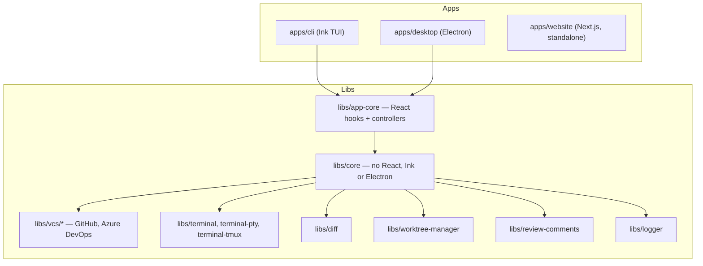

n10 is open source at
[github.com/notaharness/n10](https://github.com/notaharness/n10). Work is
planned on the [roadmap board](https://github.com/orgs/notaharness/projects/1);
see the [Roadmap](/docs/roadmap) for the direction. Issues labelled
[`good first issue`](https://github.com/notaharness/n10/labels/good%20first%20issue)
are small and fully specified. To propose something new, open an issue first.

[CONTRIBUTING.md](https://github.com/notaharness/n10/blob/master/CONTRIBUTING.md)
is the full guide, and
[SECURITY.md](https://github.com/notaharness/n10/blob/master/SECURITY.md) says
how to report a vulnerability.

## Set up

You need the [prerequisites](/docs/installation#prerequisites) for running
n10, plus a clone of the repository:

```sh
git clone https://github.com/notaharness/n10.git
cd n10
npm ci
```

The repository is an [Nx](https://nx.dev) monorepo. Run tasks through Nx:

```sh
npx nx serve desktop                  # n10 Desktop from source, with reload
npx nx serve cli                      # the terminal UI from source
npx nx dev website                    # this site, at http://localhost:3100
npx nx test <project>                 # unit tests for one project
npx nx run-many -t lint --all         # lint everything; warnings fail
npx nx run-many -t typecheck --all
npx nx e2e cli-e2e                    # end-to-end tests for the terminal UI
npx nx e2e desktop-e2e                # end-to-end tests for n10 Desktop
```

The end-to-end tests run offline against fixture repositories and a scratch
tmux server, so they never touch your own sessions.

## Working with an agent

The repository is set up for coding agents. `AGENTS.md` at the root, and in
the directories that need one, holds the working rules: module boundaries,
lint budgets, tmux safety and how to run checks. Point your agent at it
before it edits anything. The same rules apply to changes you write by hand.

## Pull requests

- Branch from `master`.
- Use [Conventional Commits](https://www.conventionalcommits.org) with the
  project as the scope, such as `fix(desktop): …` or `feat(core): …`.
- Say which issue the pull request implements, and describe what the code
  does, not how you got there.
- CI runs lint, typecheck, unit, end-to-end and visual tests on every pull
  request.

## How the code fits together

n10 Desktop (Electron) and the terminal UI (Ink) are two shells over the same
core. `libs/core` owns every sequence of Git, tmux, filesystem and provider
operations, and `libs/app-core` adds the React state both shells share.
Dependencies flow one way: an app may depend on libraries, never on another
app. The website is standalone.



The repository's `docs/` folder goes deeper:

- [architecture.md](https://github.com/notaharness/n10/blob/master/docs/architecture.md):
  a directory map of every app and library.
- [decisions.md](https://github.com/notaharness/n10/blob/master/docs/decisions.md):
  design rationale and known limitations, by area.
- [testing.md](https://github.com/notaharness/n10/blob/master/docs/testing.md):
  test fixtures, visual QA and live integration tests.
- [linting.md](https://github.com/notaharness/n10/blob/master/docs/linting.md):
  lint configuration, budgets and exceptions.
