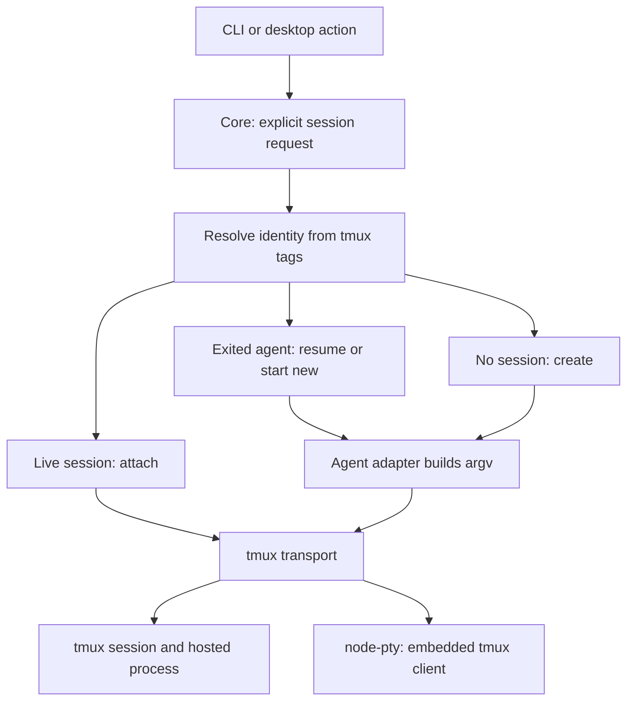

# Design decisions

Read the section relevant to the change. Area `AGENTS.md` files contain the
working rules; this document explains constraints that are easy to miss.

## Shared operations and entry points

Core owns sequences of git, filesystem, PTY, config and provider calls.
App-core supplies React bindings; shells own presentation. The desktop renderer
cannot use Node APIs and accesses core's plan through `@n10/core/plan`.
Keep that entry browser-safe and the core/app-core barrels separate.

When changing shared behavior, compare both shells. Worktree removal is
implemented in the TUI's `performDelete` and desktop's `services/worktrees.ts`;
both use core's removal sequence to stop persisted tmux sessions. Draft posting uses one comment per `postReviewComments` call,
so a partial failure cannot reset already-posted comments to drafts.

A fresh worktree needs its own `npm ci`: workspace links and nested dependencies
must resolve to that checkout. Copying only another checkout's root
`node_modules` misses per-workspace dependencies. Typecheck before code edits.
Nx targets may be inline in package manifests or inferred by plugins; inspect
resolved configuration with `npx nx show project <name> --json`.

## Tmux sessions and transport

n10 requires tmux 3.2 or newer. Startup probes it and reports an installation
hint when unavailable; a stored `terminalBackend` field has no effect. Every
worktree agent and terminal tab runs in tmux. `node-pty` remains the low-level
connection used to embed a tmux client in the CLI or desktop terminal.

Core owns identity and agent policy. `session/open-session.ts` receives an
explicit worktree or terminal request, resolves tagged sessions, and chooses a
create, attach or restart plan. It validates a worktree's HEAD before touching
an existing connection. Only create/restart calls the agent command builder.
`terminal-tmux` executes that plan, allocates collision-free names, carries
opaque tags and observes native pane state; it knows no repositories or agents.
The registry owns local terminal rendering and activity. Launch preparation is
asynchronous; callers await registration before installing relays or focusing
terminals. Concurrent requests for one identity share preparation.

Desktop creation runs `prepareTmuxSession` in an Electron utility process.
Spawning a persistent tmux server directly from Electron on Linux leaks Chromium
file descriptors into it, including profile locks. The supported utility-process
boundary isolates those resources; attach and restart can run locally against
an existing server. Build and development entry points include the worker.

Creation uses a detached placeholder while tags and `remain-on-exit` are set,
then replaces only that placeholder with the agent or shell. Restart refuses a
live pane: `respawn-pane` without `-k` and subsequent metadata writes share one
server command queue, so a losing concurrent restart cannot overwrite the
winner's agent tag. Attaching never builds argv or rewrites identity tags.

Tmux retains its server environment. Each launch explicitly supplies HOME,
PATH and the agent adapter's environment additions; do not copy the entire
process environment into command-line `-e` flags. `list-sessions -F` output is
tab-separated; `tmux -u` preserves separators under non-UTF-8 locales.

A dead pane carries less than it looks. `pane_dead` flips when the pane's file
descriptor closes; `pane_dead_status`, `pane_dead_signal`, `pane_dead_time` and
the retained `Pane is dead` notice arrive only once tmux has reaped the process,
which is a separate event. Short of CPU — a two-core CI runner, a loaded
laptop — tmux can leave the process unreaped indefinitely, so a pane reads dead
with an empty status and no notice written into it, permanently. The notice is
therefore not something a capture or a repaint can recover, and a missing exit
status is reported as code 0. Do not gate exit reporting on the status arriving,
and do not assert on the notice: an agent's own final output and the
application's own exited state are the signals that always exist.

Tests isolate HOME and the tmux socket, unset inherited TMUX, and validate that
the socket belongs to the fixture before cleanup. Kill fixture sessions
individually; never use `tmux kill-server` or the user's default server.

macOS and Linux are the supported platforms. Every launch goes through tmux,
which has no native Windows build, so there is no native Windows path; the old
`cmd.exe` branches in the agent registry (`shellInvoke`, `shellEnvRef`) and
their `/bin/sh`-does-not-exist-on-Windows rationale predate the tmux-only
launcher and are gone. WSL is untested and secondary — its tmux runs under
Linux, so it may work, but nothing here specifically supports it.

## Session identity shared with Orchestra

Names are labels; tags carry identity. n10 and the Orchestra skill's bash
scripts create ordinary tmux sessions using the same user options:

| Session user option       | Meaning                               |
| ------------------------- | ------------------------------------- |
| `@orchestra-spawner`      | Creator, such as `n10` or `orchestra` |
| `@orchestra-repo`         | Canonical main checkout path          |
| `@orchestra-session-type` | `worktree`, `shell` or `agent`        |
| `@orchestra-branch`       | Exact branch for a worktree session   |
| `@orchestra-agent`        | Agent used for the most recent launch |

The shared names live in `session-identity.ts`. Creator/reporting metadata
survives attachment and restart; a successful new process updates its agent
metadata. Tags contain data, never arbitrary commands to execute. They live
only as long as the tmux session, and do not provide persistence after reboot.

Worktree lookup matches canonical repository plus exact branch. A terminal
lookup uses its actual allocated tmux target. `session-resolver.ts` obtains one
listing and applies those rules for attach, discovery, liveness and cleanup.
A session lacking a spawner or recognized type is foreign; worktree sessions
also require a repo tag. A familiar name alone never authorizes attachment or
termination. Duplicate worktree identities resolve to the oldest session;
extras are listed, never silently killed.

Labels are `<repo>-<branch>`, `<repo>-shell` or `<repo>-agent`. The repo is the
canonical main checkout's basename; `/`, `.` and `:` become `-`. A label longer
than 200 characters keeps its first 195 plus a four-digit hash suffix. Name
collisions add `-2`, `-3`, and so on, always from the original preferred label.
A duplicate-name race retries allocation without adopting the other session.
Core registry keys are JSON tuples: `["worktree", repo, exactBranch]` or
`["terminal", actualTmuxName]`. Display labels never address registry entries.

## Discovery, restart and terminal lifecycle

Discovery polls worktrees and tmux, diffs observations with `diffScans`, and
attaches through the shared launcher. Recheck local connection state between
awaits so concurrent user actions cannot create duplicate connections. Failed
attaches have bounded retries. Failed local clients become eligible for
rediscovery without pretending their hosted agents exited.

A tagged worktree process is running only while its pane is alive. Standalone
terminal tabs are found globally by their session type and tmux `session_path`.
An orphaned worktree session appears as an agent terminal when its tagged branch
no longer matches a listed worktree; attachment preserves its original tags.
Terminal grouping is derived from its directory. Restoring tabs does not move
focus. Discovery also removes retained tabs whose sessions were deleted outside
n10.

Agent panes use `remain-on-exit` and retain final output. Resume uses the
recorded agent, regardless of the current project default: Claude and Codex
have explicit resume adapters. Their native continuation selects a conversation
in the working directory; the agent tag is not a conversation ID. Missing or
unsupported resume metadata produces an actionable error. Start-new choices
explicitly select an agent and a fresh conversation, including the configured
default. Shell panes close normally when their process exits.

Hosted-process exit and tmux-client disconnect are different events. Native
`pane_dead` drives exit state. Client disconnect retries attachment in the
transport while preserving the local registry identity and subscriptions.
Notify snapshots of listeners, because cleanup during one callback must not
prevent later callbacks from receiving the event.

Quitting n10 disposes local clients; tmux sessions keep running. Explicit
Stop, terminal close and worktree removal terminate the matching session,
including when no local connection exists. `removeWorktreeSession` owns shared
stop/remove/delete operations with the captured repository.

Carry output sequence numbers across reattachment and restart so mounted
terminals accept subsequent chunks. Resize on fit and when `spawnedAt` changes,
even if the session name and dimensions are unchanged. `paneTerminalGrid`
measures the actual font and padding; the first fit corrects startup estimates.

## Desktop repositories and tabs

The host serves one repository at a time; the tab strip can contain several.
Activating a foreign tab opens its repository through `useRepoFollowsTabs`.
Use canonical real paths for repository identity so symlinked paths cannot
produce duplicate tabs or disagree with git and tmux names.

`TabsProvider` lives above the repository gate because `Workspace` remounts on
switch. Keep one reconciliation step: `Workspace` sends `sync-items` to the pure
`tabs-model.ts` reducer. It handles stale identities, previews, new agents,
foreign sessions and terminals. Reconcile only the repo described by the update.
Agent auto-open history is repo-qualified; closing a tab must not reopen it on
an unchanged poll. Store titles on tabs because foreign items may be unavailable.

Sidebar snapshots carry their repository identity. Drop mismatched answers in
the renderer, and recheck identity between host awaits, to prevent rows from a
new repository entering the previous repository's tab state.

Use native menus and dialogs where the OS supports the interaction. The review
workspace has a navigation rail and one content pane; keep the terminal mounted
when switching to the diff so scrollback survives. The diff owns its toolbar.
Each tab has an ErrorBoundary. Markdown paragraphs render as `div` when they may
contain block images; the host fetches protected images with provider auth.

Optimistic removal drops a session row but retains a PR row with its session
fields cleared: the PR outlives its checkout. Status indicators combine CI and
review status; CI can worsen the result, but passing CI does not imply approval.
The status matrix and tab invariants are covered by model tests.

## Plans and babysitting

Plan items are value snapshots taken when queued. Later comment edits or
resolution must not change them. `composePlanPrompt` follows `planRows` order so
item numbers match what the user sees. The renderer composes the delivered text
because it previews that exact prompt. Checkout injects into a live agent,
respawns an ended one, or creates a worktree and launches an agent.

The babysitter baseline is what the agent was told, not the latest observation.
Hold or delivery failures leave it unchanged. A new head or thread reply can be
news; the user's own latest comment is not relayed. Recovery from a reported CI
failure is news; an initial green result alone is not. An unavailable conflict
check is reported as unavailable, never interpreted as a clean result.

Batch updates after ten minutes of quiet or thirty minutes maximum, and deliver
only after the agent has been idle for thirty seconds. Start agents with `seed`,
not `continue-or-seed`, which may discard the prompt. Use `checkoutWorktree` for
an existing branch: inventing one from HEAD would send work to the wrong commit.

Pass `cwd` to every git operation and check `live()` after awaits. Serialize
fetches through `sync/fetch-queue.ts`; invalidate reused refs when the head moves.
Use `sync/conflicts.ts` for both the badge and briefing. The worktree resolver is
process-global, so check liveness immediately before checkout as well.

Babysitters read the shared PR cache, distinguish unknown from gone, and require
consecutive absences before ending a watch. Resolve the provider per poll so
settings changes take effect. Desktop watchers are stored per repo, pause while
another repo is open, and stop when their worktree is removed. Push `spawned`
and `ended` events; other status is read through the sidebar. `onStatus` fires
on transitions, not timestamp-only changes. Timing overrides support tests that
assert the actual prompt received by a fake agent.

## Pull request caching and providers

The desktop sidebar, babysitters and sync loop share core's per-repo PR cache.
Key cache entries, in-flight requests and sequence guards by cwd. Only the newest
fetch for a repo commits. Failures retain the last good list and retry on the
interval. Changing global credentials clears entries and invalidates in-flight
results. `cached`/`refreshInBackground` support polling; explicit reads can await
refresh. The TUI's `usePrData` is its process's single list reader.

GitHub uses authenticated `gh`; offline tests replace that executable on PATH.
Azure DevOps uses REST and a PAT, with recorded anonymized fixtures rather than
e2e coverage. Extend those fixtures when changing Azure behavior. Scrub identities
and repository details from recordings; keep credentials out of fixtures.

Azure statuses are history. Group by context and choose the newest iteration,
date and id. `notApplicable` retracts a check without voting; missing state means
queued (`notSet`). Branch-policy build validation uses policy evaluations,
which this status path does not read.

Azure request budgets prevent per-PR polling from exhausting organization limits:

- Memoize settled CI against both source and target merge commits. Pending CI
  is reread first; comments are not keyed to commit identity.
- Separate the displayed answer from a result complete enough to memoize.
- Budget detail reads per cycle and order by last read, with id as a stable tie
  breaker. Age entries out instead of deleting visible answers on refresh.
- A missing row on a complete runs page means no build. On a truncated page or
  failed lookup, omit the row: it has not been resolved and must not be cached as none.

Babysitter thread reads use the provider throttle and TTL outside the list-cycle
budget. GitHub gets rollup and counts with its list query and needs no equivalent
per-row cache-reset methods. `request-budget.spec.ts` checks request counts.

## Diff generation and rendering

PR diffs compare commits so review anchors remain stable. Bare worktree diffs
include index, working tree and untracked files. Build untracked patches without
`git add -N`: displaying a diff must not modify the agent's index. Poll active
worktrees; do not recursively watch a checkout and exhaust inotify on dependencies.

Whole-file context (`-U99999`) supports comments on unchanged lines; fold it in
the viewer. Stream git output with `runGit`, which preserves partial output and
reports truncation rather than discarding the entire buffer on overflow.

Bound worktree diffs before expensive reads. Use `lstat` for symlinks, churn to
bound deleted files, and exclude both paths of an oversized rename. A content-free
rename only needs headers. Size untracked files before reading, respect git ignores,
and render symlinks as mode-120000 patches without following them. Trim total-output
overruns at complete file boundaries. The PR path retains files because review
comments depend on them. Git-backed regression cases live in
`worktree-diff.integration.spec.ts`.

File-tree collapse state follows each file's content revision, not poll timing
or churn counts. Ignore temporary empty snapshots; unchanged snapshots preserve
state. Open ancestors only for new or changed files.

## TUI, browser bridge and packaging

Ink passes `TerminalEmulator` ANSI through `<Text>`; raw stdin forwards to the
PTY. Strip CI-related variables when spawning the interactive TUI. The serve
target sets `TSX_TSCONFIG_PATH` for automatic JSX transformation.

The wterm host keeps the PTY alive across WebSocket reconnects and replays a ring
buffer. Use one build script for server and client to avoid output-directory
cleaning conflicts. Playwright and Nx must agree on artifact output paths.

Pin desktop and wterm-host packages to the same exact wterm version. Separate
copies have incompatible constructor identities for `instanceof`. Import CSS
from `@wterm/dom/css`; the React package's relative CSS import depends on hoisting.
For pasted images, the host chooses the temporary-file suffix from its own MIME
table and inserts the path into the PTY; text paste stays with wterm.

Comment images use _virtual_ kitty placements (`U=1`) written out-of-band
with `process.stdout.write`, the precedent being `apps/cli/src/utils/window-title.ts`;
`CommentProse` then renders U+10EEEE placeholder rows as ordinary Ink `<Text>`,
clipped to the card interior so Ink never draws a truncation `…` over the image.
Each distinct url is fetched and decoded once. Kitty loops animated GIFs natively
(`a=f` frames plus `a=a,s=3,v=1`, no ongoing traffic); ghostty lacks `a=f`, so
n10 re-transmits frames on a chained timeout (≤120 frames, ≥50 ms per frame,
≤3 concurrent) while a reviews pane shows, and `N10_GIF_ANIMATION=off` keeps a
static composite. Image download and decoding live in `libs/image-loader`, the
protocol in `libs/kitty-graphics`.

Mouse tracking (`?1000h`) is refcounted across consumers because the enable and
disable writes are global to the terminal; batching every SGR report in a stdin
chunk is what makes a fast wheel spin scroll by more than one line.

For release preparation and global-install constraints, see
`.agents/skills/publish-beta/references/packaging.md`.

The Linux installers are a second packaging of the same desktop build
(`npx nx package-linux desktop`, `apps/desktop/electron-builder.yml`). Each is
built on, and holds binaries for, one architecture: `scripts/package-linux.mjs`
copies node-pty and the one installed beam platform package from the
workspace, and both stay unpacked from the asar because other processes run
them. The executable is `n10-desktop`, so a deb never shadows the npm
package's `n10`. An AppImage's session bin points into its FUSE mount, so
`n10 util` and `beam` in sessions that outlive it fail until it runs again;
the deb has fixed paths. Where AppArmor blocks user namespaces (Ubuntu 24.04
and later) the deb installs a profile, and the AppImage's launcher adds
`--no-sandbox`.

The app tells builds apart by manifest name, not `app.isPackaged`, which is
false under the npm package too: `n10-dev` is the dev build, and anything else
reports its manifest version. An installed app opens its last path argument,
or the cwd only when a terminal started it. When no terminal started it, it
puts the login shell's PATH first, since a desktop menu's PATH lacks tmux and
the agents.

## Machine integration decisions

Wiring beam into n10: remote tmux, the desktop's client of the beam
daemon's control socket and the UI's gating. Code cites these as
`decisions.md D<n>`. beam itself is a separate project
(`github.com/notaharness/beam`) with its own spec.

| #   | Decision                                                                                                                                                                                                                                                                                               | Why                                                                                                                                                                                                                                                                                                                                                                                                                                      |
| --- | ------------------------------------------------------------------------------------------------------------------------------------------------------------------------------------------------------------------------------------------------------------------------------------------------------ | ---------------------------------------------------------------------------------------------------------------------------------------------------------------------------------------------------------------------------------------------------------------------------------------------------------------------------------------------------------------------------------------------------------------------------------------- |
| D2  | A session's or terminal's `machine` is `'local'` or a beam `peerId`, and n10's registry keys gain a machine segment whose local value is `local`.                                                                                                                                                      | Every id belongs to the machine it lives on, so two machines may hold the same session label or worktree path. A `local` segment leaves existing local behaviour byte for byte unchanged while making a remote entry unable to collide with it.                                                                                                                                                                                          |
| D3  | One session poller per machine, not per backend: one `tmux list-sessions -F …` on a ~1s interval, fanned out to every backend subscribed to that machine.                                                                                                                                              | A remote backend polling `tmux display-message` per session the way `TmuxBackend` does locally would cost one network round trip per session per half-second. Fanning one call out costs one round trip regardless of how many remote sessions are open.                                                                                                                                                                                 |
| D4  | A remote session's `connectionState` (the `pty` stream's health) and its `processState` (what the D3 poller last reported) are driven by two different sources.                                                                                                                                        | A dropped connection must never render as the agent having exited. They are different failures with different remedies, and one source cannot tell them apart.                                                                                                                                                                                                                                                                           |
| D5  | Remote tmux runs through a `MachineExecutor` seam — the same argv this code would run locally, handed to something that runs it elsewhere — rather than a second remote implementation.                                                                                                                | The plan is the same plan; only the execution moves. One seam keeps local and remote from drifting, and the interface is declared locally rather than imported because `@n10/core` depends on `libs/terminal-tmux` and not the reverse.                                                                                                                                                                                                  |
| D8  | With only this machine in the list, nothing this feature adds renders beyond Fleet and its entry points: no machine prefixes, and no `machine`/`launchId` fields in requests.                                                                                                                          | Most users never join a fleet, and they must see no trace of the feature — request payloads and background cost included. The gate is one predicate (`hasPeerMachines`) so every surface answers it the same way.                                                                                                                                                                                                                        |
| D13 | The desktop itself is the mailbox subscriber (`msg.subscribe` on its own control connection), and `msg.ack` means "the pane or the Claude inbox received the text". Anything else is `msg.defer` with the reason.                                                                                      | The desktop already reaches every pane and inbox a report lands in, so it is the only thing in a position to ack honestly. A subscriber holds one envelope at a time, so each is settled at once; a target with no live connection is deferred and retried by a later subscription, and a refusal stays deferred and visible until dismissed.                                                                                            |
| D14 | The relay resolves an envelope's target against this machine's own registries, never the envelope's say-so, delivers only for a sender granted `all` (D17), caps its size and strips control characters first.                                                                                         | This is the boundary at which a peer's bytes become input to a local agent. The check belongs at the edge that owns the consequence, rather than resting on an assumption that some layer below already made it.                                                                                                                                                                                                                         |
| D15 | The desktop uses a beam daemon already running and leaves it on quit. Otherwise it starts one with `--exit-with-parent`, and on quit stops it through the child: its stdin closed, then a kill.                                                                                                        | A daemon started from the CLI or a service is not the app's. The app's own stops with it, crash included, so this machine leaves its peers' lists. Unenrolled, a daemon serves only its socket (beam docs/02): D8's cost is one idle process.                                                                                                                                                                                            |
| D16 | Plain `n10` opens the desktop, `n10 --tui` the TUI, `n10 util` the review utility, all one package. The desktop's local sessions still get `n10` and `beam` from a directory first on their PATH; the `n10` there runs `util` with the app's own code and forwards the rest to the next `n10` on PATH. | One package with one executable cannot conflict with itself on install, and a TUI user downloading Electron is the accepted cost. A session's `n10 util` must work where no `n10` is on its PATH (a dev build, `npx`) and match the running app when a global one differs, and a dependency's executable, beam, never reaches the PATH. The app's Electron runs the shim as Node, so nothing else is needed. beam stays its own command. |
| D17 | Delivery into a session, pane or Claude inbox, needs the sender's grant here to be `all`; `msg` is the mailbox alone. A `claude:<id>` target then reaches any live Claude session registered with that id.                                                                                             | An `all` peer can already run anything here through `beam exec`, so typing into an agent gives it nothing more; a `msg` machine, one that should only report (beam docs/01), could otherwise start work through an agent. Nothing local says which Claude session supervises remote players, and a player's tags are its machine's say-so.                                                                                               |
