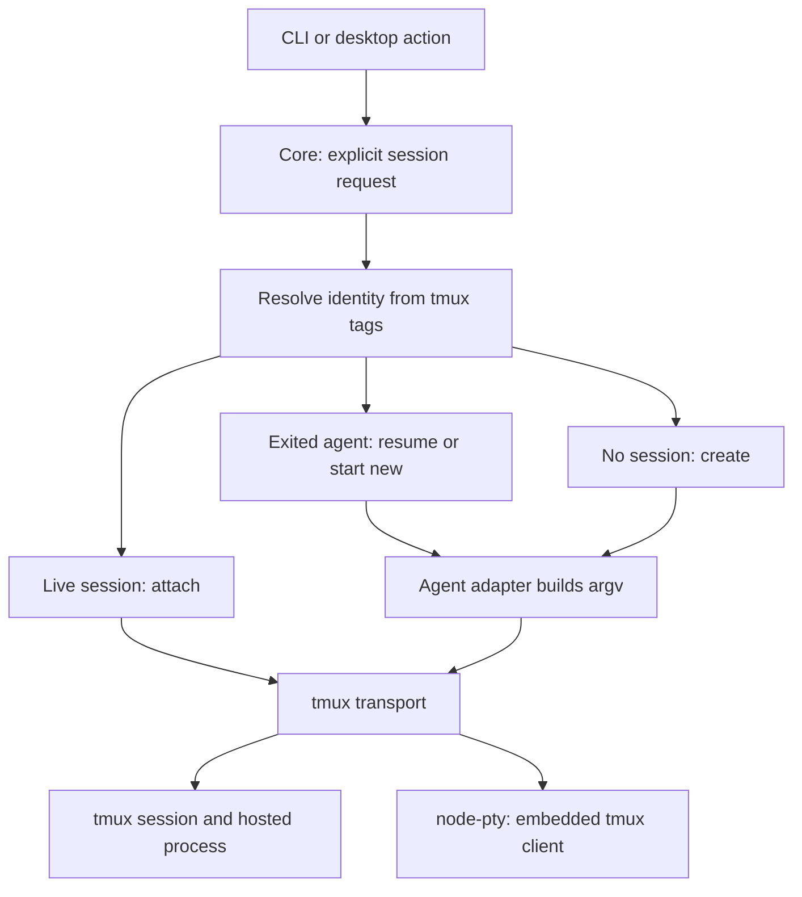

# Design decisions

Read the section relevant to the change. Area `AGENTS.md` files contain the
working rules; this document explains constraints that are easy to miss.

## Shared operations and entry points

Core owns sequences of Git, filesystem, PTY, config and provider calls. The
engine owns what both shells do with them: what to read and when, what to keep,
and who hears about it. App-core supplies React bindings; shells own rendering
and input. The desktop renderer cannot use Node APIs and accesses core's plan
through `@n10/core/plan`. Keep that entry browser-safe and the core/app-core
barrels separate.

The engine is a layer of its own because shared primitives did not keep the
shells converged. Both called the same provider, yet the TUI polled it from a
hook while the desktop read core's cache, with different refresh, overlap and
error semantics. Coordination written twice drifts however much it shares, so
it is written once, below React: `@n10/engine` depends on core, core may not
import it, and neither imports a shell or the React layer (enforced in
`eslint.config.mjs`). Each process creates its own engine services, so a TUI
and a desktop open on one repository poll independently.

Domain ownership and execution boundaries are specified in
[the engine plan](design/engine-domains.md). Config commands persist and re-read
before dispatching effects; React observes stable snapshots. The host cannot
import React bindings. No new worker or generic kernel is needed by these domains.

When changing shared behavior, compare both shells. Worktree removal is an
engine command over core’s guarded removal sequence; shells request a verdict
and present confirmation before executing that command. Agent findings publish through VCS publishers and core’s durable submission
ledger. A partial failure retains completed comments; an unanswered write is
reconciled before retrying.

A fresh worktree needs its own `npm ci`: workspace links and nested dependencies
must resolve to that checkout. Copying only another checkout's root
`node_modules` misses per-workspace dependencies. Typecheck before code edits.
Nx targets may be inline in package manifests or inferred by plugins; inspect
resolved configuration with `npx nx show project <name> --json`.

## Tmux sessions and transport

n10 requires tmux 3.2 or newer. Startup probes it and reports an installation
hint when unavailable; a stored `terminalBackend` field has no effect. Every
worktree agent and terminal tab runs in tmux. `node-pty` remains the low-level
connection used to embed a tmux client in the CLI or desktop terminal.

Core owns identity and agent policy. `session/open-session.ts` receives an
explicit worktree or terminal request, resolves tagged sessions, and chooses a
create, attach or restart plan. It validates a worktree's HEAD before touching
an existing connection. Only create/restart calls the agent command builder.
`terminal-tmux` executes that plan, allocates collision-free names, carries
opaque tags and observes native pane state; it knows no repositories or agents.
The registry owns local terminal rendering and activity. Launch preparation is
asynchronous; callers await registration before installing relays or focusing
terminals. Concurrent requests for one identity share preparation.

Desktop creates sessions from its session host, an Electron utility process.
Spawning a persistent tmux server directly from the Electron main process on
Linux leaks Chromium file descriptors into it, including profile locks. The
supported utility-process boundary isolates those resources, but not the host's
own: on Linux, node-pty's `forkpty` masters are not close-on-exec and tmux keeps
the descriptors it inherits. A server the host creates while it holds a PTY
master keeps that master open, and its attach client gets no hangup when the
host lets go. The host creates a server only when none is running, and so while
it holds no attach clients to one, which leaves a narrow race; nothing may rely
on a server it created holding none of its descriptors.

```mermaid
flowchart TD
  UI[CLI or desktop action] --> Core[Core: explicit session request]
  Core --> Resolve[Resolve identity from tmux tags]
  Resolve --> Live[Live session: attach]
  Resolve --> Exited[Exited agent: resume or start new]
  Resolve --> Missing[No session: create]
  Exited --> Agent[Agent adapter builds argv]
  Missing --> Agent
  Live --> Transport[tmux transport]
  Agent --> Transport
  Transport --> Server[tmux session and hosted process]
  Transport --> Client[node-pty: embedded tmux client]
```

Creation uses a detached placeholder while tags and `remain-on-exit` are set,
then replaces only that placeholder with the agent or shell. Restart refuses a
live pane: `respawn-pane` without `-k` and subsequent metadata writes share one
server command queue, so a losing concurrent restart cannot overwrite the
winner's agent tag. Attaching never builds argv or rewrites identity tags.

Tmux retains its server environment. Each launch explicitly supplies HOME,
PATH and the agent adapter's environment additions; do not copy the entire
process environment into command-line `-e` flags. `list-sessions -F` output is
tab-separated; `tmux -u` preserves separators under non-UTF-8 locales.

A dead pane carries less than it looks. `pane_dead` flips when the pane's file
descriptor closes; `pane_dead_status`, `pane_dead_signal`, `pane_dead_time` and
the retained `Pane is dead` notice arrive only once tmux has reaped the process,
which is a separate event. Short of CPU — a two-core CI runner, a loaded
laptop — tmux can leave the process unreaped indefinitely, so a pane reads dead
with an empty status and no notice written into it, permanently. The notice is
therefore not something a capture or a repaint can recover, and a missing exit
status is reported as code 0. Do not gate exit reporting on the status arriving,
and do not assert on the notice: an agent's own final output and the
application's own exited state are the signals that always exist.

Tests isolate HOME and the tmux socket, unset inherited TMUX, and validate that
the socket belongs to the fixture before cleanup. Kill fixture sessions
individually; never use `tmux kill-server` or the user's default server.

macOS and Linux are the supported platforms. Every launch goes through tmux,
which has no native Windows build, so there is no native Windows path; the old
`cmd.exe` branches in the agent registry (`shellInvoke`, `shellEnvRef`) and
their `/bin/sh`-does-not-exist-on-Windows rationale predate the tmux-only
launcher and are gone. WSL is untested and secondary — its tmux runs under
Linux, so it may work, but nothing here specifically supports it.

## Session identity shared with Orchestra

Names are labels; tags carry identity. n10 and the Orchestra skill's bash
scripts create ordinary tmux sessions using the same user options:

| Session user option        | Meaning                                                  |
| -------------------------- | -------------------------------------------------------- |
| `@orchestra-spawner`       | Creator, such as `n10` or `orchestra`                    |
| `@orchestra-repo`          | Canonical main checkout path                             |
| `@orchestra-session-type`  | `worktree`, `shell`, `agent`; `dir` is read as `agent`   |
| `@orchestra-worktree-path` | A worktree session's checkout: its identity              |
| `@orchestra-branch`        | Branch a worktree session was created for (task context) |
| `@orchestra-agent`         | Agent used for the most recent launch                    |

`dir` is Orchestra's name for an agent in a directory; n10 never writes it.
The shared names live in `session-identity.ts`. Creator/reporting metadata
survives attachment and restart; a successful new process updates its agent
metadata. Tags contain data, never arbitrary commands to execute. They live
only as long as the tmux session, and do not provide persistence after reboot.

Worktree lookup matches canonical repository plus canonical checkout path —
the physical path as resolved on the machine holding it (`pwd -P` there,
`realpath` locally). The branch never identifies a checkout: a `git switch`,
a rename or a restart keeps the session its worktree's, and a second worktree
on the original branch never claims it. A terminal lookup uses its actual
allocated tmux target. `session-resolver.ts` obtains one listing and applies
those rules for attach, discovery, liveness and cleanup. A session lacking a
spawner or recognized type is foreign; worktree sessions also require repo
and worktree-path tags, with no fallback to `#{session_path}` or the branch
(sessions are closed before an upgrade, not migrated). A familiar name alone never authorizes attachment or
termination. Duplicate worktree identities resolve to the oldest session;
extras are listed, never silently killed.

Labels are `<repo>-<branch>` for worktrees and `<directory>-shell` or
`<directory>-agent` for standalone terminals. Worktree labels use the canonical
main checkout's basename; terminal labels use their own directory's basename; `/`, `.` and `:` become `-`. A label longer
than 200 characters keeps its first 195 plus a four-digit hash suffix. Name
collisions add `-2`, `-3`, and so on, always from the original preferred label.
A duplicate-name race retries allocation without adopting the other session.
Core registry keys are JSON tuples: `["worktree", repo, canonicalCheckout]` or
`["terminal", actualTmuxName]`. Display labels never address registry entries.

## Discovery, restart and terminal lifecycle

The repository handle's engine session service owns discovery, adoption, session
rows, connection facts and launch/stop commands. Discovery reads the handle's live
worktree scope and supplies its explicit repository to tmux observation; core
never reads process cwd for this scan. Pure observation differences (`diffScans`),
tag identity, PTY activity classification and native launch/incarnation checks
remain core primitives. Output relays, pane dimensions and terminal-tab UI stay
in the shell.

Discovery polls worktrees and tmux and attaches through the shared launcher.
The original warm tmux 3.4 measurement (50 iterations) was 2.3 ms for
`git worktree list --porcelain -z` and 3.3 ms for `tmux list-sessions -F`:
two forks and about 5.5 ms per scan, or 0.14% of one core at four seconds.
Both are batch listings; fork count does not grow with the worktree count.
Tmux hooks are per-server global state: separate n10 instances overwrite each
other, while appended hooks cannot be selectively removed. Control mode needs
an existing session and participates in window sizing unless `ignore-size` is
set. Neither supplies a simpler independent observer. The non-recursive
filesystem watch is a latency shortcut; polling still discovers work when the
watch cannot be installed. Three adoption attempts, a scan apart, survive
transient Git locks without creating an endless deterministic spawn loop.

Recheck local connection state between
awaits so concurrent user actions cannot create duplicate connections. Failed
attaches have bounded retries. Failed local clients become eligible for
rediscovery without pretending their hosted agents exited.

A launch captures one repository handle and its config before awaiting worktree
resolution or fleet checks. A repository change before launch refuses the request.
Identical requests join; incompatible requests resolving to one checkout cannot
replace each other's PTY. Parking a repository on a switch stops its observation
timers and listeners but preserves every connected agent. Exit notifications update
session facts without spawning or reattaching.

How an agent's session ended decides what its tab shows, following what tmux
keeps. A process that exits or crashes leaves its dead pane (`remain-on-exit`):
the agent stays listed as exited, across repository switches, and its pane is a
read-only view of the final output with Resume. Nothing is sent to it, neither
keystrokes nor resizes. A session that is gone — n10's Stop, `tmux kill-session`
outside n10, a tmux server restart — leaves nothing to show: the backend reports
`processState.gone`, the engine releases the agent as it ends, and its card and
pane go, so the tab returns to its no-agent state (Launch Agent, the Overview).
An exited agent's dead pane is not polled, so discovery is what sees its
session go later, and releases it then. Another machine that cannot be reached
is neither: its agent waits to reconnect, said on its card (in warning, not
Running's green) and in the pane's banner. Two things notice. The fleet sees the
peer become unreachable: the engine's machine service tells core's machine registry,
which remembers it for sessions opened later and tells that machine's poller.
And a session listing on the machine that does not settle within a deadline
counts as a failed poll, for a transport that neither answers nor fails. Either
way the sessions attach nothing until the machine is back by every account (the
fleet says so, and a listing succeeds again), since beam can hand back a stream
to a peer that is not there, which would read as reconnected. Keystrokes and resizes that race any of these are dropped and
logged by the host, never thrown back to the renderer.

Agent selection uses explicit `agentId`, defaulting to Claude. The hidden fixture
runner requires `agentId: 'test'`; only that runner interprets `aiCommand`. No
command-prefix inference or migration fallback exists.

A tagged worktree process is running only while its pane is alive. Standalone
terminal tabs are found globally by their session type and tmux `session_path`,
on this machine and on each machine the fleet says is connected: every scan
asks those machines for their tmux listing through their executors, one
`list-sessions` each. A listing goes over the network and can take until its
deadline, so it runs beside the scan rather than in it: a machine that has gone
quiet holds back neither this machine's scan nor another machine's, its answer
is acted on when it arrives, and it is not asked again while one listing there
is out. The tags make a session a tab, not who started it, so a terminal
another machine's n10 or Orchestra started is listed like any other. Only a
listing that succeeded ends a machine's terminals; one that fails or times out,
or a machine the fleet does not list, ends none, and they wait to reconnect as
its agents do. A terminal launched while a listing was out is not missing from
it. Another machine's tmux cannot be asked synchronously, so
whether it still holds an exited agent's pane is its backend's last listing.
That backend stops polling a dead pane, so discovery's listing there is what
sees the session go.
An orphaned worktree session appears as an agent terminal when its tagged checkout
no longer matches a listed worktree; attachment preserves its original tags.
The process-wide engine terminal service owns directory/kind identity, launch
coalescing, retained agents, shell exit cleanup and native-target removal.
Restarts take directory, kind and machine from the retained terminal; request
fields cannot redirect it. Core tags a newly created standalone terminal with
its own directory, independent of the selected repository. Engine facts expose
connection health only for remote terminals.

Desktop adapts lifecycle callbacks into output relays, preserving relay sequence
numbers across restarts. Tab grouping, home-directory display and recent-repo
bookkeeping stay shell-specific. Restoring tabs does not move focus. Discovery
also removes retained tabs whose sessions were deleted outside n10.

Agent panes use `remain-on-exit` and retain final output. Resume uses the
recorded agent, regardless of the current project default: Claude and Codex
have explicit resume adapters. Their native continuation selects a conversation
in the working directory; the agent tag is not a conversation ID. Missing or
unsupported resume metadata produces an actionable error. Start-new choices
explicitly select an agent and a fresh conversation, including the configured
default. Shell panes close normally when their process exits.

Hosted-process exit and tmux-client disconnect are different events. Native
`pane_dead` drives exit state. Client disconnect retries attachment in the
transport while preserving the local registry identity and subscriptions.
Notify snapshots of listeners, because cleanup during one callback must not
prevent later callbacks from receiving the event.

Quitting n10 disposes local clients; tmux sessions keep running. Explicit
Stop, terminal close and worktree removal terminate the matching session,
including when no local connection exists. `removeWorktreeSession` owns shared
stop/remove/delete operations with the captured repository.

Worktree removal is one flow in core. `checkWorktreeRemoval` decides what the
user must confirm (clear, a live agent, work only `force` removes, or a refusal)
and each shell renders its own prompt from that verdict. The shell hands the
confirmed verdict back to `removeWorktreeSession`, which enforces it at
execution time: the prompt can stay open while an agent writes or commits, and
nothing it did after the check was judged. A `force` verdict names every risk
that applies, not the first, because the prompt is the user's whole picture of
what they agree to lose. `--force` is all or nothing, so removal forces only when
the verdict named a risk git guards with it (uncommitted changes, submodules),
and git's own test for submodules is the one n10 applies. Unpushed commits go
with the branch and never need it. A force prompt that runs `--force` says it
discards whatever is uncommitted when it runs, which is what `--force` does. The
checks fail closed: status is read whole, untracked files included whatever the
repository's settings, and a checkout git cannot answer for has `unknown
changes`, which only force takes. The verdict carries the repository (by its
common git directory), the checkout's canonical path and the branch's tip when
it was judged. Before the agent is stopped and again once it has, removal looks
for anything the verdict did not cover: another repository or checkout, a moved
branch, a rebase (which leaves the branch where it was until it finishes), a
checkout that left the branch, or a risk git guards with `--force` that the
verdict did not name, such as a file written into a checkout judged clean. Any
of them keeps everything. A branch that moves during the removal itself, or
that git will not delete, keeps the branch. `removeWorktreeSession`
returns what it did, and each shell says what was kept and why. The
merged-branch sweep uses the same guard. The engine worktree command
scans its repository’s discovery before and after core removal, so the shells learn of n10's
removals through `onChanged`, as they learn of `git worktree remove`: discovery
can only report the removal of a worktree it has seen.

Carry output sequence numbers across reattachment and restart so mounted
terminals accept subsequent chunks. Resize on fit and when `spawnedAt` changes,
even if the session name and dimensions are unchanged. `paneTerminalGrid`
measures the actual font and padding; the first fit corrects startup estimates.

The desktop draws terminals with xterm.js and its WebGL renderer
(`@xterm/addon-webgl`), because drawing is where a terminal's cost goes. For an
8 MiB burst of coloured log lines in 64 KiB chunks, the renderer's main thread
was busy 305 ms where wterm's was 1,080 ms. For 300 full-screen redraws of a
250×70 grid with a colour change every four cells, it was busy 1.0 s where
wterm's was 9.4 s, and held 59 fps where wterm reached 32. xterm's DOM renderer
falls between them: 469 ms, 8.0 s and 38 fps (Electron 44 on Intel Iris Xe,
medians of three runs). A WebGL context the browser takes away (memory
pressure, a suspend) disposes the addon, as its documentation advises, and
xterm carries on with its DOM renderer. The grid is fitted again then, because
WebGL rounds cells to device pixels and the DOM does not. Without a GPU there is
no WebGL2 and the DOM renderer is what runs: the e2e suite (`--disable-gpu`
under xvfb) and the visual baselines see that one, and `terminal-webgl.test.ts`
gives the window SwiftShader to cover WebGL and its loss.

Each terminal releases its WebGL context when it goes. Disposing the addon
removes its canvas but leaves the context alive until the canvas is garbage
collected (xtermjs/xterm.js#6068), and Chromium keeps 16 contexts in a page,
evicting the oldest past that. Every mount makes one (a switch, a pre-warmed
spare, a review pane, a launch's probe), so without the release a terminal kept on screen while
the user moved through some sixteen others lost its context and dropped to the
DOM renderer. The release is `WEBGL_lose_context`, the platform's own call, on
the canvases the addon added; `terminal-webgl.test.ts` keeps every canvas from
collection and checks the terminal on screen keeps WebGL through twenty mounts.

`FitAddon` is the only reckoning of a terminal's grid, and the grid takes the
whole pane: no padding, only the scrollbar the addon keeps clear and the part
of a cell left over at the right and bottom. The session terminal fits whenever
its pane's box changes, and the launch estimate opens a hidden terminal in the
pane, with the same options and renderer, and asks it the same question. A
probe on the DOM renderer would start an agent narrower than it is drawn,
because WebGL rounds cells down to device pixels; the WebGL probe costs some
100 ms for a window's first launch and about 16 ms after, and releases its
context like any other terminal. The terminal's boxes clip their overflow: a screen still
drawn for the previous grid would otherwise bring in scrollbars, which the fit
would then measure as lost room.

Keys go to xterm, except those the window must see. Ctrl/Cmd+C with a selection
and Ctrl/Cmd+V go on to the browser, whose copy and paste events xterm and the
paste handler act on; without a selection Ctrl+C is the interrupt. The palette's
Mod+K is taken in the capture phase, ahead of any terminal, so it opens the
palette and sends nothing to the PTY. Shift+Enter sends `ESC[13;2u`, the key as
the kitty and fixterms keyboard protocols spell it, where xterm would send the
plain Enter's CR, so an agent can take it as a new line rather than a submit.
xterm 6 implements neither protocol; the sequence is the one wterm sent. tmux
passes it on only to an application that asked for extended keys, as Claude Code
does (modifyOtherKeys), and re-encodes it: 3.4 hands `ESC[13;2u` on, while 3.5
and later ignore the request unless the server's `extended-keys` is on, and then
write the key in `extended-keys-format` (`ESC[27;2;13~` by default). On tmux 3.5
or later without `set -s extended-keys on`, Shift+Enter reaches the agent as CR
and submits. n10 leaves the user's tmux options alone; setting it itself is
[#335](https://github.com/notaharness/n10/issues/335). Pastes go through
`term.paste`, so they are bracketed when the application asked for it, and a
blocked terminal drops them as it drops keystrokes. Text loses its ESC bytes
first, so a clipboard cannot end the bracket early and type the rest as
commands. An image becomes a temporary file, whose path is pasted. OSC 8 links
open externally on a modified click (Cmd on macOS, Ctrl elsewhere).
`@xterm/addon-unicode11` gives emoji their two cells, which xterm's default
Unicode 6 tables do not.

Mouse tracking is xterm's own, any-motion (DECSET 1003) included, so an agent
that highlights what is under the pointer is told where it is with no button
held, and xterm shows the arrow rather than the I-beam while the application
takes the mouse. Selecting still works then: Shift-drag on Linux and Windows,
and Option-drag on macOS (`macOptionClickForcesSelection`), as iTerm and VS Code
have it. xterm has no Shift-drag on macOS, where wterm took Shift everywhere.

A terminal mounts from the host's snapshot of its session
(`services/session-relay.ts`): the tmux client's first output, then the last
512 KiB after it. tmux sets its client's terminal up once, in that first output
(the alternate screen, application cursor keys and bracketed paste) whatever
the application in the pane asks for, and undoes it only when the client
detaches or is suspended. It brackets pastes and encodes cursor keys for each
pane itself, and neither `refresh-client` nor a resize sends the setup again;
only a pane's own modes, mouse tracking among them, come back with a resize. So
the relay keeps that output whole ahead of the ring rather than reconstruct
modes from the stream, and starts over at each new client's first output
(`SessionBackend.onAttach`): that client's output, its setup and then a full
redraw, supersedes what came before. The head is the client's first read,
locally or over beam. tmux writes the setup, a few hundred bytes, in a write of
its own before the first redraw, so the first read holds it whole unless the
reader splits it; nothing checks for that. A first read that is something else
leaves the setup in the ring, where it can be dropped as before. A snapshot whose
ring has dropped output still bounces the grid so the application repaints the
screen the ring no longer holds.

## Desktop repositories and tabs

The host selects one repository and keeps the others it has read parked
(see Parked repositories); the tab strip can contain tabs from several.
Activating a foreign tab opens its repository through `useRepoFollowsTabs`, so
the sidebar, status bar and writes follow the tab in front.
Use canonical real paths for repository identity so symlinked paths cannot
produce duplicate tabs or disagree with Git and tmux names.

`TabsProvider` lives above the repository gate because the gate unmounts
`Workspace` when no repository is open. Keep one reconciliation step: `Workspace` sends `sync-items` to the pure
`tabs-model.ts` reducer. It handles stale identities, previews, new agents,
foreign sessions and terminals. Reconcile only the repo described by the update.
Agent auto-open history is repo-qualified; closing a tab must not reopen it on
an unchanged poll. Store titles on tabs because foreign items may be unavailable.

The tab strip's `DndContext` (`TabDragProvider`) lives above the gate for the
same reason. A tab is chosen on press, and choosing a foreign tab opens its
repository, which remounts what keeps state about one repository (the sidebar,
and the status bar and command palette under one key: siblings sharing a key
are left behind on a switch). The pointer sensor watching the press must
outlive the switch, and it lifts the tab by id.

Wrapped, full rows share their width and the last row keeps its tabs' own: an
end piece after the last tab grows far faster than the tabs, so only the last
row's room goes to it. The end piece is a pointer drop target only, resolved
to the last tab so the sorting strategy opens the end slot; collisions go by
pointer first because the nearest centre takes a tab on the row above for the
room at the end of the row below. A keyboard drag steps between droppables,
so it skips the end piece. Labels are cut by measurement because Chromium has
no start-side `text-overflow`, and branch names keep their end.

Sidebar snapshots carry their repository identity. Drop mismatched answers in
the renderer, and recheck identity between host awaits, to prevent rows from a
new repository entering the previous repository's tab state.

Use native menus and dialogs where the OS supports the interaction. The review
workspace has a navigation rail and one content pane. The diff owns its toolbar.

The editor renders two panes at most: the active tab's and one spare, hidden
and `inert`. A hidden terminal per open agent cost the renderer a terminal write
for every chunk every agent printed, and bought nothing under tmux: the
client's terminal accumulates no scrollback of its own, since tmux keeps the
history. One spare buys an instant switch for the tab the user is about to
open: the tab the pointer has settled on (a tab or a sidebar row), or else the
tab left last. Settled is decided as the hoverIntent jQuery plugin decides it
(`lib/tabs/hover-intent.ts`): the position is sampled every 100 ms, and a
pointer that moved under 6 px since the last sample has settled, so a hand
still drifting a pixel or two on the row counts, where it would keep
restarting a fixed wait. Panes are keyed by tab id, so pressing the spare's tab
shows the pane already rendered, and the pane it replaces becomes the
spare. A new hover replaces the spare rather than queueing behind it, and a
press on any other tab mounts that tab straight away; missing a pre-warm is
fine, a press that waits behind one is not. A pane let go of before its reads
came back leaves them running on the host, which cannot take a call back, so
until they have landed a new hover warms nothing: it is dropped, not queued,
and reads for panes nobody looks at never stack up. Leaving an element, or its
going away (a closed tab), lets its pane go. Tabs and sidebar rows are chosen
on the primary button's press, as browser and editor tabs are, so the swap
starts before the release; the drag sensor still waits for the pointer to
travel. A terminal watches its session while it is mounted
(`watchSession`): the host answers the ring buffer and then sends that window
the session's output, and nothing for sessions no window watches. Only a
terminal on screen shows its session (`showSession`), which holds core's
`showTerminal`, the same seen-signal the TUI's pane holds; a spare sees
nothing. Tab switches never detach or kill sessions.

Another repository's tab is held ready the same way. Its pane renders under a
`RepoProvider` for that repository (`EditorPane`), against what the renderer
holds for it: its `repoInfo` and sidebar rows, read from the host, which
answers for a parked repository as the engine does, from what it holds, and
refreshes behind it only once that is older than the parked TTL. The rows
read is what applies the rule (`handle.prewarm()`), so a hover asks the host
nothing of its own. Pressing the tab shows that pane while the repository
opens: `openRepoAsync` sets the cached `repoInfo` before the host answers and
reverts it if the open fails, and `Workspace` is not keyed by repository, so
the pane on screen is the one held, not a new mount behind a notice. A
repository the host cannot read (moved or deleted) shows `ForeignRepoPane`
with a retry; a failed open reads its info again, since a hover may have
cached it before the checkout moved. A parked repository's agent terminal starts
from the host's buffer for that session: a buffer is read by the session's
name, which is qualified by its repository, whichever one is selected. Kills
still refuse another repository's session.

Writes name no repository: the host applies them to the one it has selected.
The host opens a repository synchronously, and one window's requests reach it
in order, so a write sent after the open lands on the repository opened. A
failed open leaves a gap: the window still shows the repository it asked for
until the answer comes back and the revert is on screen. Every write waits on
`writable()` (`lib/data/repo-switch.ts`; mutations through the
`MutationCache`'s `onMutate`, and the direct review-draft and submit calls),
which resolves once the host has answered the open and, behind a failed one,
refuses until the repository returned to is on screen.

The renderer keeps what a repository's panes and sidebar are drawn from for as
long as the app is open (`RETAINED_KEYS`, `gcTime: Infinity`): a repository
left hours ago is shown at once and refreshed behind. Kinds keyed by a head or
a range (checks, diff manifests) go an hour after the last pane lets go of
them: each push leaves an entry nothing shows again. Diff text and worker
results keep the default collection, since they are large and read again
locally. Placeholders hold an answer only within its
repository (`keepRepoAnswer`), so a pane never shows another repository's
rows while its own load. A view with nothing held shows its loading state.

A tab that mounts again opens where the user left it: the pane they picked,
the diff's picked file and top line, and the walkthrough step. A pane they
never picked follows the landing rule again, so an agent started since shows.
The views are held per tab id in memory for this run, beside the tabs
(`TabViewsHost` in `lib/tabs/tab-views.tsx`), so they outlive a repository
switch, and dropped when the tab closes. Nothing is written to disk or to tmux:
a reload starts every tab fresh. A saved file or line no longer in the diff is
not guessed at: the view starts from the top.

Render errors are caught at three levels, each showing the error's message with
Try again (remount) and Reload window. The root boundary sits in `main.tsx`,
outside every provider, so no render error can unmount the whole tree into a
blank window. The workspace boundary sits below the providers, so a failed
workspace keeps the tab strip's state, toasts and a pending revocation, and Try
again remounts it with them. Each tab has its own, so one broken pane leaves the
rest usable. Reload window is there for a failure a remount would only repeat.

Vite's React plugin swaps a module in place only when it exports nothing but
components ([consistent components exports](https://github.com/vitejs/vite-plugin-react/tree/main/packages/plugin-react#consistent-components-exports)).
A module that also exports a hook or a context is re-run instead, which mints a
new context object while the provider from the old one stays mounted, so every
consumer throws. Contexts, hooks and helpers therefore live in modules of
their own (`lib/fleet/fleet-context.ts` beside `fleet-provider.tsx`) in new and
touched code; older modules that mix them are split when next changed.

Markdown paragraphs render as `div` when they may contain block images; the
host fetches protected images with provider auth.

A pull request tab opens on its Overview, whoever wrote it (`initialMode`): the
Overview is the pull request's main page, and Review changes leads on to the
diff. A running agent takes the pane instead, and a worktree without a pull
request has no Overview and opens on its diff. The Overview never calls a pull request ready: the list row has
no policies, required reviewers, conflicts or merge permission, so readiness
stays "not fully known" until those are read. Until a native requirement signal
is read, an approval or a passing check is an observation, and a failing check
or a holding verdict is a concern, not a block; only the provider's own
lifecycle (open, draft) is a verdict. The next step's button is the Overview's
way into the changes. It sits in the heading, at the end of the pull request's
actions, on the very spot where the diff's toolbar puts Finish review, so a
second click where the first one was opens the form: the heading spans the
pane, the Overview keeps its scrollbar's gutter, and both rows are measured
from the pane's top and end. Every verdict is filed as a review through one submit,
in the provider's own terms, never as a separate vote. The diff's Finish
review form files the summary, verdict and chosen drafts on the commit the
diff read (a chosen range's end), and approves only when that is the
provider's head. It is the only place a verdict is given, so every one is
given from the changes, where the reviewer has read them. Like GitHub's, the
form is a popover anchored to its button, not a modal: the diff still scrolls
under it, and the summary autosaves, so closing it loses nothing.

The Overview has no header bar; its heading carries the pull request's identity
and actions. Every other pane keeps the bar across the rail and the pane, so the
rail sits 40 px lower there than on the Overview: beside the rail, the bar would
lose the rail's width and its title or its details. Every other pane's bar has
"← Review", which goes up, never back through history: from the changes to the
Overview, and from the terminal, plan or walkthrough to the review pane last
shown (`backTarget`). The Overview is the top of the review, where Back leads,
so the rail lists neither it nor the comments: the conversation is the
Overview's, below the description, and the threads are the diff's. Its context
column leads with the reviewers, then completion. Below 720 px of workspace width
the rail folds with its own collapse control, and it comes back once there is
room unless the reader chose since (`rail-model.ts`).

The activity keeps resolved threads out of view until the reader shows them, by
the provider's own resolved state. What is hidden is fixed when the reader
arrives or hides them again: a thread resolved while in view stays there with
its new status, since the list never moves under the reader. A reopened thread
leaves the hidden set (`pruneHidden`), so resolved again, it stays in view.

Who must review is said only in the providers' own terms
(`pr-review-requirements.ts`). Azure DevOps marks each reviewer required or
optional, and its required-reviewer policies name identities. A reviewer is
listed by policy only where a policy that applies to these changes names them
and adds them as they are listed, required by a blocking one or optional by
another: Azure lists them because of that policy now. Anything else would be
reconstructed from overlapping ids. A policy that no longer applies may or may
not be what added someone, and a required reviewer no policy names may have
been added by hand or by a policy since disabled, so neither gets a reason.
Azure records who added each reviewer in the pull request's `ReviewersUpdate`
history threads, which the conversation read already fetches; reading the
reason from there is a follow-up. GitHub marks no one:
its rules ask for a number of approvals, for code owners and for teams by id,
and a request says only whether it went to a code owner. A GitHub reviewer's
requirement is therefore unknown, never inferred from their being asked, and
the Overview shows no one as required. The Reviewers list splits into the
required and, under an Optional heading, the optional only where the provider
states every reviewer's requirement and both kinds are asked
(`lib/review/reviewer-model.ts`); a requirement left unstated is read as
neither, so such a list stays whole. Grouped, a row adds only why they were
asked. Completion's Reviews row is
the provider's verdict and the approvals the rules ask for; GitHub's count is
the strictest of classic protection, as enforced on this account, and every
rule set. Who must approve, and why, is the Reviewers list's: hovering a
reviewer's standing shows every rule read that names them (`StandingRule`),
with its paths and whether the provider says it applies here. A rule naming
someone is the provider's own statement even where it is not why they are
listed, so the hover shows it while the reason stays unset. GitHub's rulesets
name teams by database id, which the detail read carries as `ruleId`. Its rules
read gives a ruleset's id but not its name, so the hover calls one "Ruleset".

Completion says "Waiting for your review" where the provider asks the viewer
for a review that would count (`asksViewer`). The checks read also reads the
detail for this: where it names the viewer, an optional reviewer's approval
counts only while a rule that counts anyone's is not met (Azure's minimum
reviewers, by its own evaluation), or while a required group has not approved.
Group membership is not read, so an optional viewer is kept for any waiting
group. Where the detail or the rules were not read, the request stands. On Azure the
detail shares the checks read's cached requests; on GitHub it adds the detail
query to each checks read.

The checks read (`getPullRequestChecks`) takes readiness from the provider's own
verdict, GitHub's `mergeStateStatus`, and explains it with the provider's facts:
`mergeable`, `reviewDecision`, each check's `isRequired`, and the base branch's
protection and rule sets. Core (`pr-readiness.ts`) adds no verdict of its own.
It is ready only where the provider says so and none of its details disagree,
and blocked where the provider says so or the pull request is a draft (its own
lifecycle). Anything else is unknown. A block that nothing read explains reads "Blocked by a
branch rule". The unresolved-thread count comes from the list, older
than the verdict, so it explains a block but never overturns a clear one. Anything that could not be
read is listed beside the verdict and does not override it.

Azure DevOps has no single verdict field. Its completion gate, in its own
words, is that "all required reviewers approved it and all required branch
policies are met", so the adapter (`pr-checks.ts`, `pr-policies.ts`) reads
exactly that: the required reviewers' votes, each blocking policy's evaluation
(an expired build's approval is not met) and `mergeStatus`. Blocked where any
of them stops it; clear only where every blocking policy is met on a merge that
succeeded; undecided otherwise. A draft is blocked by its lifecycle, as on
GitHub. Reviewer and comment policies are not listed as items, since the review
requirement and `MergeState.conversations` carry their verdicts; other
policies, such as work item linking, are listed with `kind: 'policy'`.

A worktree's tabs close when discovery reports its checkout gone
(`worktrees-removed`), whoever removed it, and not when its row leaves the
sidebar: a sidebar answer can belong to another repository mid-switch, and a
tab opened while its worktree is being created has no row yet. Discovery
abandons a scan whose git or tmux listing failed (a tmux listing that failed
would read as no sessions, ending every terminal and releasing every exited
agent for good), scans at once for any checkout the
worktree resource lists that it has not seen, and a reopened repository's
scanner starts from the last scan its previous handle saw. A worktree whose
directory was deleted counts as removed; checking its branch out again clears
the stale git registration. Git cannot tell a deleted directory from one on a
volume that is not mounted: both are `prunable`. A worktree on such a volume
reads as removed while it is away, and checking its branch out meanwhile
unregisters it. `git worktree lock` keeps git from calling a worktree prunable.

An agent still running in a removed worktree keeps its row and its tab, both
marked, until it exits or is stopped. Closing the tab would leave it running
unseen: its PTY stays held, so it is never offered as an orphan terminal. The
row comes from this process's PTY registry (`strandedSessionRows`): a live
local agent whose checkout directory is gone. It has no branch, since the
branch may be checked out in a new worktree, and is keyed by its session.
Discovery holds the worktree as `stranded`, not removed, and reports it gone
as soon as the agent exits or is stopped; it then ends the agent's tmux
session, whose retained pane has nothing left to show or restart in. It stays
stranded while its agent runs and git does not list it, even if something
recreates the directory, and discovery never ends a running agent. The
desktop tab shows the terminal with Stop agent; the TUI marks the row
`worktree removed` and its tab-bar entry `removed`, and the kill-agent key
stops it.

Optimistic removal drops a session row but retains a PR row with its session
fields cleared: the PR outlives its checkout. Status indicators combine CI and
review status; CI can worsen the result, but passing CI does not imply approval.
The status matrix and tab invariants are covered by model tests.

### Keyboard tab switching

The four tab shortcuts act on the editor tab strip, the one strip of tabs that
spans the window. The review workspace's rail (Sessions · Files) picks panes
inside one tab; it is a list, not a strip, so the chords always mean the strip.
`useTabSwitching` listens on the window in the capture phase and stops the
event, because xterm and text boxes otherwise consume Ctrl+Tab; it stands
aside inside a dialog and while Settings records a chord. Nothing else binds
these chords: the native menu has no accelerator for them and Electron has no
browser tab handling of its own. Plain Shift+Tab stays the terminal's (Claude
Code's mode switch), which is why the defaults all hold Ctrl.

The bindings are the TUI's `KeyDescriptor`s in the global config's
`keybindOverrides`, under `desktop.`-prefixed ids the TUI catalog never
resolves, written through the engine config service. Most-recently-used
cycling is a desktop pref (`tabCycleMru`, off by default so Ctrl+Tab matches
Ctrl+PgDn until asked): a walk snapshots the order on the first press and
commits when no Ctrl, Alt or Cmd is held any longer, or the window loses focus.
The order and a walk in progress live at module level in
`lib/tabs/tab-switching.ts`, and the hook is mounted in `App.tsx`'s gate, above
the workspace: a walk onto another repository's tab switches repositories,
which remounts the sidebar and the parts keyed by repository, and the walk
must carry on. A tab closed under
the walk keeps its place in the snapshot, so the next press goes to its live
neighbour in the direction pressed rather than back to the front.

Recording refuses a chord without Ctrl or Alt (it would be taken from every
text box and terminal), one of the app's own shortcuts (`host/app-shortcuts.ts`,
the list the native menu's accelerators and the shortcuts dialog are built
from), the page's own chords (find in diff, the tab lift) and another tab
action's. On macOS the menu holds Cmd, which no tab shortcut can, so only the
page's chords that answer to Ctrl as well are refused there. While recording,
the window ignores menu accelerators (`webContents.setIgnoreMenuShortcuts`), so
Ctrl+W reaches the recorder instead of closing Settings; Electron keeps that on
the webContents across a reload, so main releases it whenever a page starts
loading. The shortcuts do nothing while no repository is open (the picker,
connecting), leaving the order and any walk as they were. Nothing pushes config changes to the
renderer, so the bindings are read again when the window comes to the front
and when Settings → Keyboard opens; a read begun before a write is dropped.

### Orchestrator tabs

An Orchestra orchestrator's tab carries the Brain icon, and its players' tabs
stand under it rather than beside it. Which session is an orchestrator, and
whose players, comes from tags alone (core `discovery/orchestrator-groups.ts`).
A player's `@orchestra-orchestrator` of `tmux:<session>` names its session.
`claude:<id>` and `codex:<thread>` name a conversation, which the tmux server
cannot tie to a session. Orchestra closes that gap explicitly: `spawn.sh` and
`adopt.sh`, run inside tmux with the orchestrator's own identity as the
target, write it as `@orchestra-target` on the session they run in, and take
it off every other session of that server. That is how a terminal tab where
`claude` was run by hand becomes an orchestrator. n10 does not infer the link
from process trees, Claude's session registry or transcripts. Repositories
play no part: a player in another repository, open or not, or a dir player
in a directory of its own, groups like any other. The host lists this
machine's server only. So a `beam:` target (an orchestrator on another
machine), a player on another machine, and an orchestrator outside tmux
(Claude Desktop, a daemon) group nothing; such a player keeps its own tab,
and its launch context still shows where it reports. A session marked with a
target is an orchestrator with or without players. A fresh agent launch
clears the mark with the other supervisor tags.

The strip changes how tabs are shown, not what they are
(`lib/tabs/orchestrator-tabs.ts`). Player tabs open, close and activate as
before and stay in `TabsState`; the strip leaves out each one whose
orchestrator has a tab. A tab matches a session by its registry key, or, from
another repository, by repository and checkout. An orchestrator that is
another's player keeps its place, so its own players stay reachable. Where an
orchestrator tab's close button sits, it shows the count of its player tabs,
and keeps the X when it has none; middle click, Delete and its menu still
close it. The tab carries what its hidden players would show: it is the
strip's selection while one of them is active, and takes their unseen dot.
A hidden player's attention blink moves to the count, in the primary colour:
the tab's own blink shades toward the selected tab's background, so it would
not show while the orchestrator or another of its players is selected. Hovering the tab opens a Radix hover card listing the player
tabs as tab rows, with each tab's marks, repository band and hover-revealed
X. Resting on a row holds its pane ready as resting on a strip tab does, and
a press chooses it. A row's X is that tab's own close, with its confirmation
and agent stop. The list holds tabs, not sessions: a player whose tab was
closed is not listed and not reopened from here. The card is pointer-only, so
the trigger cancels Radix's open on keyboard focus, and the tab's native menu
lists the same players under a disabled "Players" heading (the contract's
menus have no submenus). The tab is one element from its first player to its
last, so the card's coming and going never remounts it.

Positional keyboard switching (Ctrl+PgDn/PgUp, and Ctrl+Tab without
most-recently-used order) walks the order the strip presents: each tab it
shows, an orchestrator's followed by its player tabs, which the strip notes in
`tab-switching.ts`. Close Others on an orchestrator's tab keeps its player
tabs, which the strip shows as part of it; from any other tab, and Close All,
they close like every tab.

## Plans and babysitting

Plan items are value snapshots taken when queued. Later comment edits or
resolution must not change them. `composePlanPrompt` follows `planRows` order so
item numbers match what the user sees. The renderer composes the delivered text
because it previews that exact prompt. Checkout injects into a live agent,
respawns an ended one, or creates a worktree and launches an agent.

`engine/babysitters` owns watches keyed by repository and PR, their polling,
remote-read freshness and delivery coordination. Core keeps the pure baseline
model, prompt composition and Git/session primitives. Desktop supplies the active
config handle, pane dimensions and output adoption; it holds no watcher registry.
The TUI has no babysitting controls. A parked repository retains its watch baseline
but cannot poll or deliver until selected again. Concurrent starts share one lookup;
stop, shutdown and worktree removal cancel pending starts before they create a watch.
Busy timer ticks are skipped; explicit polls share at most one queued follow-up.
Spawn completion names its captured repository even if selection changed while
launching. Shutdown stops watchers and detaches clients without killing agents.

The babysitter baseline is what the agent was told, not the latest observation.
Hold or delivery failures leave it unchanged. A new head or thread reply can be
news; the user's own latest comment is not relayed. Recovery from a reported CI
failure is news; an initial green result alone is not. An unavailable conflict
check is reported as unavailable, never interpreted as a clean result.

Worktree-removal suspension stops a watch and recreates it when removal is
refused or fails. That discards the delivered baseline, so the resumed watch may
re-brief findings the agent already received. A separate change should
park/resume the same watch and test
refused removal and late delivery together. It must retain the removal safety
verdicts and must not detach sessions on repository switches. See
[the suspension follow-up](design/engine-domains.md#babysitter-removal-suspension).

Batch updates after ten minutes of quiet or thirty minutes maximum, and deliver
only after the agent has been idle for thirty seconds. Start agents with `seed`,
not `continue-or-seed`, which may discard the prompt. Use `checkoutWorktree` for
an existing branch: inventing one from HEAD would send work to the wrong commit.

Pass `cwd` to every Git operation and check `live()` after awaits. Serialize
fetches through `sync/fetch-queue.ts`; invalidate reused refs when the head moves.
Use `sync/conflicts.ts` for both the badge and briefing. Checkout receives the
captured repository and configured worktree path. Check liveness immediately
before checkout as well.

Babysitters read the shared PR cache, distinguish unknown from gone, and require
consecutive absences before ending a watch. Resolve the provider per poll so
settings changes take effect. Desktop watchers are stored per repo, pause while
another repo is open, and stop when their worktree is removed. Push `spawned`
and `ended` events; other status is read through the sidebar. `onStatus` fires
on transitions, not timestamp-only changes. Timing overrides support tests that
assert the actual prompt received by a fake agent.

## Pull request caching and providers

Both shells read pull requests through the engine's list
(`createPullRequestList`): the TUI's `usePrData`, and the desktop host's
sidebar, babysitters and sync loop. The TUI holds a `watch`; the desktop's
demand is its renderer's sidebar poll.

- An answer is keyed by scope: repo path, provider, project and a credentials
  generation. Replacing any of them at the same path starts an empty scope, and
  a request out under the old one commits only there. Secrets never enter a key;
  `credentialsChanged` resets every provider's caches and bumps the generation.
- One request per scope. Reads join the request out; a forced read queues
  exactly one request behind it, which forced reads meanwhile share, so a slow
  answer never overwrites a newer one. A watch tick that finds a request out is
  skipped, not queued.
- `refresh` has the provider forget its per-row memo when that refresh's own
  request starts. Forgetting when the user asks lets a request already out
  write its answers straight back.
- A failure keeps the last good list with the error beside it and waits out the
  interval before retrying.
- A `gh` read is killed at `GH_READ_DEADLINE_MS` (30s; `execFile`'s
  `timeout`), so a hung read cannot hold the queue: the engine sees an ordinary
  failure. Mutations run without one; a killed mutation may or may not have
  reached GitHub.
- The engine resolves providers from persisted config. Config commands persist
  before invalidation, refresh and subscription notification. A settings edit
  forces a read without `refresh()`:
  a credential change has already reset every provider, and an interval edit
  should not cost a cycle of per-row reads.

GitHub uses authenticated `gh`; offline tests replace that executable on PATH.
Azure DevOps uses REST and a PAT. Provider tests use recorded anonymized
fixtures; desktop e2e uses an offline host preload. Extend those fixtures when
changing Azure behavior. Scrub identities and repository details from recordings;
keep real credentials out of fixtures.

Azure statuses are history. Group by context and choose the newest iteration,
date and id. `notApplicable` retracts a check without voting; missing state means
queued (`notSet`). Branch-policy build validation uses policy evaluations,
which this status path does not read.

Azure request budgets prevent per-PR polling from exhausting organization limits:

- Memoize settled CI against both source and target merge commits. Pending CI
  is reread first; comments are not keyed to commit identity.
- Separate the displayed answer from a result complete enough to memoize.
- Budget detail reads per cycle and order by last read, with id as a stable tie
  breaker. Age entries out instead of deleting visible answers on refresh.
- A missing row on a complete runs page means no build. On a truncated page or
  failed lookup, omit the row: it has not been resolved and must not be cached as none.

Babysitter thread reads use the provider throttle and TTL outside the list-cycle
budget. GitHub gets rollup and counts with its list query and needs no equivalent
per-row cache-reset methods. `request-budget.spec.ts` checks request counts.

## Parked repositories

`engine/repositories` keeps a handle for every repository opened or read this
run, and selects one. Selecting another parks the one before: its discovery
stops, and its config, worktrees, session rows, review reads and pull request
list stay for the life of the process. A repository left hours ago is still
worth showing at once, and nothing a person opened in one run is enough to
need a bound. `get(path)` hands out a handle for reading without selecting it.

A parked repository's reads are stale-while-revalidate with one threshold,
`PARKED_REPOSITORY_TTL_MS` (an hour, `kernel/read-freshness.ts` applies it).
Inside it, they answer what is held and read nothing; past it, they answer
what is held and start a read behind it; with nothing held, they read and wait,
as the selected repository does. The selected repository keeps each
resource's own TTL. `prewarm()` applies the same rule to what a repository's
panes all need: its worktrees and session rows, and its pull request list
(`refreshInBackground` with a `maxAge`). The pull request list never evicts a
scope a repository shows; past its bound it drops only scopes a config change
left behind. Within one repository, each review resource kind still holds 32
entries, never evicting one observed or loading. A refresh behind a parked
read that fails does not fail the next read: it is answered with the data, and
the error stays in the snapshot for observers.

Two diff reads are exempt. A checkout's live diff keeps its one-second TTL:
agents in a parked repository keep editing, and it is a local Git read. Patches
are let go when their repository is parked (`reviews.park()`): each may be as
large as the 64 MiB patch ceiling and two are held per repository, so keeping
them would let every repository visited in a run hold up to 128 MiB in the
host; the renderer keeps the batches it shows, and reading one again is a
local Git read between fixed commits. Manifests and listings, which are small
and what a pane needs first, stay.

The desktop host answers a pane's reads for the repository the pane belongs
to, open or parked, and records a visit there too: it is bookkeeping beside the
history read, not a provider write. The sync loop runs only for the selected
repository, since it fetches and removes merged worktrees, so a parked
repository's merge and conflict marks are the ones its loop last reported, not
loading, until it is opened again; meanwhile its pull request list can move on
through `prewarm()`.

Only the selected repository takes writes; a parked handle refuses them before
any work: review replies, resolutions, submissions, mention searches, review
draft saves and discards, agent findings' edits and publication, worktree
creation, removal, rebase and fetch, config writes and session launches. The
review writes and launches check again after their awaits, before the provider
or tmux is asked.

## Review read ownership

The repository handle owns `engine/reviews`: thread, description, detail, checks,
conversation and Git diff resources. Reads coalesce, ordinary callers reuse fresh
answers, and a forced read queues one follow-up. Provider data and branch resolutions
are fresh for 30 seconds; live checkout diffs for one second. A failed read retains
same-scope data and permits immediate retry. Explicit thread invalidation (including
opening a composer) forces an engine read. Account/config changes clear data
and reject obsolete publication. Reads answer whichever repository they are asked
of, selected or parked; writes refuse any but the selected one (see Parked
repositories).
The desktop RPC rejects a failed answer and its query cache retains the last good
view. TUI hooks subscribe directly. Frontends own visibility and error presentation,
not another freshness policy.

PR list changes expire the repository’s review reads so a new head, check or
review cannot remain hidden behind their TTL. Same-scope invalidation retains the
last successful answer. Manual remote refresh invalidates provider reads after
the provider memo is cleared.
Both shells issue reply, resolve and verdict commands through the engine. A
confirmed thread change patches its unchanged base snapshot or invalidates a raced
snapshot, and expires
related checks/conversation reads; resolve and review-submit commands refresh the captured
repository's list. Draft save/discard/submission and mention search share the same
identity context.

Git metadata parsing is a core operation with explicit cwd. The engine refreshes
source refs when the PR head differs, shares the core target-fetch queue's five-minute
freshness, and pins both commit IDs before reading file lists or patches. Full patches
and per-file patches use the same comparison. Resolution caches expire on list
changes; manifests and patches are keyed by exact commit IDs, with no time expiry.
A manifest carries the comparison just resolved, never the one its listing was
first read for: a target can move past the same merge base.
The TUI carries its displayed manifest's refs into each patch request. Config
identity checks compare disk values without invoking reload or publishing effects. Metadata overflow is an error, never
an incomplete file list. Resource maps evict idle entries without evicting observed
or active reads. A patch map keeps the two last finished reads beside those in
flight: the renderer holds what is on screen, and each patch may reach the
ceiling.

No worker is added for orchestration or subprocess waits. Desktop diff parsing and
syntax highlighting remain in their existing renderer workers; the final profiling
slice determines whether host CPU work warrants another boundary.

## Agent findings and publication

`engine/reviews/agent-comments.ts` owns finding resources, edit/delete policy and
filesystem observation. The common Git directory identifies the repository, so
linked worktrees share findings while equal PR numbers in different repositories
do not. Files live under `~/.n10/reviews/<repository hash>/pr-<number>`; no legacy
unscoped path is read. The standalone utility resolves this identity through core.
Only observed resources attach a nonrecursive watcher; the last observer
leaving closes it.

Agent publication uses core’s draft submission machinery in the separate
`~/.n10/agent-review-publications` store, keyed by provider repository, PR and
account. Human writing stays in `review-drafts`. Every network write goes through
`VcsProvider.publishReview`; review-comments contains storage and formatting only.
Selected findings are submitted as one native review with one verdict. A partial
retry resumes the same durable submission and skips confirmed findings; the
error reports how many findings were posted.
Completed findings stay posted after a later failure. An uncertain outcome retains
its ledger and account binding, blocks edits, and is reconciled on retry. Restarted
processes can retry findings left posting without inventing a second write path.

## Guided review

The review agent writes a guided review beside its draft comments: a short
slideshow that walks the reader through the pull request before the diff.
It is stored as `guide.json` next to `comments.json`, one per repository and
pull request, so it shares the findings' identity and every linked checkout
reads the same guide. Running `n10 util add-guide` again replaces it.

The agent learns the format from n10, not from a plugin. `n10 util guide-help`
prints the authoring instructions and the review prompt points to it. Every
agent n10 runs can call a command, so Claude, Codex, Gemini and Copilot need
nothing installed, and the instructions ship in the same release as the
renderer that draws them, so the format they describe is always the one
shown. A skill in `notaharness/plugins`, offered through an install prompt
when it is missing, was considered and deferred: it makes a feature depend
on per-agent installation and lets the instructions drift from the renderer.

Consistency comes from structure and limits rather than from a long
rulebook. The agent writes JSON with a fixed set of primitives: markdown
prose, a picture beside it (a mermaid diagram or a few lines of code), or a
before and an after. `add-guide` validates it and stores nothing on a
failure, naming what to cut: 2 to 8 slides, a one-sentence lede (160
characters), a 200-character summary, 400 characters of body prose (fenced
code does not count), at most four files per slide with their lines in
order, one picture per visual with a 120-character caption, and diagrams in
the visual fields, not in the body. Agents given looser limits wrote accurate but
dense slides that read as a document, not a thread. The reader opens on a cover
n10 draws from the title, summary and slide titles, so the titles are the
outline. `add-guide` records the commit checked out where the agent ran;
the desktop says when the pull request has moved past it.

The guide hands the reader on to the review rather than standing beside it.
A place a slide names opens the diff at the agent's draft comment when one
covers those lines (`draftAt`), so a suspected problem reads as code with
its comment, through the comment navigator's existing jump, and otherwise
at its first line (the diff's `jumpToLine`, which resolves rows through
the same line map the tab's saved place uses); and the last
step opens the drafts walkthrough when there are drafts. `guide-help` has
the agent write its comments first and name their lines on the closing
slide, which ranks suspected problems, intended tradeoffs and what was not
verified.

A diagram on its own spans the slide under the words at its natural size,
labels at 16px, and is never shrunk to fit a column or a height; a tall
flowchart squeezed beside the text was unreadable at 1600×900. Before and
after sit side by side, so `guide-help` asks for those narrow (TD) and for a
lone diagram wide (LR), each one idea of at most eight nodes.

Only the desktop asks for a guide (`buildReviewLaunchRequest`'s `guide`
option), and only when the review launch dialog's **Guided review** box is
checked: a guide costs the agent time, and some reviews do not need one.
Unchecked, the prompt says nothing of a guide. The box starts checked and
remembers the last choice in the desktop prefs (`guidedReview`), as the tab
strip's overflow does, rather than in Settings: it is a choice made at
launch, not a setting. The choice travels on the launch request
(`ReviewLaunchRequest.guide`, required); the host does not decide it. A
review launched unchecked leaves any earlier `guide.json` in place: only
`add-guide` replaces it, and that guide still describes the commit it was
written for. Once the pull request moves past that commit the guide says so;
at the same commit it shows as current, and a place it names opens whichever
draft comment now covers those lines. The TUI cannot
show slides, so its reviewer does not spend time on one.

Diagrams are agent output, so mermaid draws them at its `strict` security
level with HTML labels off. n10 adds the theme, fonts and HTML labels to
mermaid's own `secure` keys (the security level and the edge cap among
them), so a diagram's `%%{init}%%` changes none of them. The theme comes
from the design tokens. A diagram mermaid cannot parse shows its source;
mermaid's own error drawing is suppressed, so none is left in the page. Mermaid loads on the first diagram; nothing else in the renderer
needs it. The desktop pins the website's version, so the workspace holds one
copy.

## Diff generation and rendering

PR diffs compare commits so review anchors remain stable. Bare worktree diffs
include index, working tree and untracked files. Build untracked patches without
`git add -N`: displaying a diff must not modify the agent's index. Poll active
worktrees; do not recursively watch a checkout and exhaust inotify on dependencies.

Whole-file context supports comments on unchanged lines; fold it in the
viewer. A pull request's diff asks for Git's largest context, so no file is
cut short; worktree diffs still ask for 99,999 lines. Stream Git output with
`runGit`, which preserves partial output and reports truncation rather than
discarding the entire buffer on overflow. This read transport kills a child
after 30 seconds and rejects, releasing its resource lane; mutations use a
separate transport and do not inherit this deadline.

Bound worktree diffs before expensive reads. Use `lstat` for symlinks, churn to
bound deleted files, and exclude both paths of an oversized rename. A content-free
rename only needs headers. Size untracked files before reading, respect Git ignores,
and render symlinks as mode-120000 patches without following them. Trim total-output
overruns at complete file boundaries. The PR path retains files because review
comments depend on them. Git-backed regression cases live in
`worktree-diff.integration.spec.ts`.

A PR diff resolves the provider's head and target to commits and never
substitutes a local branch for a commit the clone lacks. Missing commits or
branches trigger a real fetch, since an earlier one evidently missed them; a
target the caller did not pin is fetched at most every five minutes. The
engine's review reads own this for both shells: the TUI's file list is the
same manifest, and its file view the same patch. Both
reads pin git's output format against user config: no copy detection, which
would present new code as a small edit of its source; every submodule change;
fixed prefixes. The provider list polls, so the revision on screen is pinned
per repository and pull request outside the pane, which unmounts in a
background tab: head, target branch, and the target commit it resolved to, so a
re-read after the cache expires resolves the same way. A closed tab reopened
comes back at that revision with anything newer offered, not swapped in.
Choosing what a new visit compares against belongs to revision selection.
Loading the newer revision reads its file list and first batch before moving
the pin, so a failed load leaves the diff in place. Only a pin whose read never reached the screen
follows the provider without being asked: there is nothing to keep.

A PR's file list comes from the manifest, never from a patch that may have been
cut, so every file is listed however big the change. Bodies are read in batches
of at most 4 MiB or 100 files, in list order, once the list settles with them in
view; the first batch reads at once, so a small PR is read at once. A file
showing only its collapsed header is read once opened. Deleted files, renamed
or copied ones, and the rest batch apart: Git pairs renames among the paths a
read names, keeping a few candidate sources for each file, so a subset can pair
files otherwise than the whole-PR manifest did; a small PR that deletes or
renames files takes a read per kind. Each read is checked against
the manifest, and a file paired otherwise is read again by its own paths. What
stays read is bounded — the first batch, those on screen, the last four that
left the screen or were asked for elsewhere — and at most two reads run at
once; a dropped read is cancelled or released, and read again when reached. A file past 2 MiB is read only when
asked, by its changes or whole, so one file cannot hold the rest back. A file
cut from a shared read is offered a read of its own; only a lone read past the
ceiling is "too large". Counts Git never gave stay unknown rather than zero,
and the Files header lists what cannot be shown. A jump into files not yet read
stays pending while their bodies land above it, until no read is in flight and
no file on screen waits for one — a jump lands before its file's batch is asked
for — or the reader scrolls. Single-file mode hands the same list one section: fold,
Viewed and comment state are shared, not copied, and a switch keeps the row on
screen. It still virtualizes its section, so it is not yet the unvirtualized
reading surface assistive technology needs; that belongs to keyboard and
navigation work (I11).

A changed binary image shows its two sides in place of git's notice. Each
side's frame has its final size before anything is read, and the row is
estimated at that size, so an image arriving moves nothing below it. A side
is read by the manifest's blob id, which names its bytes forever, and its
format is decided by its leading bytes, not its name: a renamed or misnamed
file shows as what it is, and anything but a raster format the renderer draws
is refused — SVG included, which is markup that can carry script. A side
crosses IPC as a data URL, so one past 10 MiB is not read, and the renderer
takes that ceiling from core's browser-safe entry so the two cannot drift.
The renderer caches what it shows and drops a side 30 seconds after no frame
shows it; the host keeps only the last two reads, for a quick re-read and to
join reads in flight, rather than every image the reader scrolled past at up
to ~13 MB each. A side is read once its frame comes within 200px of its scroll
container (the diff's or the review stepper's, whose clipping would otherwise
swallow the margin) and the scroll has rested 150 ms with it there, as body
batches wait for the list to settle: a drag through forty screenshots must
not read forty blobs. A worktree's diff has no blob ids and shows no images.

Two sides are compared side by side, in turn in one frame, or split in one
frame by a divider. The choice sits on the image's row and is the last one made
there, kept as the `imageCompare` desktop pref, like the tab strip's overflow:
it holds for every image row after it and across restarts, and Settings does
not list it. An added or deleted image has nothing to compare, so its row
offers no choice and keeps its one side beside the other's absence; the row is
sized by its side count, since only two sides carry the choice's line. Stacked
sides each lie on their own checkerboard, so the side on top hides the one
beneath even where it is transparent, and both stay mounted, so neither has to
decode again when it comes back. The toggle swaps sides every second and holds
still under `prefers-reduced-motion`, where a button flips it. The divider is
Radix's slider thumb over the whole frame: pressing anywhere moves it there,
dragging works by mouse, pen or touch (`touch-action: none`), the keyboard
moves it once focused, and it reads as a slider with its position. The thumb
is as thin as the line, so Radix's keep-in-bounds nudge, which shifts a thumb
by up to half its width near the ends, cannot move it off the edge it reveals.

A pull request's history is compared at exact commits, never at whatever a
branch holds now. The provider's record — GitHub's commits and force-pushes,
and the latest review the account it answers as submitted — is read from the
recent end; a history longer than one page, or with an event GitHub would not
resolve, says it is incomplete, and a review read as another account than the
one n10 acts as is not offered as the viewer's. GitHub sends each reply to a
thread as a review of its own, with one comment, so a `COMMENTED` review with
no summary and one reply is not counted as a review; one reply submitted as a
whole review looks the same and is not counted either. When the newest review
names no commit, or the reviews read do not reach it, the last review is
unknown: an older one never stands in. A range between two revisions fetches
each missing one by id and otherwise names it as unavailable. It reports
whether the later revision builds on the earlier, and whether the target's own
changes came in between, since a rebase or a merge of the target makes "since
your last review" include them; when either revision shares no history with
the target, it says it cannot tell. The reader's visits are kept outside the repository per account and pull
request. "Since your last visit" is the last visit before the current one, and
the renderer names the visit: looking again or refreshing within it must not
move the baseline, a new visit must, and a first visit has none rather than
one made up. A force-push can leave a reviewed head reachable from nothing, so
the kept visits, the frozen baseline and the last reviewed head are held by
refs under `refs/n10/retained/`, one set per account and pull request,
replaced whole on each visit. Refs there are real refs: `git log --all` shows
their commits and `git push --mirror` publishes them. Nothing yet lets them go
when a pull request closes.

File-tree collapse state follows each file's content revision, not poll timing
or churn counts. Ignore temporary empty snapshots; unchanged snapshots preserve
state. Open ancestors only for new or changed files.

## TUI, browser bridge and packaging

Ink passes `TerminalEmulator` ANSI through `<Text>`; raw stdin forwards to the
PTY. Strip CI-related variables when spawning the interactive TUI. The serve
target sets `TSX_TSCONFIG_PATH` for automatic JSX transformation.

Selecting a sidebar row remounts `MainTabBody`, which is keyed by the selected
item, and Ink subscribes `useInput` in a passive effect. Until that effect runs,
a key still reaches the previous body's handler and acts on the old selection.
Ink 7's `useEffectEvent`-based `useInput` closes that window for re-renders but
not for a remount. Tests that act on a new selection wait for the remounted
pane's `(loading...)` placeholder to clear first (`active-tabs.test.ts`).

The wterm host keeps the PTY alive across WebSocket reconnects and replays a ring
buffer. Use one build script for server and client to avoid output-directory
cleaning conflicts. Playwright and Nx must agree on artifact output paths.

The bridge's browser client draws n10 with `@wterm/dom`, pinned to an exact
version. For pasted images in the desktop, the host chooses the temporary-file
suffix from its own MIME table and the path is pasted into the PTY.

Comment images use _virtual_ kitty placements (`U=1`) written out-of-band
with `process.stdout.write`, the precedent being `apps/cli/src/utils/window-title.ts`;
`CommentProse` then renders U+10EEEE placeholder rows as ordinary Ink `<Text>`,
clipped to the card interior so Ink never draws a truncation `…` over the image.
Each distinct url is fetched and decoded once. Kitty loops animated GIFs natively
(`a=f` frames plus `a=a,s=3,v=1`, no ongoing traffic); ghostty lacks `a=f`, so
n10 re-transmits frames on a chained timeout (≤120 frames, ≥50 ms per frame,
≤3 concurrent) while a reviews pane shows, and `N10_GIF_ANIMATION=off` keeps a
static composite. Image download and decoding live in `libs/image-loader`, the
protocol in `libs/kitty-graphics`.

Mouse tracking (`?1000h`) is refcounted across consumers because the enable and
disable writes are global to the terminal; batching every SGR report in a stdin
chunk is what makes a fast wheel spin scroll by more than one line.

For release preparation and global-install constraints, see
`.agents/skills/publish-beta/references/packaging.md`.

## Machine integration decisions

Wiring beam into n10: remote tmux, the desktop's client of the beam
daemon's control socket and the UI's gating. Code cites these as
`decisions.md D<n>`. beam itself is a separate project
(`github.com/notaharness/beam`) with its own spec.

| #   | Decision                                                                                                                                                                                                                                                                                                                                                                                                                                                                             | Why                                                                                                                                                                                                                                                                                                                                                                                                                                      |
| --- | ------------------------------------------------------------------------------------------------------------------------------------------------------------------------------------------------------------------------------------------------------------------------------------------------------------------------------------------------------------------------------------------------------------------------------------------------------------------------------------ | ---------------------------------------------------------------------------------------------------------------------------------------------------------------------------------------------------------------------------------------------------------------------------------------------------------------------------------------------------------------------------------------------------------------------------------------- |
| D2  | A session's or terminal's `machine` is `'local'` or a beam `peerId`, and n10's registry keys gain a machine segment whose local value is `local`.                                                                                                                                                                                                                                                                                                                                    | Every id belongs to the machine it lives on, so two machines may hold the same session label or worktree path. A `local` segment leaves existing local behaviour byte for byte unchanged while making a remote entry unable to collide with it.                                                                                                                                                                                          |
| D3  | One session poller per machine, not per backend: one `tmux list-sessions -F …` on a ~1s interval, fanned out to every backend subscribed to that machine.                                                                                                                                                                                                                                                                                                                            | A remote backend polling `tmux display-message` per session the way `TmuxBackend` does locally would cost one network round trip per session per half-second. Fanning one call out costs one round trip regardless of how many remote sessions are open.                                                                                                                                                                                 |
| D4  | A remote session's `connectionState` (the `pty` stream's health) and its `processState` (what the D3 poller last reported) are driven by two different sources.                                                                                                                                                                                                                                                                                                                      | A dropped connection must never render as the agent having exited. They are different failures with different remedies, and one source cannot tell them apart.                                                                                                                                                                                                                                                                           |
| D5  | Remote tmux runs through a `MachineExecutor` seam — the same argv this code would run locally, handed to something that runs it elsewhere — rather than a second remote implementation.                                                                                                                                                                                                                                                                                              | The plan is the same plan; only the execution moves. One seam keeps local and remote from drifting, and the interface is declared locally rather than imported because `@n10/core` depends on `libs/terminal-tmux` and not the reverse.                                                                                                                                                                                                  |
| D8  | With only this machine in the list, nothing this feature adds renders beyond Fleet and its entry points: no machine prefixes, and no `machine`/`launchId` fields in requests.                                                                                                                                                                                                                                                                                                        | Most users never join a fleet, and they must see no trace of the feature — request payloads and background cost included. The gate is one predicate (`hasPeerMachines`) so every surface answers it the same way.                                                                                                                                                                                                                        |
| D13 | The desktop itself is the mailbox subscriber (`msg.subscribe` on its own control connection), and `msg.ack` means "the pane or the Claude inbox received the text". Anything else is `msg.defer` with the reason.                                                                                                                                                                                                                                                                    | The desktop already reaches every pane and inbox a report lands in, so it is the only thing in a position to ack honestly. A subscriber holds one envelope at a time, so each is settled at once; a target with no live connection is deferred and retried by a later subscription, and a refusal stays deferred and visible until dismissed.                                                                                            |
| D14 | The relay resolves an envelope's target against this machine's own registries, never the envelope's say-so, delivers only for a sender granted `all` (D17), caps its size and strips control characters first.                                                                                                                                                                                                                                                                       | This is the boundary at which a peer's bytes become input to a local agent. The check belongs at the edge that owns the consequence, rather than resting on an assumption that some layer below already made it.                                                                                                                                                                                                                         |
| D15 | The desktop uses a beam daemon already running and leaves it on quit. Otherwise it starts one with `--exit-with-parent`, and on quit stops it through the child: its stdin closed, then a kill.                                                                                                                                                                                                                                                                                      | A daemon started from the CLI or a service is not the app's. The app's own stops with it, crash included, so this machine leaves its peers' lists. Unenrolled, a daemon serves only its socket (beam docs/02): D8's cost is one idle process.                                                                                                                                                                                            |
| D16 | Plain `n10` opens the desktop, `n10 --tui` the TUI, `n10 util` the review utility, all one package. The desktop's local sessions still get `n10` and `beam` from a directory first on their PATH; the `n10` there runs `util` with the app's own code and forwards the rest to the next `n10` on PATH.                                                                                                                                                                               | One package with one executable cannot conflict with itself on install, and a TUI user never has to download the Electron binary. A session's `n10 util` must work where no `n10` is on its PATH (a dev build, `npx`) and match the running app when a global one differs, and a dependency's executable, beam, never reaches the PATH. The app's Electron runs the shim as Node, so nothing else is needed. beam stays its own command. |
| D17 | Delivery into a session, pane or Claude inbox, needs the sender's grant here to be `all`; `msg` is the mailbox alone. A `claude:<id>` target then reaches any live Claude session registered with that id.                                                                                                                                                                                                                                                                           | An `all` peer can already run anything here through `beam exec`, so typing into an agent gives it nothing more; a `msg` machine, one that should only report (beam docs/01), could otherwise start work through an agent. Nothing local says which Claude session supervises remote players, and a player's tags are its machine's say-so.                                                                                               |
| D18 | A path named on this machine reaches another `~/`-relative when it is under this machine's home, and unchanged otherwise. Commands run in the far side's home and report the directory they found: `git rev-parse --show-toplevel --show-prefix` for the repository's clone, which must be that directory's own repository, and `cd -P` then `pwd -P` for a terminal directory. A remote worktree lives in that clone. Transport and Git failures reach the user in their own words. | Each machine's user has their own home, so an absolute path from here names nothing there. beam resolves `~/` against the accepting machine's home (beam docs/04); the far side's answer is the only canonical form of its path, and a missing clone or directory fails by name instead of starting tmux somewhere else.                                                                                                                 |

## Repository scope

`engine/repositories` owns canonical identity and the open sequence: validate,
fill missing project configuration against that explicit checkout, configure
worktree paths, then create or reload its config handle. Failed validation preserves
the active scope; nested directories and aliases resolve to Git’s toplevel.
The config service derives repository/provider/viewer metadata and publishes
changes; repository selection has no second metadata store. Core supplies
filesystem validation and resolver operations. Desktop chooses its startup repo
and keeps recents; the TUI opens its requested checkout before mounting React.

Repository detection, worktree operations, session commands and plan delivery
receive captured paths and repository handles. Plan delivery validates the
repository lifetime before each effect.

## Shared remote sync

One engine service runs the complete fetch, merged-branch sweep and conflict
read for a captured repository. Config’s sync revision invalidates an active
pass and rearms its timer; auto-delete changes count as a revision so disabling
it cancels a pending sweep. Timer ticks skip busy work. Explicit refreshes join
one queued follow-up, and repeated start calls preserve the existing schedule.
Provider errors retain the last successful badges and timestamp while
publishing an error. Shells render typed notices and observe loading state.

A failed fetch preserves the last successful fetch timestamp and publishes a
plain-language error. Provider-based merged detection and conflict reads continue
using local Git data. Automatic deletion still requires core’s guarded local
verdict, which refuses removal when it cannot establish safety. Worktree changes alone
do not trigger a fetch; both shells refresh badges on the configured sync
interval or explicit refresh.

Cancellation is checked between reads and before guarded removal. A completed
removal always emits its repository-qualified notice, even after cancellation.
Repository switches can start another service immediately; stale reads cannot
publish or start removal. Shutdown cancels future work and awaits removals
already underway. It does not put a deadline on a Git mutation. Desktop detaches terminal clients
and stops its daemon while removals finish. The TUI announces a shared three-second
grace period for automatic removals and manual operations, then detaches and exits
even if an operation is still pending; this shell exit bound does not cancel or
retry a mutation. Both manual and
automatic removals go through captured-repo engine commands, with core retaining
the stop/remove/delete safety checks. Desktop supplies repo-qualified babysitter
ports; a retained checkout resumes watchers only while its repo is selected.

## Repository-scoped worktrees

Repository handles own `WorktreeService`. A read shares the resource's active
request or a snapshot fetched within one second; an explicit refresh during a
read joins one follow-up. Failed Git reads retain the last good lists with an
error. Desktop RPCs reject a failed refresh so the query layer reports it;
TanStack Query keeps its prior successful sidebar data, and Workspace renders
that data while toasting the error. A first failed read has no prior rows.
Successful commands refresh the resource, so both shells see the same
creation, removal and rebase behavior. A configured path change invalidates
in-flight publication and reads with the new path policy immediately.

`WorktreeScope` is an immutable value passed through the Git primitives and
removal safety checks. It captures repository, path resolver and optional remote
machine before awaiting. A desktop launch that overlaps repository selection
keeps the original service. The process has no selected worktree resolver.
Session targets resolve from checkout identity; PR targets ensure a checkout
exists. Editor process launching and selection/focus remain shell adapters.

Discovery captures its repository and replaces its non-recursive filesystem
watch when the configured worktree base changes. Switching repositories parks
the old handle: its resources stay, its observation stops, and retained session
clients are untouched.

## Engine fleet boundary

`engine/machines` owns fleet snapshots, one in-flight read, mail overlays,
remote command/PTY capability and the local-versus-remote launch guard. A push or
transport replacement invalidates an older list response. Failed reads retain
last-known machines and report an error; a shell without ports observes an
unavailable capability. Commands never fall back to a local executor.

Each PTY handle uses the transport that opened it. A port replaced during attach
causes the late stream to detach from its original transport. Fleet data types
live in the browser-safe `@n10/engine/contract` entry. Desktop only adapts engine
events to IPC and installs Beam ports; Beam sockets, reconnection, enrolment
protocols, the mail relay and utility-process daemon ownership remain adapters.
D15's external-versus-app-owned daemon shutdown rule is unchanged.

### Engine plan delivery

`plans/plan-commands.ts` supplies `sessions.checkoutPlan` to both shells. The
command captures config and path policy before its first await and checks the
repository lifetime before checkout, delivery or process replacement. Identical
in-flight sends coalesce; a different prompt or delivery mode is rejected so no
plan is silently dropped. Delivery returns the actual checkout's session key.
Completed launches are adopted under the captured repository even if selection
changes during launch; worktree/session observation refreshes after success or
failure. A refresh failure is logged and cannot replace the delivery result,
so a successfully sent plan is never presented as retryable. Mutations have no
automatic replay or timeout.

The frontend retains its cart and composed preview. Core retains launch, attach,
stop and inject primitives; its plan checkout orchestrator and the desktop's
coalescing/adoption coordinator are deleted. The browser-safe engine contract
owns the plan request/result types.

### Browser bindings and domain boundaries

App-core is a browser-safe React layer over injected structural clients. The
engine's type-only `contract` entry exposes client and payload types without
loading Node services. Core `ui`/`plan` and review-comments `ui` expose pure
presentation models. A browser bundle regression covers their transitive graph.
Placement computes data without writing host logs. CLI-owned hooks adapt PTY
frames, activity, tab registry state and TTY dimensions; `LayoutProvider` requires
the shell's dimension hook and pane initialization receives session presence.

Engine domains import neighboring domains through explicit `api.ts` surfaces.
ESLint enforces those edges, prohibits domains in the kernel and Node APIs in
React bindings, and rejects raw config reads in production shells. Core PTY I/O
remains available to shell transports. The small shared terminal-dimension
validator is extracted because session, terminal and plan commands use it; this
does not introduce a generic kernel framework or a second desktop query cache.

## Host execution boundaries

Engine domains share one Node owner per shell. The desktop keeps its measured
utility-process boundary; the renderer owns its existing diff/highlight workers.
Domain separation does not require thread separation. The
[host workload assessment](design/host-worker-assessment.md) records timer delay,
CPU, RSS and real Git-read latency for idle, ten-terminal and large-diff cases.
It does not demonstrate a sustained host CPU bottleneck that would pay for a
worker pool. Keep ordered mutations and PTY ownership in their current process.
Require an attributed CPU profile and identical-fixture before/after evidence
before adding another worker; asynchronous I/O or smaller payloads may address
the measured cost without a new lifetime and queue.

## App updates and release channels

The engine's `updates` domain owns checks, persistence, retry policy and the
snapshot used by desktop and TUI. Core owns registry HTTP, semantic-version
comparison and install identity. Preferences are global
(`~/.n10/update-preferences.json`), separate from cached metadata. Both shells
observe the same preferences; repositories and remote machines have no update
settings. Development and packaged builds do not request npm metadata. A
loopback-only fixture override is accepted only by development builds and uses
a separate cache.

Published npm installs read the public package's `beta` and `latest` dist-tags,
accepting the newest stable or beta semantic version. Both tags follow beta
while `LATEST_FOLLOWS_BETA` is enabled. Preview is the default; choosing Stable
persists that intent and explains that no non-beta release exists yet. Both
choices currently use the same feed. A real channel split must filter
prereleases for Stable and retain opt-in beta delivery for Preview.

Checks start two seconds after launch when the cache is stale, then run daily
with up to an hour of jitter. Concurrent requests in one shell coalesce. Both
shells reread the shared cache before checking and on their preference tick, so
completed checks and server retry deadlines are shared. Simultaneous cold starts
can still each make a request. npm install identity resolves in the background;
it cannot delay either shell becoming ready. Conditional ETags,
a five-second deadline and bounded response bodies limit the work. Offline or
invalid responses retain the last successful result and back off from fifteen
minutes to a day. Manual checks bypass ordinary failure backoff; server rate
limits and Retry-After deadlines survive restarts and also apply to manual
checks. Automatic checks can be disabled. There is no telemetry, authentication,
repository path, machine inventory or user identifier in the request: the
registry receives an ordinary public metadata request and the network address.

A quiet desktop status-bar notice opens Settings > Updates; the TUI shows a
compact notice beside its tabs and an Updates panel under Settings (`s`, `u`).
The npm action is offered only when the installed package's real path matches
`npm root --global`. Local npm installs receive local-install guidance. n10
copies/displays `npm i -g @notaharness/n10@<detected-version>` and offers
**Quit to update**.
Quit uses the normal engine/host drain and terminal detach path. tmux processes
survive and can be reattached after reopening; unsaved renderer-only state is
not promised to survive.

Writable global npm installations on Linux and macOS also offer **Update and
restart**. Core's read-only preflight verifies the active npm root, current and
target versions, prefix and write access. After closing the UI, the owner
revalidates that plan and invokes npm with the exact version and explicit
`--prefix`, inherited stdio, and the user's normal npm configuration. There is
no shell, elevation, mutation timeout, automatic retry or n10-managed rollback.
Read-only global prefixes offer the manual command with administrator-rights
guidance. An owner-PID claim in `~/.n10/npm-update.lock` serializes n10's
installers across shells. Dead owners (`kill(pid, 0)` returning `ESRCH`) are
reclaimed; live owners are preserved. Each contender publishes its own claim
before inspecting peers and removes only dead claims or its own, so concurrent
reclaimers cannot delete a new owner's lock.

The TUI shares ordinary quit's three-second grace period for stopping scheduling
and draining pending operations, then unmounts Ink, pauses its
stdin, and detaches terminal clients before running npm in the foreground. The
existing process then starts the installed entry point with inherited stdio and
exits with its status. Pausing stdin matters: removing stream listeners alone
does not stop a flowing stream from consuming the replacement's input. Ordinary
TUI launches have no parent launcher or detached updater. During npm and the
replacement session the parent absorbs tty SIGINT/SIGHUP (the foreground child
already receives them), forwards SIGTERM, and waits for child completion.
Ctrl-C leaves npm time to finish its native interruption cleanup, including
pending I/O and rollback, before recording a failure and reopening n10. Keeping
the parent alive also prevents a PTY session leader's exit from hanging up npm
mid-install. Replacement exits use the shared launcher's exit-status mapping,
including 128 plus the terminating signal.

Desktop uses its existing Node launcher. The accepted `will-quit` path writes a
private request, drains the host, and exits with the update handoff code. Choosing
Stay in the unsaved-draft dialog clears the request, so a later ordinary quit
cannot unexpectedly install anything. The launcher waits for Electron to exit,
loads its update runtime before files can be replaced, runs npm, and starts the
installed entry point. No copied standalone updater is required on POSIX.

Both paths retain npm logs under `~/.n10/npm-update-logs` and record the last
result for the reopened Settings screen. A success applies only to its installed
target version; a failure applies only to its recorded starting version. Manual
updates make those messages obsolete without either shell deleting shared state.
An install failure attempts to reopen
the existing entry point and keeps the manual command available; a damaged
installation may require running that command from the terminal. Windows,
local installs and packaged apps keep the manual path. Native packaged updates
remain a separate increment. GitHub's prerelease flag is not a channel selector:
a beta release may be marked as a non-prerelease.
