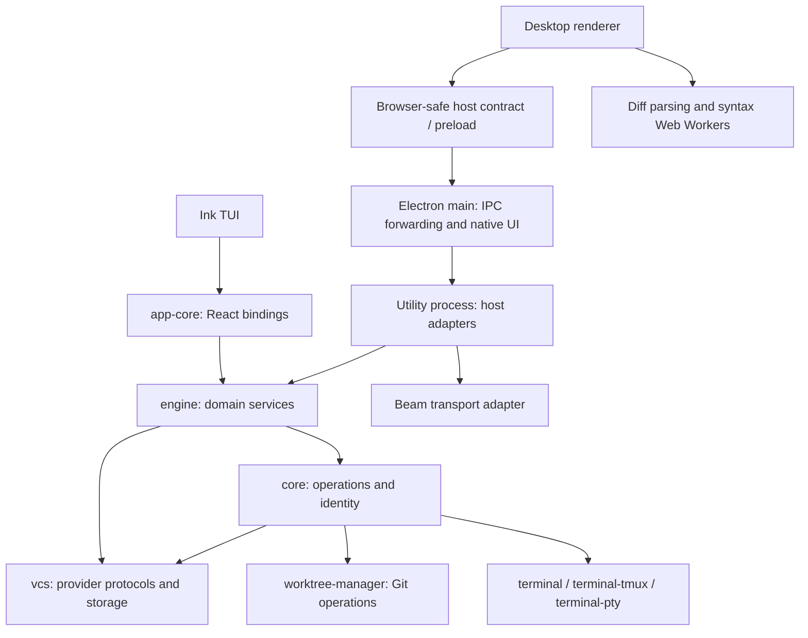

# Engine domains and execution boundaries

## Ownership

The engine owns product coordination: scoped state, freshness, scheduling,
commands and invalidation. Core owns operations that can run without a frontend
or a long-lived engine. A domain migration includes both consumers and deletes
their policy implementations. Sharing a helper while retaining two coordinators
does not complete a migration.

The target is shared implementation. The TUI and desktop still have independent
engine instances; a multi-client daemon would require separate decisions about
job lifetime, terminal input/resize ownership, reconnect and cross-process writes.

Desktop engine code lives in `main/host-worker.ts`'s utility process, not Electron
main. The TUI runs it in process. Main owns windows, menus, dialogs and process
supervision. Host adapters map commands/events to IPC and supply platform ports;
they must not import React bindings or Electron. Renderer navigation, tabs,
visibility, focus, toast text and terminal presentation remain shell concerns.

## Survey and migration order

| Area             | Current implementation                                                                                                                 | Destination and sequence                                                                                                                                                                                                                                                                                |
| ---------------- | -------------------------------------------------------------------------------------------------------------------------------------- | ------------------------------------------------------------------------------------------------------------------------------------------------------------------------------------------------------------------------------------------------------------------------------------------------------- |
| PR list          | `engine/src/lib/pull-requests`, TUI `usePrData`, host `pull-requests`                                                                  | Already engine-owned. Preserve scoped snapshots, single-flight reads, deadlines and memo invalidation.                                                                                                                                                                                                  |
| Settings         | `engine/config` owns scoped state and persistence effects; `ConfigContext` observes; engine repository handles own config lifetime     | Engine config service owns snapshots, persistence ordering and effects. Core owns coercion/bag writes; React observes; host filters and masks the form.                                                                                                                                                 |
| Repository setup | `engine/repositories` resolves Git roots, owns config/worktree handles; shells select repositories                                     | One handle owns config and worktree services. Metadata is derived by that service and observed through its subscription; repository queries do not publish. Unmigrated session callers retain a canonical shell cwd.                                                                                    |
| Sync             | `engine/sync` owns scheduling and the complete pass; TUI `useRemoteSync` observes; host `remote-sync` adapts notices                   | One bounded coordinator with skipped busy ticks, one explicit refresh, generation cancellation, success/error/last-success state and captured repo. Shells only bind lifetime, snapshots and notices.                                                                                                   |
| Worktrees        | `engine/worktrees` owns lists, freshness and commands; shell adapters only select, launch editors and render                           | Keep guarded stop/remove/delete operation and outcomes in core. Engine commands orchestrate it and invalidate worktree/session resources; sync uses that command. No duplicate removal sequence.                                                                                                        |
| Review reads     | TUI `useRemoteComments`/`useDiffData`, host `reviews`, `pr-details`, `pr-checks`, `pr-conversation`; core PR snapshot/identity helpers | Scoped engine resources, keyed by repository/provider/account/PR and revisions. Keep provider parsing and wire protocols in vcs. Move reads before publication.                                                                                                                                         |
| Review writes    | TUI `useReviewComments`, host `drafts`/`review-drafts`; review-comments poster plus vcs publishers                                     | One engine command surface over scoped durable stores. Route both agent-comment publication paths through vcs publishers and delete review-comments' poster. Preserve partial/unknown outcomes; never automatically replay an uncertain mutation. Separate reviewable slice.                            |
| Sessions         | core discovery/launch/registry/babysit; TUI `useSessionManager`; host `discovery`, `sessions`, `terminals`, `babysit`                  | Engine owns observation, adoption, launch policy, attention facts and babysitter lifetime. Core keeps identity/launch/removal operations; terminal libs execute opaque plans. Shells supply view size and output transports. Preserve clients across repo switches and detach, never kill, on shutdown. |
| Machines         | host `remote-machines`, main/beam ports and daemon owner                                                                               | Engine owns fleet state and remote command policy once session scope includes machine identity. Beam remains a transport adapter; Electron retains utility-process spawning. Preserve external daemon ownership.                                                                                        |
| Plans            | core browser-safe plan store and checkout operations, app-core plan hook, desktop plan presentation                                    | Keep the cart local to each frontend for now. Checkout becomes an engine command with session work. No new global cart or persistence without a product need.                                                                                                                                           |

The numbered delivery stack below is authoritative. Config comes first because it removes a backend-to-React dependency, fixes implicit
repo writes and eliminates duplicate effect dispatch without changing destructive
sync policy or terminal lifetime. Sync is higher risk: core safety checks must
remain authoritative during repo switches and auto-deletion. Reviews then benefit
from the established config/account scope and command invalidation model.

The agent registry's `agentIdFromCommand` legacy inference is a separate cleanup
alongside session extraction. Use explicit agent identity, including fixture agents;
do not introduce a replacement compatibility path. Config storage reads the current nested format; flat Azure credential/project
format has no migration or fallback path.

## Delivery stack

The implementation covers every domain above. Each row is a separate reviewable
PR based on its predecessor; a domain with materially different read/write risks
is split explicitly. Every PR replaces the relevant shell policy with engine
consumers and deletes superseded code. Changes requested on an earlier PR are
propagated through the stack before merging.

1. **Config**: scoped snapshots, persistence and settings effects (#263).
2. **Repository scope**: one engine repository-open operation for canonical
   identity, validation, config detection and worktree setup. Both shells use
   it; desktop retains recent-repo UI and selection. Engine operations receive
   captured repo paths; shell cwd changes survive only until their remaining
   core callers are migrated, without adding a second compatibility API.
3. **Sync**: the captured-repo worktree-removal command and one owned schedule and complete fetch/merged/conflict pass, bounded
   refreshes, cancellation, snapshots and typed notices. Auto-delete calls this
   engine command over core’s guarded removal; the following worktree slice adds
   resources and the remaining commands. Both shell coordinators
   disappear. Preserve removal verdicts and repo-switch safety.
4. **Worktrees**: list/branch resources and create/check/remove commands over
   core's guarded operations. Both shells consume the same state/invalidation;
   sync calls the domain's removal command.
5. **PR and review reads**: scoped detail/check/conversation/thread/diff resources,
   including freshness and invalidation. Provider protocols remain in vcs;
   renderer diff parsing/highlighting remains presentation work.
6. **Review commands and drafts**: shared reply/resolve/draft/publication commands,
   scoped stores and publication reconciliation. Both agent-comment posting paths
   use vcs publishers; delete review-comments' independent poster.
7. **Sessions**: discovery, adoption, launch/restart/stop, lifecycle and attention
   facts shared by both shells, then babysitter coordination if its size warrants
   a separate PR. Delete shell orchestration; preserve retained connections across
   repo switches. Remove legacy command-to-agent inference and use explicit
   fixture-agent identity.
8. **Machines**: fleet snapshots and remote command policy with injected machine
   ports. Beam socket/native-process ownership stays in desktop adapters; an
   unsupported shell observes an unavailable capability without a fake backend.
9. **Plans**: shared checkout command and session invalidation. Keep each
   frontend's browser-safe cart and presentation local; delete duplicated
   checkout coordination, not the intentionally local cart.
10. **Contract and dependency closure**: extract the browser-safe engine contract
    used by bindings/IPC, enforce domain public APIs, and tighten migrated bindings
    against direct backend operations. Extract kernel mechanics only where the
    implemented domains demonstrate reuse; no speculative command framework.
11. **Worker evidence**: profile the completed host under large-diff and active
    terminal workloads. Record results and retain existing execution boundaries
    if no additional offload pays off. Any justified worker is its own coherent
    PR with bounded queues, disposal and before/after measurements.

For every slice, run typecheck before code changes, relevant unit tests with
negative regression probes, full lint, final typecheck and affected TUI/desktop
e2e. Open the PR immediately after its local checks so review overlaps the next
slice. Review findings and replies live on that PR. A completed stack requires
all listed domain ownership changes and the final dependency audit; a worker or
shared daemon is not a quota to fill.

## Config contract

A config service has one explicit repository, stable snapshots and subscriptions.
Its snapshot holds resolved config, provider, configured status, revision and a
sync revision. Commands persist first, re-read the effective config (including
fallbacks), then invalidate PR credentials/read demand and notify subscribers.
Failed writes publish nothing and run no effects. A reload compares effective
values, so a no-op preserves snapshot identity. An explicit saved override may
need a disk write even when the effective value is unchanged.

The service owns field-to-effect policy. The desktop adapter restarts its current
sync loop when asked; the TUI observes the sync revision as a polling dependency.
Keybind patching uses the same store; keybind interpretation stays in React.
Secrets stay in the Node service: the existing host form masks them and does not
expose the service snapshot over IPC. Subscription payloads contain no credentials.

This does not promise external-file watching or cross-process coherence. Both shells open engine repository handles before background work starts. The
handle owns its config service; opening the same repo and manual detection use
that service’s detect command. Settings queries only read snapshots. PR reads continue to resolve persisted config.

## Kernel: extract from evidence

Keep domains as folders with public factories and explicit ports. The PR list's
poll schedule and scoped store already solve its needs; a second domain with
synchronous commands does not justify replacing them with a generic framework.

Extract shared scope/store/scheduling mechanics only when another domain needs the
same semantics. Keep a future kernel domain-free. Prefer direct typed commands and
subscriptions until transport/reconnect needs justify a command bus and revisioned
event stream. Do not add `@n10/react`, a universal `useResource`, TanStack query-core,
or a second IPC contract without a demonstrated consumer. The desktop query cache remains a
presentation cache; it must not become a second owner of migrated domain policy.

## Dependency enforcement

`eslint.config.mjs` enforces Nx tag direction (`scope:core` cannot depend on engine
or app-core; engine cannot depend on app-core) and forbids React/Ink/Electron in
Node domain code. Restrict package subpaths as well as bare imports. Host/main
backend files cannot import app-core. Host files cannot import Electron.

Renderer rules deny Node builtins and Node-only packages, allowing browser-safe
entries; Node types may be imported as types. Extend the existing rule to Node
builtins and every provider. Preserve the plan/readiness exceptions.

During migration, unmigrated hooks may still import core/provider operations.
Across shell directories and app-core, restricted imports prevent raw config
persistence. Unmigrated domains may still read config directly. When all domains
move, tighten app-core globally to browser-safe bindings and split the contract
into an engine-owned browser entry. Do not declare that end state enforced today.

Future cross-domain dependencies must use public domain APIs; kernel imports of
domains and relative cross-domain implementation imports can be forbidden with
folder-specific `no-restricted-imports` overrides when those folders exist.

## Workers and processes

Retain the measured utility-process host boundary. [PR #260](https://github.com/notaharness/n10/pull/260)
reports the same ten-tab, three-launch, twenty-switch benchmark against #259:
main-loop p99 fell from 5.4–5.7 ms to 0.5 ms across light/redraw/burst loads. Total
RSS increased by about 111–121 MB; switch latency did not improve. This supports
main-loop isolation, not a claim that process splitting makes computation faster.

Retain the renderer's existing lazy Web Worker pool for diff parsing/highlighting
(`renderer/workers/diff-worker.ts`, `lib/diff/worker-pool.ts`). Its recorded
scheduling measurement is 1288 ms versus 38 ms to make the flicked-to file readable;
`bench-highlight.mjs` and `bench-engine.mjs` reproduce highlighting workloads.
This is presentation work already off the renderer loop; routing it through the
host would add transport and ownership complexity without demonstrated benefit.

Do **not** add host worker_threads without a measured host bottleneck. Git reads use child processes
(`core/utils/git-run.ts`), provider I/O is asynchronous, and remote sync mostly
waits on subprocesses/network. Another worker does not accelerate that waiting.
Small config reads/writes do not have a measured event-loop problem. Keep mutations,
PTY connection ownership and ordered session commands in their current owner.

For a future worker proposal, collect host event-loop delay and a CPU profile under
large diffs, many sessions and large Git output; separate subprocess time from
JSON/diff parsing and copying. Measure p95/p99 interaction latency, throughput,
cold start, transfer cost and RSS before/after on identical fixtures. Prefer async
I/O over moving synchronous I/O wholesale. Only measured sustained CPU work should
get a bounded worker_threads pool, with plain inputs, stale-result rejection,
queue limits and explicit error/disposal behavior. Use another utility process
only for demonstrated crash/native-resource isolation, not one process per domain.

Repo-bound services use one instance per captured checkout, as config does. A
shell selects the active instance and stops its schedules when selection changes;
retained session clients have their own lifetime. The PR list is a multi-repository
cache because readers and watchers share entries across scopes. Do not impose a
single global store shape on both lifetimes.
