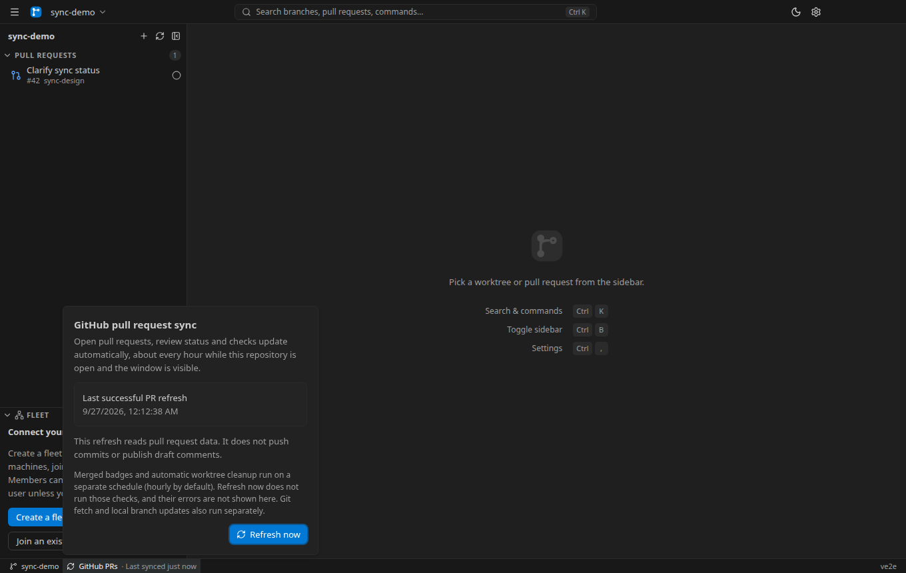
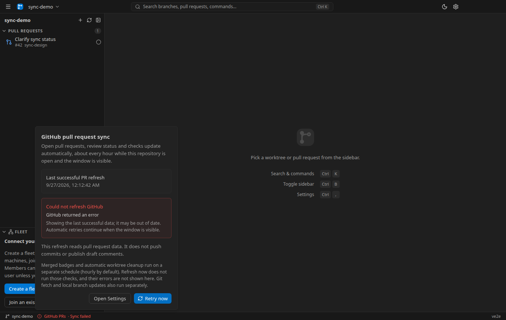
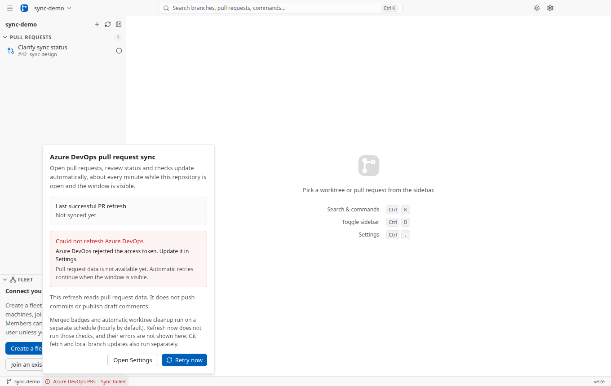

# GitHub and Azure DevOps sync

## What runs today

Desktop has two independent paths, both involving the provider:

| Operation              | Trigger and cadence                                                                                                                                                                                                                                              | Effect                                                                                                                                                                                                                                     |
| ---------------------- | ---------------------------------------------------------------------------------------------------------------------------------------------------------------------------------------------------------------------------------------------------------------- | ------------------------------------------------------------------------------------------------------------------------------------------------------------------------------------------------------------------------------------------ |
| Open-PR refresh        | Opening a configured repository; visible-window sidebar reads every 4 seconds request a refresh when `prPollInterval` expires (default 60 seconds). Explicit refresh bypasses the cache. Other readers, including babysitters, can also request current PR data. | Reads open PRs, review/approval state, unresolved thread counts and checks/build status. Updates the sidebar and the PR data shared with babysitters. GitHub's list is filtered to PRs involving the configured user.                      |
| Repository maintenance | Opening a repository with a configured provider, then `mergePollInterval` (default one hour, minimum five minutes). This host timer is independent of renderer visibility.                                                                                       | Fetches/prunes Git refs, attempts to update local main from origin, **queries the provider for merged branches**, and computes conflicts. Supplies **Merged** badges and can remove eligible merged worktrees when auto-delete is enabled. |

Neither path pushes commits or publishes draft comments. Comment bodies, diffs and
other PR details have their own reads; open-PR refresh is not a refresh of every
open pane.

The open-PR cache retains the last successful response on failure, records the
error and retries when a reader next requests data after the interval. Its timestamp
advances only on success. **Refresh now** also clears provider-specific detail
caches (including Azure's cached check results). Credential changes invalidate the
cache and start a new attempt. The renderer's interval polling pauses when the
document is hidden; it does not set React Query's `refetchIntervalInBackground`.
Other readers may still refresh the shared cache.

**Refresh now does not run repository maintenance.** After merging a PR, a refresh
can remove it from the open-PR list while its worktree's Merged badge and automatic
cleanup wait for the next maintenance pass—up to the configured interval under
normal operation. Git fetch/fast-forward and conflict checks also wait for that pass.

Maintenance failures are not reported through the sync status UI. In particular,
a failed `fetchMergedBranches` call is logged and replaced by an empty merged set:
Merged badges can disappear and auto-delete skips that pass. Fetch/update errors
can also be logged or returned as booleans. A top-level pass failure is logged.
`lastGitSyncAt` therefore does **not** certify successful Git or merged-PR checks.
The visible last-success timestamp and error describe only the open-PR refresh;
there is no user-visible maintenance health indicator today.

Sources: core `pull-requests/pull-request-cache.ts` and `sync/remote-sync.ts`;
Desktop host `services/pull-requests.ts`, `services/sidebar.ts`, and
`services/remote-sync.ts`; renderer `lib/data/queries.ts` / `mutations.ts`;
worktree-manager `branches.ts` for Git updates.

## Design: automatic open-PR sync with explicit status

Keep automatic refresh: these are reads needed to keep the workspace current,
and the existing cache shares them among readers. The status bar names
**GitHub PRs** or **Azure DevOps PRs**.

- Show **Syncing…**, **Last synced {relative time}**, **Not synced yet**, or
  **Sync failed**. A failed attempt never replaces the last successful timestamp.
- Clicking the status opens an anchored, non-modal popover. It explains open-PR
  data and the configured automatic cadence while the window is visible, and
  shows the exact **Last successful PR refresh** time.
- Explicitly explain that Merged badges and automatic worktree cleanup are checked
  on a separate schedule (hourly by default); **Refresh now** does not run those checks and their errors
  are not shown here. Do not imply that a successful PR refresh certifies maintenance.
- A failure remains visible in the bar, including on hover. The popover shows the
  error as text, explains whether data may be stale or unavailable, and offers
  **Retry now** and **Open Settings**. The Settings action closes the popover.
- While refreshing, disable the action and show **Refreshing…**. On success,
  the existing cache clears the error. Opening details does not fetch.
- Missing provider/credentials lead to Settings, with the existing tooltip style
  and distinct missing-provider/credentials icons. Escape closes the popover and
  returns focus; outside interaction dismisses it without blocking the workspace.

## Appearance

Open-PR scope and the separate maintenance checks, in the dark theme:

A failed refresh keeps the last successful timestamp:

First-refresh failure and a direct Settings action, in the light theme:

