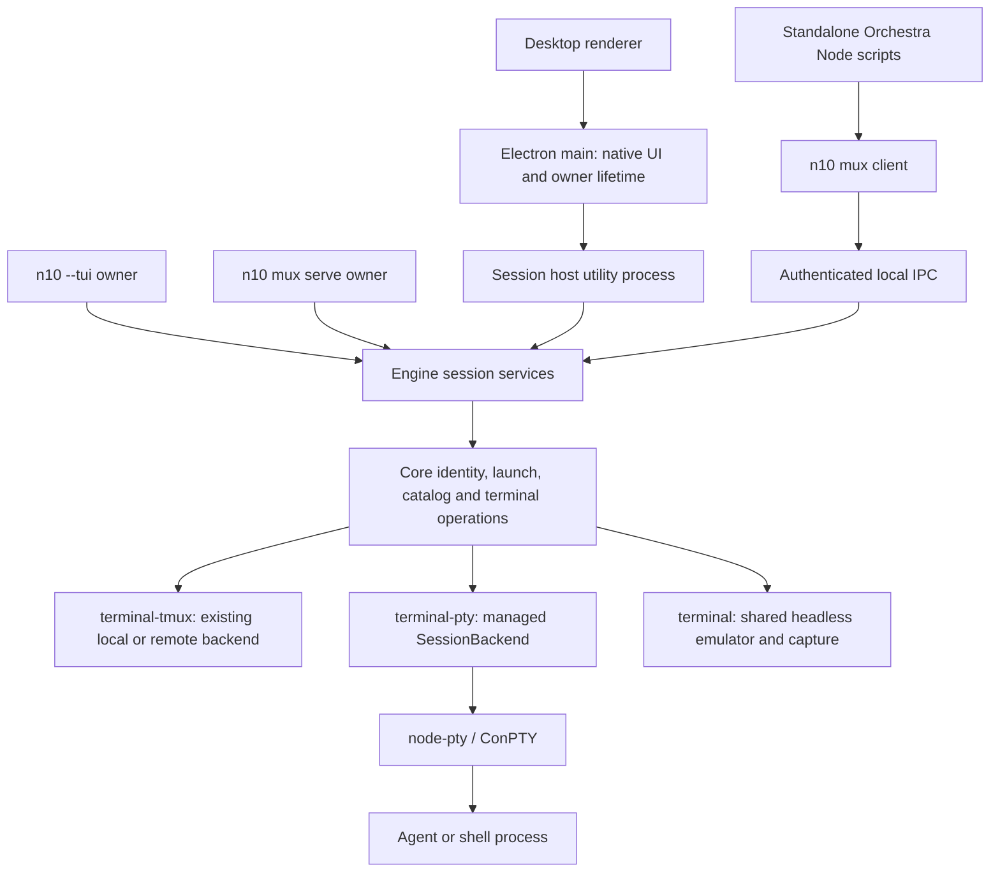
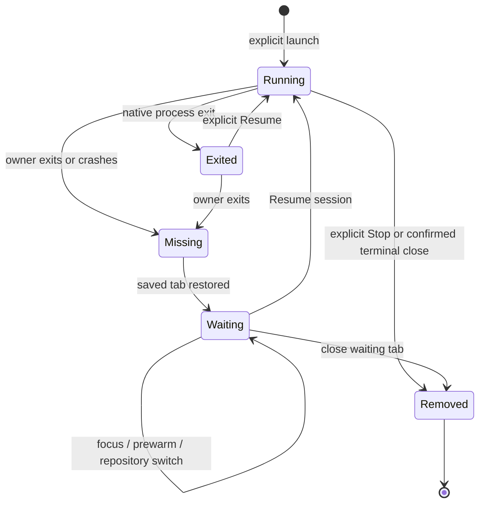

# Windows support

Status: proposed; design review required before implementation.

## Goals and boundaries

Run n10's desktop and TUI on native Windows without tmux. Sessions use ConPTY,
are owned by the running n10 program, and end when that owner exits. Expose a
small `n10 mux` interface so Orchestra can create, inspect, message, adopt and
stop those sessions. Preserve Orchestra's tmux behavior on Linux and macOS,
including installations without n10. Support beam on Windows for the existing
fleet workflows, with the same grants and durable delivery guarantees.

The initial supported Windows target is Windows 11 x64, local NTFS checkouts,
Git for Windows, and the Node/Electron versions pinned by the repositories.
ConPTY's technical minimum is older than this product baseline; do not infer a
Windows 10 support promise from the underlying library. Windows ARM64, UNC/SMB
checkouts and WSL integration require separate qualification. Reject unsupported
path/host combinations explicitly rather than translating them into another OS.

This design does not add a tmux emulator, pane/window management, persistent
Windows sessions, a Windows service, automatic background hosting, or a tray.
It does not restore the deleted Windows launcher branches, old backend settings,
old packages or old tag formats. n10 installer/package distribution is outside
scope; executable resolution and native dependencies required to run a development
build are in scope. Beam's binary and npm platform package are in scope. No code
is implemented by this document.

## Baseline and prerequisite

The design branch starts at n10 `378e7e72`, the head of
[PR #331, persist tabs with explicit session resume](https://github.com/notaharness/n10/pull/331),
on `feat/restore-tabs`. GitHub reports that PR conflicting with `master`.
**Before implementation, merge current master into Kristján's `feat/restore-tabs`
branch, resolve conflicts there, and verify its resume behavior. Never rebase or
force-push Kristján's branch.** Then merge that updated base into downstream
branches. This design PR targets `feat/restore-tabs`; it does not resolve those
conflicts or merge the feature. Recheck the file map after the merge.

Source observations that constrain the implementation:

- [Architecture](../architecture.md) and [decisions](../decisions.md) define
  core → engine → React bindings → shells. Core owns identity and operations;
  engine owns observation, lifecycle and coordination. A transport knows no
  agents, repositories or Orchestra policy.
- [SessionBackend](../../libs/terminal/src/lib/session-backend.ts) separates
  process state from connection state and `dispose` from `kill`.
  [terminal-tmux](../../libs/terminal-tmux/src/lib/tmux-backend.ts) implements it;
  its remote backend runs tmux over beam. [terminal-pty](../../libs/terminal-pty/src/lib/pty-session.ts)
  is a node-pty wrapper, **not an existing direct-session backend**. Its
  `dispose()` kills its process; blindly substituting it breaks detach semantics.
- [session-identity.ts](../../libs/core/src/lib/session-identity.ts),
  [session-resolver.ts](../../libs/core/src/lib/session-resolver.ts),
  [session/open-session.ts](../../libs/core/src/lib/session/open-session.ts) and
  [session-backend.ts](../../libs/core/src/lib/session-backend.ts) still depend
  on tmux listing, native incarnations and launch plans. Backend selection alone
  cannot deliver Windows discovery, restart or removal.
- The [desktop session host](../../apps/desktop/src/main/host-worker.ts) is an
  Electron utility process. Its [services](../../apps/desktop/src/host/services)
  adapt engine sessions into renderer IPC. `session-watch.ts` tracks viewers;
  `session-relay.ts` holds a 512 KiB output ring and monotonic sequence numbers.
  Renderer unmount/reload is not session termination. Host restart currently
  assumes tmux survived; that assumption is false for Windows PTYs.
- #331 saves tabs and launch metadata in `~/.n10/open-tabs.json`, attaches live
  sessions, and waits for **Resume session** when they are missing. It captures
  verified Claude conversation IDs only through Linux `/proc`; elsewhere it
  retains known launch metadata. Directory continuation can select another
  conversation when several share a directory/account.
- [PR #316](https://github.com/notaharness/n10/pull/316) supplies the Shell setting.
  Its current resolver probes `sh`, `$SHELL` and `/bin/sh`, and launches `-l`.
  Those are POSIX rules, not a Windows shell resolver.
- `git log --all -i --grep=windows` identifies merged
  [PR #94](https://github.com/notaharness/n10/pull/94), notably `53ec2f35` and
  `b09fd4af`: shell quoting, Git's slash-separated paths, reusing an existing
  checkout under another directory, and agent launch all needed Windows fixes.
  `e71c7cf0` deliberately deleted the unreachable `cmd.exe` agent branches after
  tmux became mandatory. Retain the working Git fixes and regression scenarios;
  do not revert that deletion as a substitute for a new launch model.
- `libs/pty-manager` and `libs/tmux-*` do not exist at this branch tip. Historical
  `6b734b07` contains the PTY/emulator owner; `10e2185c` deletes obsolete tmux
  wrappers; `e245e805` renames tmux-control to terminal and `367daed8` renames
  tmux-manager to worktree-manager. Their present responsibilities live in the
  packages above and `libs/worktree-manager`; do not recreate the historical tree.

Orchestra was inspected at plugins `431094cf`; beam at `d4c062a4`, using their
local repositories and instructions. All eleven Orchestra script files, both
skills, the tmux backend and the beam process/control/distribution code were
read. These revisions define the inventory below; repeat the inventory if their
heads change before implementation.

## Architecture and ownership

Agree with the proposed direct desktop backend and small mux API. Refine “in
process” to mean **inside the session host**, not Electron main or the renderer.
Keep node-pty on that process's main thread. Its
[documented ConPTY support and thread restriction](https://github.com/microsoft/node-pty)
fit this existing boundary.



The diagram shows alternative owners, not three servers to start together.
Windows has one active default local owner per OS user: desktop, TUI, or
foreground `n10 mux serve`. A named, user-scoped mutex selects it before startup
publishes an endpoint. A second desktop activates the existing desktop through
Electron's normal single-instance behavior. Starting another owner type fails
with its type and PID and instructions to close it; it never takes ownership or
kills sessions. This deliberately avoids a multi-host selection UI and PTY
migration. Tests use explicit isolated profiles. Supporting simultaneous TUI and
desktop Windows owners is a follow-up requiring a reviewed client/ownership UX.

On Linux/macOS, ordinary n10 continues to require tmux. `n10 mux serve` can run
there explicitly for protocol tests or deliberate temporary PTY use; it does not
change ordinary n10's session selection or steal tmux sessions. Orchestra's
new-session selection checks executable tmux first, then n10. A found but broken
or unsupported tmux fails visibly; it does not silently switch backends and lose
existing sessions. A recorded session handle always pins its backend, even if
PATH later changes. Remote selection is performed **on the target machine**.

### Layer responsibilities

| Location                       | Responsibility                                                                                                                                                                                                                                        |
| ------------------------------ | ----------------------------------------------------------------------------------------------------------------------------------------------------------------------------------------------------------------------------------------------------- |
| `libs/terminal`                | Backend-neutral terminal types: spec, live/exited/missing facts, opaque target/incarnation, I/O handle, capture data and transport capability types. Remove generic types' dependency on tmux structures.                                             |
| `libs/terminal-pty`            | Managed PTY records, create/attach/restart/stop, native process lifetime, retained exit facts; no interpretation of `@orchestra-*`. Reuse node-pty and public emulator APIs.                                                                          |
| `libs/terminal-tmux`           | Existing tmux behavior and a translation to the common contracts. Keep exact targets, native atomic guards and remote batch observations.                                                                                                             |
| `libs/core`                    | Backend choice for the execution machine; tag validation and matching; canonical paths; launch/continuation policy; shared session catalog/registry operations; mux encoding/client/server transport primitives and scoped filesystem/Git operations. |
| `libs/engine/src/lib/sessions` | Shared session service over those operations: discovery, adoption, shutdown snapshots, serialized mutations, worktree and directory lifecycle. Mux commands call the same services as UI commands.                                                    |
| `apps/cli`                     | Lazy `mux` dispatch and foreground owner composition; retain lazy Ink/Electron imports. CLI output and exit codes only.                                                                                                                               |
| `apps/desktop/src/host`        | Compose the same engine with a local mux endpoint; adapt output/events to existing IPC. No second launcher or discovery loop.                                                                                                                         |
| Electron main / TUI            | Confirm close, own lifetime containment, display errors. Renderer uses typed browser-safe contracts only.                                                                                                                                             |
| Orchestra                      | Git worktree workflow, harness choices, prompt composition, supervision and report routing, over its backend interface. No import from n10 and no requirement to install it for tmux.                                                                 |

Introduce a narrow OS binding only for public Windows APIs absent from Node's
public API: private named-pipe serving, SID/ACL operations and Job Objects.
Keep it below core, with no Electron dependency. Scaffold a package only if
needed using Nx; do not build a general platform framework. Use a supported
binding or a small reviewed N-API binding, never private node-pty/libuv handles,
DLL injection, polling `taskkill`, or parsing localized `tasklist` output.

### Catalog, terminal state and guards

A managed record owns one PTY and one emulator independent of attached viewers.
Extend/refactor the existing core registry; do not create a second registry just
for mux. An attached `SessionBackend` is a handle to that record:

- `dispose()` releases that handle/subscriptions. It does not stop the record.
  `kill()` explicitly stops the exact record. Owner shutdown stops all its PTY
  records; it only disposes tmux clients.
- Every PTY emits native process exit once. Agent records retain final screen,
  exit code and tags until explicitly stopped or the owner exits. Shell records
  follow the existing engine shell-exit cleanup. A pipe/viewer disconnect leaves
  process state unknown or unchanged until the owner answers.
- `hostId` is a random UUID per owner lifetime, `sessionId` a UUID per managed
  record, `generation` increments for each new process, `revision` for metadata
  changes. Mutations carry expected generation/revision where applicable.
  Concurrent restarts of an exited record have one winner; replacing a live
  generation requires the existing explicit replacement confirmation.
- Creation reserves identity and label, validates the full request, installs
  metadata, binds output/exit listeners, then starts the process. Expose either a
  complete record or an error; no shell placeholder and no `launching` tag for
  mux. A spawn error releases its reservation but preserves the Git worktree.
- Engine serializes by canonical checkout as well as record ID. Distinct labels
  do not allow duplicate launches for the same worktree. When importing already
  duplicated tmux identities, retain the oldest-session rule and list extras.
- Local PTY observations are in-memory snapshots and events. Keep the periodic
  Git reconciliation/watch shortcut in the engine. Remote listings remain one
  batch per machine. Failed reads are not empty successful listings.

Capture uses the existing headless terminal's public buffer/modes/title events,
not regex stripping of an ANSI byte ring. Keep parsing output while no tab is
visible. Return the visible active screen plus requested normal-buffer history,
with alternate-screen and truncation facts. Retain bounded history (initially
10,000 lines) and cap a response at 512 KiB UTF-8. Bound the byte replay ring too;
splitting oversized chunks must preserve Unicode. Wait for the emulator write
callback before reporting the matching capture sequence or final exit frame.
Desktop relay sequence numbers continue across restart as #331 expects; mux
also carries generation so stale output cannot paint a new process.

## `n10 mux` CLI and protocol

The command is a small client, except `serve`. It is not tmux with renamed
arguments. No `-F` expressions, windows, panes, general paste buffers, tmux
options, executable hooks, or arbitrary command evaluation.

If no owner is running, commands fail `HOST_NOT_RUNNING`, with “Open n10 or run
`n10 mux serve` in another terminal.” They do not auto-open the desktop, start a
detached server, or exit successfully after spawning a child that immediately
dies. `serve` stays in the foreground until Ctrl+C/console close or an explicit
shutdown request. A one-shot client's exit never ends hosted sessions.

All commands except `serve` and `connect` emit one JSON result on stdout;
diagnostics go to stderr. Structured request bodies use UTF-8 JSON from stdin
(`--request -`) rather than a shell-quoted JSON argument. Human Orchestra output
is generated by Orchestra, preserving its existing text/JSON shapes.

| Command                            | Request / result and semantics                                                                                                                                                                                                        |
| ---------------------------------- | ------------------------------------------------------------------------------------------------------------------------------------------------------------------------------------------------------------------------------------- |
| `n10 mux status`                   | Protocol/capabilities, OS, owner type, host ID and session count; no secrets. Also serves as the capability probe.                                                                                                                    |
| `n10 mux serve`                    | Foreground headless composition of the engine and PTY catalog. Prints endpoint readiness on stderr. No daemonize flag.                                                                                                                |
| `n10 mux list`                     | One batch of complete session summaries, including retained exits, tags, activity and title. Filtering/branch resolution stays in core or Orchestra.                                                                                  |
| `n10 mux inspect ID`               | Exact record summary including generation/revision; missing is an error. ID is opaque, never a label prefix.                                                                                                                          |
| `n10 mux self`                     | Validates injected host/session context against the owner and returns that summary. No search by cwd or agent thread ID.                                                                                                              |
| `n10 mux create --request -`       | `{requestId,label,cwd,argv,envSet,envUnset,cols,rows,tags,retainOnExit}`; returns allocated IDs, label, generation and canonical paths. `argv` is executable plus arguments, never shell source. Validate dimensions 2–500.           |
| `n10 mux restart ID --request -`   | Launch body plus expected generation; only an exited record. Resume policy/argv belongs to the caller's agent adapter. No implicit fresh launch and no live `--force`. UI replacement uses the separately confirmed engine operation. |
| `n10 mux metadata ID --request -`  | Atomic `{expectedRevision,set,unset,claimTarget?}`; validates reserved identity fields. `claimTarget` moves one `@orchestra-target` value from any other record in this host to this record atomically.                               |
| `n10 mux send ID --request -`      | `{requestId,generation,mode,text?,key?,submit?}`; modes `paste`, `literal`, `key`. No raw terminal buffer API or shell execution. Returns accepted byte count and outcome, not “agent read it.”                                       |
| `n10 mux capture ID [--history N]` | `{text,seq,generation,truncated,alternateScreen}`. Orchestra implements whitespace cleanup, `--lines`, dead-pane default history 40 and sample comparison.                                                                            |
| `n10 mux stop ID --request -`      | Expected generation; stop only that session and erase its retained record. Never remove its worktree/branch.                                                                                                                          |
| `n10 mux shutdown --request -`     | `{expectedHostId,confirmStopAll:true}`. Explicitly stop the owner and all owned PTYs; normal clients have no implicit shutdown. Desktop routes this through its close confirmation; headless accepts the explicit request.            |
| `n10 mux connect --stdio`          | Authenticated local proxy carrying the protocol on stdin/stdout; used for remote access over `beam exec`, not for starting a server. EOF detaches subscriptions only.                                                                 |

Each summary contains `{hostId,sessionId,label,generation,revision,createdAt,cwd,
process:{state,pid?,exitCode?},cols,rows,lastOutputAt,title,tags}` and a verified
launch classification (`shell`, known agent, or unknown). Do not fabricate a
Windows equivalent of POSIX foreground-process-group inspection. Known agents
launched directly by the owner have native liveness; agents started by typing
into arbitrary shells remain unknown until a supported registration mechanism
identifies them. Adoption/report-to-pane must fail closed on unknown ownership.

A worktree create verifies that its canonical repo/checkout tags agree with Git
and cwd. Identity tags are immutable after creation; the metadata command can
change supervision/report/conversation metadata, not silently reassign a checkout.
Transport storage treats tags as opaque strings; validation is core policy.
All twelve keys in the inventory are carried, including keys n10's current
`LISTED_TAGS` omits. Reject tabs, newlines and NUL in shared tags to preserve the
tmux contract. Never put credentials in tags.

### Wire format and failure semantics

Use one versioned NDJSON protocol on a local byte stream, with UTF-8 JSON and
LF framing. It is distinct from beam's protocol; beam transports it unchanged.
The first exchange authenticates and negotiates version 1. Then:

```jsonl
{"v":1,"id":"r17","op":"session.capture","params":{"sessionId":"UUID","history":40}}
{"id":"r17","ok":true,"result":{"text":"ready","seq":92,"generation":1,"truncated":false,"alternateScreen":false}}
{"id":"r18","ok":false,"error":{"code":"STALE_GENERATION","message":"Session restarted; inspect before retrying"}}
```

CLI verbs map to `host.status`, `session.list/inspect/self/create/restart/metadata/
send/capture/stop`, `host.shutdown`. The persistent protocol additionally exposes
`session.watch/unwatch` and `session.resize` for remote frontend handles. Every
mutation includes `expectedHostId`; never apply a queued operation to a replacement
owner merely because it published the same descriptor path.
`watch` atomically returns a snapshot and its sequence before events after that
sequence. Events carry `{event,hostId,sessionId,generation,seq,data}` for output,
metadata, exit and removal. Disconnect ends watches, not sessions.

Limit lines to 1 MiB, text input to 256 KiB, tags to 64 keys / 4 KiB per value,
and allow at most 32 outstanding requests per connection. Split output events
into bounded chunks. A subscriber that cannot drain a 1 MiB queue is disconnected
with a resnapshot requirement; never block every PTY on a slow reader. Initial
handshake/read deadlines are bounded; a mutation has no “timed out, safe to retry”
meaning. Distinguish `HOST_NOT_RUNNING`, `AUTH_FAILED`, `VERSION_UNSUPPORTED`,
`NOT_FOUND`, `IDENTITY_MISMATCH`, `STALE_GENERATION`, `RUNNING`, `INVALID_REQUEST`,
`SPAWN_FAILED`, `UNSUPPORTED` and `OUTCOME_UNKNOWN`.

Use exit 0 for success, 2 for usage/validation, 3 for unavailable host/session,
4 for authentication/version failure, 5 for stale/conflicting state, 1 for other
failures including uncertain delivery. Preserve error codes in JSON. `send`
serializes a whole paste/literal-plus-submit operation against other client
writes. Paste honors the terminal's bracketed-paste mode; key encoding honors
its cursor mode. Start with `Enter`, `Escape`, `Tab`, `Backspace`, arrows, `Home`,
`End`, `Delete`, `PageUp`, `PageDown`, `C-c`, `C-d`, `C-z`; unsupported keys fail.
The tmux adapter can retain tmux's wider key vocabulary on tmux.

Mutation `requestId`s are caller-generated UUIDs for correlation, not an
exactly-once delivery mechanism. Clients never automatically retry mutations
after connection loss, including with the same ID. Return `OUTCOME_UNKNOWN` and
reconcile through list/inspect: creation can be located by the request ID retained
on its record, while an uncertain paste requires operator judgment. Generation
and revision guards still reject stale restart/metadata requests. A PTY write
accepted is not proof that an agent submitted or acted on it. If submission
fails after paste, return the partial outcome and do not fall through to another
delivery route. The proxy has no offline mutation queue. This keeps delivery
honest without an unbounded deduplication ledger or replay after owner crashes.

### Endpoint discovery and authentication

Windows uses a local named pipe, e.g.
`\\.\pipe\n10-mux-v1-<user-sid-hash>-<profile-hash>-<host-id>`.
Publish an atomic endpoint descriptor under
`%LOCALAPPDATA%\n10\run\<profile>\mux.json`, containing protocol, host ID, owner
PID/start identity and pipe name. This is discovery data, not session persistence.
Linux/macOS use a Unix socket in a private user runtime directory and a mode-0600
descriptor. Explicit test profiles must not touch the default descriptor.

Node [supports named-pipe clients and servers](https://nodejs.org/api/net.html#ipc-support),
but a pipe name or `chmod(0600)` on Windows is not authorization. The server must
create its pipe with a protected DACL restricted to the current user's SID,
reject remote clients, and use first-instance protection against pipe squatting.
Use documented [named-pipe security](https://learn.microsoft.com/en-us/windows/win32/ipc/named-pipe-security-and-access-rights)
and [CreateNamedPipe](https://learn.microsoft.com/en-us/windows/win32/api/winbase/nf-winbase-createnamedpipea)
APIs; do not assume Node exposes an arbitrary pipe security descriptor. Validate
the connected server's PID/start identity before using the endpoint. The native
binding should expose an ordinary supported byte-stream interface; do not graft
raw handles into Node's private `_handle` implementation.

Also create a fresh 256-bit host secret in a user-only ACL-protected file, never
in command-line arguments, logs, tags, open-tabs data or renderer IPC. Use a nonce
challenge/HMAC over protocol, host ID and client/server nonces, with separate
client/server proofs, before any session operation. The Windows binding must
provide both private listen and verified connect as public byte-stream adapters:
checking the connected server PID needs the actual pipe handle, which Node's
public `net.Socket` API does not expose. Unix clients use `net.createConnection`.
The secret
is a same-user capability, not protection against malicious processes already
running as that user or administrators. Rotate it on every owner start. Remove
only the matching descriptor on graceful shutdown; a new owner verifies stale
PID/start identity before replacing it. Never delete a live owner's endpoint
because a client cannot authenticate.

**Sandbox access is a real constraint.** Agent commands can run as restricted or
different OS users; current [Codex Windows documentation](https://developers.openai.com/codex/windows)
describes such sandbox boundaries. Do not grant `Everyone` pipe access, copy the
secret into a sandbox, or disable sandboxing to make reports work. Use the
harness's documented permission/elevation route for the specific reporting
command. Test it with real harnesses; denial yields a full visible report and an
honest delivery failure, as the player skill requires.

## Orchestra backend layer

### Script inventory

`O/` below means `orchestra/skills/orchestrator/scripts`; `P/` means
`orchestra/skills/player/scripts` in [notaharness/plugins](https://github.com/notaharness/plugins/tree/431094cf8995267a212d7ab39c3bbf592746ea94/orchestra).
`t`, `tmux_on` and `tmux_local` are wrappers, not additional tmux commands.
All parser-facing calls use `-u`; explicit server selection uses `-S SOCKET`.
Session existence/kill use exact `=name`; pane/option targets use `=name:`.

| Source          | tmux operations and options                                                                                                                                                                                                                                                                                                                | Mux equivalent                                                                                                                        |
| --------------- | ------------------------------------------------------------------------------------------------------------------------------------------------------------------------------------------------------------------------------------------------------------------------------------------------------------------------------------------ | ------------------------------------------------------------------------------------------------------------------------------------- |
| `O/_lib.sh`     | `has-session -t =name` for name allocation/existence; `list-sessions -F` for identity; `capture-pane -p -t`; `display-message -p '#S'`; direct `-u -S` list/set calls when marking the orchestrator                                                                                                                                        | Atomic create allocation, list/inspect, capture, self, metadata claim                                                                 |
| `O/spawn.sh`    | `display-message -p -t ... '#{pane_dead}'`; `new-session -d -s NAME -c CWD -x 220 -y 50`; duplicate-name `has-session`; tag `set-option`; `status off`, `remain-on-exit on`; `load-buffer -b orchestra-prompt-NAME -`; `respawn-pane -k -t ... -c CWD -e KEY=value ... -- /bin/sh -c ...`; failure cleanup `delete-buffer`, `kill-session` | One create or guarded restart with full metadata, argv and env. No placeholder or task buffer; task reaches launch adapter over stdin |
| `O/_launch.sh`  | Direct `-S` `show-buffer -b`, `delete-buffer -b`; tag get/set for type, actual agent and Claude conversation ID                                                                                                                                                                                                                            | Node launch adapter reads the structured request; metadata update for actual agent/conversation                                       |
| `O/adopt.sh`    | `has-session`; `display-message` dead/ownership reads; tag writes; `send-keys -t ... -l TEXT`, then `Enter`, or shared paste/queue route                                                                                                                                                                                                   | Inspect verified agent, atomic supervision metadata, literal/paste send or native queue                                               |
| `O/kill.sh`     | `kill-session -t =name`; `delete-buffer -b orchestra-prompt-NAME`                                                                                                                                                                                                                                                                          | Stop exact ID; no buffer cleanup needed                                                                                               |
| `O/screen.sh`   | Dead-state `display-message`; `capture-pane -p -t =name: -S -N`                                                                                                                                                                                                                                                                            | Inspect/capture with bounded history                                                                                                  |
| `O/send.sh`     | `send-keys -t ... KEY`; `send-keys -l TEXT` then Enter; shared buffer paste; native inbox/queue when possible                                                                                                                                                                                                                              | Key/literal/paste send; keep agent-native delivery policy above the backend                                                           |
| `O/sessions.sh` | `list-panes -a -F FORMAT`; shared capture for `--sample`                                                                                                                                                                                                                                                                                   | One list per machine and capture samples; preserve busy/idle/dead heuristic                                                           |
| `O/relay.sh`    | Default `display-message -p '#S'`; shared local target checks/delivery. Talks directly to beam's control socket with `socat`/`nc -U`                                                                                                                                                                                                       | Self; shared routing over backend; Node stream to beam's Unix socket or pipe                                                          |
| `P/_routing.sh` | Remote `display-message -p '#{socket_path}'`; fallback socket rule; `show-options -qv -t`, `set-option [-u] -t`; `display-message` for `#S`, `pane_dead`, `pane_current_command`, `pane_pid`; `has-session`; `load-buffer -b orchestra-PID -`, `paste-buffer -p -d -b ... -t`, cleanup `delete-buffer`, `send-keys ... Enter`              | Status/self/inspect, metadata, serialized send. Process/agent discovery is platform-specific, not fabricated tmux formats             |
| `P/report.sh`   | Through helpers: self context, orchestrator/config tag reads, local-target delivery, last-report tag write                                                                                                                                                                                                                                 | Same workflow using stored backend context and metadata; beam handling unchanged                                                      |

Complete formats consumed by those scripts:

- Identity `list-sessions -F`: `session_name`, `session_created`, `session_path`,
  `@orchestra-spawner`, `@orchestra-repo`, `@orchestra-session-type`,
  `@orchestra-branch`, `@orchestra-worktree-path`, tab-separated.
- Orchestrator-home listing: `session_name`, `@orchestra-target`.
- `list-panes -a -F`: `session_name`, `pane_dead`, `pane_current_command`,
  `window_activity`, `@orchestra-agent`, `@orchestra-orchestrator`,
  `@orchestra-last-report`, `@orchestra-repo`, `@orchestra-branch`,
  `@orchestra-spawner`, `@orchestra-session-type`, `@orchestra-worktree-path`,
  `pane_title` (last field may contain tabs).
- `display-message`: `#S`, `#{socket_path}`, `#{pane_dead}`,
  `#{pane_current_command}`, `#{pane_pid}`. No general format evaluator is needed.
- **Hooks: none.** There is no `set-hook`, control-mode subscription, attach,
  split-window or select-pane requirement in these scripts. Do not add global
  tmux hooks to implement lifecycle observation.

The complete metadata set is `@orchestra-` plus: `spawner`, `repo`, `session-type`,
`branch`, `worktree-path`, `orchestrator`, `orchestrator-config`, `agent`,
`launching`, `last-report`, `claude-session`, `target`. `launching` remains a tmux
implementation detail. `dir` stays Orchestra's spelling, read as `agent` by n10;
Orchestra still filters players to tagged worktree/dir sessions, excluding n10's
ordinary shell/agent terminals. Labels retain the shared sanitization, cap/hash
and numeric-collision rules; identity is never inferred from the label or branch.

### Runtime decision

Recommend **standalone Node entry points in the plugin**, using Node 24 LTS as an
explicit prerequisite. Replace the shell implementation in one coordinated plugin
release; do not retain a Bash implementation beside a divergent Windows one.
Use `node <absolute skill path>/scripts/spawn.mjs` and corresponding entries for
sessions, screen, send, adopt, kill, relay and report. Both SKILL.md files and
Claude allowlists/Codex metadata change together. Install both sibling skills;
resolve installer symlinks via their real filesystem location. An optional npm
install is not required: the plugin ships runnable JS, no compile step.

This adds a runtime prerequisite and changes script invocation, while preserving
tmux workflow semantics and outputs. It does **not** require n10 on POSIX.
Document the prerequisite rather than assuming native Claude includes Node.
Moving orchestration into n10 subcommands would violate standalone operation.
Requiring Git Bash would still leave PowerShell callers, `script(1)`, `/proc`,
`ps`/`pgrep`, `lsof`, `socat`/`nc`, GNU `cp --reflink`, `sha256sum`, `md5sum`,
`/tmp`, shell environment expansion and symlink behavior to reconcile.

The internal interface is behavioral: `list`, `inspect`, `create`, `restart`,
`updateMetadata`, `capture`, `send`, `stop`, `self`. `TmuxBackend` owns the exact
argv/formats above and preserves its native session persistence. `MuxBackend`
spawns the n10 client with JSON stdin. Machine execution is a separate interface;
no backend retries a failed remote operation locally. Keep human branch/exact-label
resolution at the Orchestra layer; resolve once to an exact native handle before
mutation. No shell string is used to transport JSON, prompt text or paths.

Use Node `fs`, `path`, `crypto`, JSON and streams for portable operations. Preserve
dry-run's no-fetch/no-write behavior; defaults, model/effort selection, accounts,
existing-worktree reuse, no-fresh-on-resume, and accepted/stored/failed report
wording. Preserve POSIX resume probing where it is supported through native Unix
commands; do not emulate `script(1)` on Windows. Windows resume requires an
explicit or recorded supported agent; an unknown agent is an actionable error.
Node file copies, if requested, must be independent and handle links natively;
for n10 worktrees pass `--no-node-modules` and run `npm ci` as AGENTS.md requires.

### Self-identification and reporting

Inject `N10_MUX_HOST_ID`, `N10_MUX_SESSION_ID`, `N10_MUX_GENERATION` and the
endpoint descriptor location into every managed process, including n10-created
sessions later adopted by Orchestra. They identify the current host/session;
they are not authentication secrets. `self` validates all of them. Set
`ORCHESTRA_BACKEND=mux` for players and keep `ORCHESTRA_SESSION` as a display
label only. Tmux keeps `ORCHESTRA_SOCKET`/`ORCHESTRA_SESSION` and the current
`TMUX`/`#S` fallback. Never invent `$TMUX` for a PTY session.

Add `mux:<hostId>/<sessionId>` as a local reporting target and allow it after
`beam:<peerId>/`. It is ephemeral and never reconstructed from a label. Preserve
`claude:<sessionId>`, `codex:<threadId>` and `tmux:<session>` semantics. A report
reads its own `@orchestra-orchestrator`; a player's current Codex/Claude identity
is never a substitute. A fresh process strips parent agent/thread/messaging
markers and the parent's mux context, then injects its own context. PATH/account
selectors are explicit set/unset values; remote launches inherit the target's
accounts, not the caller's paths.

Spawn/adopt records `@orchestra-target` only when the orchestrator is its own
verified Claude/Codex conversation inside a managed session; moving a conversation
clears the previous claim in the same host. A `mux:` target directly identifies
the home session. Extend n10's grouping and relay target allowlist to understand
these handles. Labels and remote-supplied tags never authorize delivery.

Preserve inbox → queue → paste selection on Unix and the rule that an attempted
inbox/queue delivery never falls back after failure. For Windows:

- Use a documented native inbox/queue API only when its identity and account are
  verified. **A named pipe with Unix's old one-line payload is insufficient for
  Claude:** its [Windows inbox requires authentication](https://code.claude.com/docs/en/cross-session-messaging#the-sessions-inbox-socket).
  A token exported to a session's own children must not be passed to another
  player as though it were that session's child. Do not scrape private key files
  or bypass inbound permission controls.
- Default supervised Windows panes to `mux:` delivery when authenticated
  cross-session inbox or Codex thread discovery is unavailable. Send a single
  bracketed paste to the verified live managed agent. Claude skill invocations
  still require literal/paste terminal input; inbox text does not invoke a skill.
  For `claude:` explicitly requested as a destination, fail rather than silently
  retargeting a pane. For `codex:` use the native queue only if the installed CLI
  exposes it; an unsupported queue fails with guidance to use `mux:` at adoption.
- Do not port `/proc`/open-file scanning by reading another process's memory or
  reverse-engineering Windows handle tables. Capture exact conversation IDs via
  documented launch options or harness lifecycle hooks when available. External
  shell-launched agents with unknown foreground ownership cannot be safely
  adopted for automatic reports; request an explicit managed launch instead.

`report` and `relay` always resolve their own local context regardless of an
inherited `ORCHESTRA_MACHINE`. Success means transport acceptance, not that a
human/agent read it. Update `@orchestra-last-report` only after accepted delivery,
with kind, UTC timestamp and outcome. Beam `stored` is success for future delivery;
do not send it twice. Print destination, reason and the complete report on failure.

Relay keeps `msg.subscribe` → deliver → `msg.ack`/`msg.defer`, never `beam msg listen`
for delivery acknowledgment. Extend its explicit local-target allowlist for
`mux:`. The desktop still requires the peer's `all` grant before delivering into
any local agent (D13/D14/D17); `msg` alone is mailbox access. Do not run a standalone
relay alongside the desktop's relay for the same targets.

## Windows launch, paths and lifecycle

### Shells and agents

Extend #316's setting with `pwsh`, `powershell`, `cmd`, `git-bash`, retaining the
POSIX choices. `auto` on Windows selects installed PowerShell 7, then Windows
PowerShell, then `%ComSpec%`; a named unavailable shell follows the existing
fallback policy with its resolved choice visible. Git Bash is an explicit choice,
located as Git for Windows' shell, not an arbitrary `bash.exe` that might be WSL.
PowerShell launches with `-NoLogo`, cmd with `/d`, Git Bash with its supported
interactive/login flags. Never pass `-l` to PowerShell/cmd. Terminal Shell controls
terminal tabs; it does not choose the agent's own tool-execution shell.

Resolve executable/argv on the execution machine. Claude native and Codex native
executables are direct launches; Gemini/Copilot/OpenCode may be npm bins or native
executables depending on installation. Do not assume `execFile('gemini')` can run
`gemini.cmd`: [Node documents the distinction](https://nodejs.org/api/child_process.html#spawning-bat-and-cmd-files-on-windows).
Use each harness's public package `bin` entry with its Node executable where
applicable, or an explicit supported shell adapter for script commands. Never
parse npm shim source or hardcode an internal vendor-binary layout. Unsupported
installations fail before creating the session. Test `.exe`, npm bin and paths
with spaces separately. `SystemRoot`, `ComSpec`, user profile, temp and a single
case-insensitive PATH entry must survive environment assembly.

Preserve the current registry's argument forms: Claude seed/resume and optional
system prompt; Codex `-- PROMPT` / `resume ID` or `--last`; Gemini's attached
`--prompt-interactive=...`; Copilot's `--interactive=...`; OpenCode's `--prompt`.
Resume availability is a separate capability from fresh launch. Validate actual
Windows binaries before marking an adapter supported; fake agents prove our
argv transport, not vendor support. Claude may itself require Git Bash for its
tools; that is a harness prerequisite, not Orchestra's scripting runtime.

Replace n10's `/bin/sh`-composed continuation fallback with a structured launch
plan executed by the shared owner: run the continuation, inspect its result, then
apply only the caller-authorized fallback. Explicit Resume never starts fresh.
Do not restore `shellEnvRef` with platform-specific quoting. Orchestra's custom
command becomes an explicit shell/program plus arguments on Windows; the Unix
`--cmd` behavior remains documented and confined to its Bash execution mode.

JSON stdin removes tmux/CLI payload limits, **not Windows process command-line
limits**. Before spawning, check the encoded command length. Where a harness
has no supported large interactive initial-prompt input, reject oversized seed
prompts with an actionable size error; do not silently truncate, type through
startup trust dialogs, or claim that an environment variable fixes the limit.
Later 256 KiB messages use mux's stream. No global execution-policy change,
private trust-store edit or fake answer to an agent permission prompt is part of
the Windows path.

The desktop's current `session-bin.ts` writes a `/bin/sh` n10 wrapper and symlinks
beam. Replace platform assumptions with normal Windows command entry points for
both `n10 util` and `n10 mux`, using the app's code and documented Electron-as-Node
execution. Use a `.cmd` entry for interactive shells and a resolved runtime/JS
argv for machine invocation; no administrator-only symlinks. The same seam
supplies beam's `.exe`. Test a development desktop with no global n10 on PATH.
No new n10 installer is implied.

### Filesystem and Git

Core canonicalizes the main checkout and worktree on the machine holding them.
Use native realpath/final-path APIs, normalize Windows separators and drive-letter
representation for identity, and retain the canonical path once a checkout is
gone. Do not lowercase all path strings: case-sensitive Windows directories exist.
Either resolve their actual identity or reject that unsupported filesystem mode
in the first release. Never change POSIX backslashes or case. Remote paths are
opaque locally; no Linux `path.resolve` applied to `C:\\...`, or Windows resolution
of `/home/...`. Replace remote `pwd -P`/`sh` probes with execution-machine-native
operations. Keep labels separate from paths and sanitize Windows separators in
labels without changing the meaning of tags.

Use argv-based Git calls with captured cwd and porcelain/NUL-delimited output.
Retain #94's checkout-by-branch lookup when the directory differs from the name
and its boundary-aware ownership checks. Exercise drive-letter case, Git's `/`
versus native `\`, junction aliases, spaces, Unicode, branch switches, detached
HEAD and missing checkouts. Validate reserved Windows directory names, trailing
dots/spaces and path lengths before `worktree add`; report the rejected name and
allow an explicit valid worktree location rather than secretly changing identity.
Do not change system Git `core.longpaths` or symlink settings.

Worktree removal keeps the shared core safety verdict and revalidation. Stop the
matching managed process tree, await its exit/handle release, then ask Git to
remove it. Windows file locks and antivirus sharing violations may still fail:
retain branch/worktree state and report Git's error, never replace it with an
unconditional recursive delete. Atomic JSON writes use a same-directory temp file
and replacement; test sharing violations and preserve the last good saved state.

Keep nonrecursive `fs.watch` as a hint, with polling as the authority; handle
missing filenames, rename/replacement, lost watches and repo switches. No deep
checkout watcher. Use `.gitattributes` to pin script/fixture LF where needed,
read CRLF-aware text formats, and keep prompts/terminal bytes unchanged. Test
with `core.autocrlf=true` and false. Native executables replace POSIX shebang-only
fake commands in Windows fixtures.

### Lifetime and #331 UX



Windows close with live owned sessions uses a native confirmation:
“Quit n10 and stop N running sessions? Tabs and files are kept. Resume sessions
when you reopen n10.” Default button: **Cancel**; destructive button: **Quit and
stop sessions**. Include background Orchestra sessions, shells and sessions in
other repositories. On Windows, closing the last desktop window is Quit. The
TUI exit action gives the equivalent confirmation. An explicit `mux shutdown`
against a desktop owner enters that same UI flow. Ctrl+C of foreground `serve`
is explicit shutdown; it prints the sessions it is ending. OS termination cannot
promise a confirmation. Defer tray behavior; do not silently hide the app.

On confirmed quit, stop accepting creates, freeze a shutdown snapshot, flush
saved launch/tab metadata, finish already-authorized Git mutations under the
existing engine rules, stop owned PTYs, await exit within a bounded process
teardown grace, then end the host. Failed tab-save offers retry/cancel/quit with
loss clearly stated. Tmux sessions on POSIX and remotely hosted sessions are only
detached. Closing a viewer, switching repos or closing a PR/review tab must not
accidentally destroy its agent. Keep the existing explicit terminal-close/Stop
confirmation distinct from closing a waiting tab.

Guarantee owner-bound lifetime with native Windows Job Objects, not just a
JavaScript shutdown callback. The native containment boundary must be established
**before any agent can spawn descendants**. For desktop, main owns the job handle
and assigns the initialized session host before authorizing launches. On host
exit, main closes that job handle, waits for the job to empty, and only then
creates a new job/host; surviving descendants cannot pass into host recovery.
For headless/TUI, a contained
worker with an owner-held job supplies the same parent-death guarantee. Use
`JOB_OBJECT_LIMIT_KILL_ON_JOB_CLOSE`, noninherited handles and supported nested-job
semantics. [Windows documents job termination and inheritance](https://learn.microsoft.com/en-us/windows/win32/procthread/job-objects).
Prove main crash, host crash and descendant cleanup before promising the feature;
node-pty's public API does not expose job membership. A small native process
supervisor is acceptable; patching node-pty internals or assigning a running
agent after an observable spawn race is not. If containment cannot be composed
with the pinned Electron/node-pty APIs, return to design review, not a polling
kill workaround.

Save enough state while running to survive abrupt loss, not only during Quit.
#331's tab store remains the desktop presentation store. Generalize its `tmuxName`
and `TmuxSessionIncarnation` fields to a discriminated transport target, retain
repo/cwd/machine/tags/agent/account selectors and optional verified conversation
ID, and distinguish a saved resume recipe from a live handle. Do not persist
credentials, IPC tokens, complete environments, in-flight prompts or PTY memory.
Choose a new versioned snapshot schema with no old-format migration path; a
mismatched snapshot is ignored with a clear notice. Coordinate the format change
with #331 before shipping Windows.

A recreated Windows record gets a new host/session handle; saved tabs update to
it. Resuming an orchestrator cannot silently revive player tags pointing to its
old `mux:` handle. Show those players as needing adoption and explicitly rebind
them. A saved `claude:`/`codex:` target is retained only as routing data and must
still pass delivery liveness checks. Resume is explicit per tab; no “start every
saved player” behavior. Saving tabs is not a durable Orchestra session database:
headless owners retain no reboot resume catalog. Their worktrees/conversations
survive, and the orchestrator can explicitly spawn/resume with new supervision.

Exact Claude conversation resume can use a supported ID supplied at launch or a
verified lifecycle registration; known IDs must be captured before close.
Preserve `CLAUDE_CONFIG_DIR` and `CODEX_HOME` set/unset state at launch rather than
recovering it from Windows process environments. Without an exact ID, show that
continuation is scoped to the directory/account and may select the latest
conversation. For shared-directory players prefer refusal or explicit conversation
selection over guessing. Unsupported agents offer Start new, not a misleading
Resume button. Host recovery restores the UI to waiting state; it never launches
Windows agents automatically as a substitute for tmux reattachment.

## Beam Windows port and remote sessions

Beam needs a native Windows binary, but adding `GOOS=windows` is insufficient.
The current [stream code](https://github.com/notaharness/beam/tree/d4c062a42830d6fa77523d6097f31aa07135359a/internal/stream)
uses `creack/pty`, Unix process groups/signals, and Linux/Darwin wait logic.
`control/daemon.go` uses `Flock` and Unix sockets; `control/paths.go` assumes
`RawSockaddrUnix`; CLI daemon detach uses `Setsid`; terminal resize uses
`SIGWINCH`; `cloexec.go` walks `/dev/fd`. The browser opener has no Windows case.
The npm resolver assumes a binary named `beam` and four Unix platform packages.

Use OS-specific files implementing the same process/stream contract:

| Area                 | Windows implementation                                                                                                                                                                                                                                                                                                                  |
| -------------------- | --------------------------------------------------------------------------------------------------------------------------------------------------------------------------------------------------------------------------------------------------------------------------------------------------------------------------------------- |
| Interactive PTY      | Native ConPTY create/resize/close via a maintained Go binding to documented APIs, or a small Go Windows implementation. Do not use winpty, WSL or tmux.                                                                                                                                                                                 |
| Exec and lifetime    | Direct executable argv, cwd and env; separate stdout/stderr; native exit status with no invented Unix signal. Per-stream Job Object established at process creation; end descendants with the stream. PTY disconnect closes its console, then bounded teardown; exec disconnect terminates its job immediately.                         |
| Control endpoint     | User-SID-scoped named pipe with explicit DACL and local-client restriction. Preserve control NDJSON and attach framing. Public Go Windows APIs or a maintained pipe binding, not TCP loopback.                                                                                                                                          |
| Lock and persistence | Native exclusive file lock or mutex, protected user ACLs for keys/database/runtime state, safe file replacement under Windows sharing rules. No `chmod`-only security claim.                                                                                                                                                            |
| Paths                | `BEAM_CONFIG_DIR` remains explicit override; Windows default `%LOCALAPPDATA%\beam`. `BEAM_SOCKET` accepts a pipe name without filesystem `resolve`. Derive its default from SID and canonical config directory so isolated test daemons coexist.                                                                                        |
| Console/daemon       | Windows raw console/resize events or bounded size observation using documented console APIs; preserve stdin lifeline for `--exit-with-parent`. Detached daemon is explicit native process creation, no Unix `Setsid`.                                                                                                                   |
| Ceremony browser     | Native Windows URL opening; retain printed URL/QR and headless behavior.                                                                                                                                                                                                                                                                |
| Distribution         | `windows/amd64` release and `beamtest` binaries with `.exe`; npm `@notaharness/beam-win32-x64`, `os:["win32"]`, `cpu:["x64"]`, `beam.exe` in files. Map npm `win32` to Go `windows` and x64 to amd64 in `npm/pack.mjs`; `binaryPath()` resolves the extension. Update checksums, dry-run release checks and npm shim signal/exit tests. |

Update beam docs 02/04/06/07/08/09/10/11 with OS-specific behavior in the same
PRs as the code. Its spec's “start a new session to outlive the stream” is a Unix
rule; Windows must not silently allow child breakaway from jobs. Check tailcat
and pure-Go SQLite on the Windows runner. Preserve the build tags and
`CGO_ENABLED=0` distribution goal; Go race testing may need a supported C toolchain
separately. Do not publish an ARM64 binary as supported without a real runner.
The worker/tunnel/mailbox protocols do not need a Windows fork.

n10's `main/beam/paths.ts`, daemon ownership adapter, session-bin entries and
beamtest fixture downloader must consume this new platform contract. D15 stays:
an externally running beam daemon outlives n10; a daemon n10 started with
`--exit-with-parent` ends with it. Beam is not the mux owner and does not make
Windows sessions persistent.

```mermaid
sequenceDiagram
  participant O as Orchestra / remote n10
  participant B as Beam exec stream
  participant C as Target n10 mux connect
  participant H as Target running mux owner
  O->>B: target-native argv + protocol bytes
  B->>C: start client with target environment
  C->>H: authenticate on local pipe
  O->>H: create / watch / input through proxy
  H-->>O: snapshot, output and process events
  B--xC: transport lost
  Note over H: PTY stays until its owner exits
  O->>B: reconnect; list authoritative state
  Note over O,H: host gone means missing; never local fallback
```

For a remote Windows n10 session, run `mux connect --stdio` through beam **exec**,
not a second PTY nested around the client. n10's remote backend wraps that stream
as `SessionBackend`; resize is a protocol command. Keep n10's target capability
probe in n10, independent of the Orchestra plugin. Bootstrap with a native n10
executable or configured target launch argv (Node plus the public n10 entry when
needed); never execute a `.cmd` through shell-less beam exec. The authenticated
status response supplies target OS/backend capabilities. Extend the existing
machine configuration to hold this argv when PATH alone is insufficient.

Orchestra remote spawn continues to require the matching plugin installation on
the target. Resolve its Node entry relative to the target's home or an explicit
target installation path, verify its version, then use its native probe for Git,
paths and launcher resolution. Do not transplant the controller's absolute
plugin path. `node` plus a small fixed bootstrap script can resolve the user-home
relative entry without assuming the target OS; only structured request data
travels on stdin. No remote `sh -c`, `env -u`, `pwd -P` or assumed `/tmp/tmux-UID`
on Windows.

The proxy authenticates locally; no mux secret crosses beam. Beam's existing
`all` grant already authorizes exec as that user. A dropped exec kills the proxy,
not the separate mux owner. When that owner is absent, report `HOST_NOT_RUNNING`;
remote spawn never starts a detached host. The user starts n10 or foreground
`mux serve` on that machine first. Remote Linux/macOS keeps tmux, its batch poller
and attach behavior. Target OS/backend capabilities, not the controller's OS,
select both shell and session transport. Peer unreachability is connection loss,
not evidence of process exit.

## Test plan

Favor end-to-end tests using real Git, PTYs, IPC and Electron with scripted local
agents. They need no model API, provider credentials or production beam service.
Unit tests focus on protocol parsing, identity/guard rules and quoting boundaries;
they do not substitute for a Windows checkout-and-launch test.

Use `windows-2022` as the initial explicit Windows x64 runner (native ConPTY,
PowerShell, cmd and installed Git Bash), plus `ubuntu-latest` and `macos-latest`.
Qualify the Windows 11 desktop separately on a real Windows 11 machine: a Windows
Server runner is not that manual evidence. Pin Node/Electron/native build inputs.
Set `NX_DAEMON=false` in every n10 job. Add OS/architecture/backend to native-build
and e2e cache keys/inputs; results from Linux must not satisfy a Windows gate.

| Suite / repository          | Runner                                                            | End-to-end acceptance                                                                                                                                                                                                                                                      |
| --------------------------- | ----------------------------------------------------------------- | -------------------------------------------------------------------------------------------------------------------------------------------------------------------------------------------------------------------------------------------------------------------------- |
| n10 checkout → launch       | Windows; Linux/macOS tmux regression                              | Create/reuse Git worktree, discover it, launch fake agent, assert cwd/argv/env/prompt, input and resize; preserve #94's differently named directory and quoted branch cases.                                                                                               |
| n10 desktop PTY             | Windows                                                           | Real Electron host, ConPTY output, alternate screen, multiline paste, Unicode and rapid exit; terminal tab/repo switches and renderer reload leave PID alive; shell exit closes normally and agent exit retains final output.                                              |
| n10 close / #331            | Windows                                                           | Cancel quit leaves all sessions; confirmed quit stops shells, hidden players and descendants; reopen preserves tab order/focus/account identity, launches nothing on focus/prewarm, Resume launches once. Main/host crash leaves no agent children; restart shows waiting. |
| n10 mux / desktop interop   | Windows, plus explicit PTY host on Linux/macOS                    | External Orchestra-like client creates tagged player visible in desktop; desktop-created agent can be inspected/adopted; kill only exact ID; collisions, branch switch, stale generation, simultaneous restart and target claim are safe.                                  |
| n10 mux headless            | All three                                                         | No host fails actionably; foreground serve, create, capture, input, stop; client EOF does not kill sessions; owner close does. Second owner refused; stale endpoint/version/host rejected; shutdown observes ownership.                                                    |
| n10 IPC security            | Windows native integration; Unix permission tests                 | Separate unprivileged Windows account cannot read secret/connect; remote pipe access refused; bad HMAC/replay/stale endpoint rejected; malformed/oversized frames and slow readers isolated. Sandbox denial does not widen ACLs.                                           |
| n10 CLI                     | Windows, Linux, macOS                                             | `cli-wterm-host` drives real `n10 --tui` through native PTY: branch picker, settings, launch, raw input, resize, repo/worktree removal and quit. Fake executable launch uses argv, not `/bin/sh`.                                                                          |
| n10 shell/paths             | Windows                                                           | `pwsh`, Windows PowerShell, cmd, Git Bash and missing-choice fallback; spaces/Unicode/drive forms/junctions; CRLF and LF checkouts; watcher unavailable/replaced; locked-file failure preserves state.                                                                     |
| plugins tmux parity         | Linux and macOS, **n10 removed from PATH**                        | Spawn fresh/resume/dir, defaults/accounts, adopt, send modes, screen/history, sample/list JSON, exact-tag kill, report outcomes, remote failure. Real scratch tmux plus scripted agents and inbox/queue endpoints.                                                         |
| plugins mux                 | Windows from PowerShell and Git Bash; POSIX explicit host         | Same workflow against real n10 mux with tmux absent; installed skills and symlink layout, backend selection, self-context, stale supervisor on resume, long/multiline text, escaped tags, no duplicate report after partial failure.                                       |
| plugins selection           | Linux/macOS with both tools; isolated Windows PATH                | tmux wins even with n10 present; no n10 probe needed when tmux exists; broken tmux is visible; pinned mux context remains mux after PATH changes; remote probe uses target's tools.                                                                                        |
| beam native process/control | Windows; existing Linux/macOS                                     | In-process paired daemons, dev DERP/fake worker, native pipe auth/lock, exec argv/stdin/stdout/stderr/exit, ConPTY resize/paste, disconnect and descendant cleanup, daemon parent-death and owned/external daemon distinction.                                             |
| beam mailbox / npm          | Windows; existing Linux/macOS                                     | Offline stored report survives daemon restart and delivers once; revoke/grant/queue limits/defer; packed npm install resolves `beam.exe`, runs version/status, starts/stops isolated daemon; `beamtest` executable works.                                                  |
| n10 + plugins + beam        | Windows two-daemon fixtures; paired Windows ↔ Linux qualification | Spawn/list/capture/send/report/kill in both directions, Unix tmux independent of n10, Windows owner required, disconnect reconnect versus host death, target-native paths/accounts, no local fallback, `all`/`msg` relay boundaries.                                       |

Extend existing `desktop-e2e`, `cli-e2e` and `e2e:beam` targets; do not create
parallel shell-specific test infrastructures. Windows fixture changes include
HOME **and** USERPROFILE/LOCALAPPDATA isolation, executable fake `gh`/agents,
native child teardown, removing Linux-only ozone flags, and invoking npm/Playwright
through a supported Windows entry. Linux alone uses xvfb. The current
`run-e2e.mjs` already gates xvfb by OS; its `spawnSync('npx', ...)` and fixtures
still need Windows handling. Keep pinned-container visual baselines on Linux;
Windows interaction assertions must not depend on Linux font pixels.

Every tmux fixture uses a scratch socket within its fixture HOME, unsets `TMUX`
and `TMUX_PANE`, and reaps individual fixture sessions only; never kill-server.
Every mux/beam fixture owns a separate profile/config directory, endpoint, job
and recorded process identities. Stop those exact owners, await child exit, then
delete fixtures. A failed cleanup retains evidence rather than deleting files
still in use. No tests contact `beam.n10.is`, public DERP or live user sessions.

Run beam's fake-worker/DERP scenarios entirely on Windows in required CI. A true
Windows↔Linux fleet needs a dedicated paired-runner harness or scheduled isolated
VM job; separate ordinary GitHub jobs are not proof of cross-OS interaction.
Keep it a release gate with reproducible logs and explicit fixture ownership.
Manual qualification also covers native Claude/Codex start/resume/report under
normal permissions, Git Bash-required Claude tooling, optional Gemini/Copilot/
OpenCode installations, standard-user pipe denial, console close/logoff and
Windows Terminal rendering. Record tested versions and unsupported cases.

Intended manual reproduction after implementation:

```powershell
$env:NX_DAEMON = 'false'
npm ci
npx nx e2e desktop-e2e -- windows-sessions.test.ts open-tabs-restart.test.ts
npx nx e2e cli-e2e -- windows-sessions.test.ts
npx nx e2e:beam desktop-e2e
# Separate terminal: keep this owner open for the plugin scenario.
n10 mux serve
# From the plugins checkout, with the built n10 on PATH:
node orchestra/tests/e2e.mjs --backend mux
```

The `windows-sessions` tests and plugin Node runner above are planned, not
existing commands that this design claims to have run. Keep unit/build/lint/
typecheck Windows jobs too; port OS-specific tests instead of excluding entire
core/engine suites. Newly added regressions must be shown failing with the
relevant behavior deliberately broken, then restored, per repository guidance.

## Reviewable implementation PRs

Each row is a separate review unit with its own green applicable tests. Scaffold
and dependency changes are committed before hand edits. Coordinate cross-repo
versions through published artifacts or exact CI commits; never copy another
worktree's node_modules. All n10 Nx invocations use `NX_DAEMON=false`.

### n10 stack (base: reconciled #331)

1. **Backend-neutral session contracts.** Generalize observations, launch plans,
   targets/incarnations and resolver without changing tmux behavior. Update
   core/engine call sites, removal and remote seams in the same PR; delete
   superseded tmux-only generic APIs. POSIX live-session e2e is the gate.
2. **Native Windows viability and fixtures.** Introduce Windows runner, real
   ConPTY create/I/O/resize/exit scenario and minimal private-pipe/Job Object
   binding. Prove main/host death, nested-job behavior, pre-spawn containment and
   separate-user denial. This is an early go/no-go, not production UI support.
3. **Managed PTY sessions in both shells.** Implement catalog/handles, retained
   exits, event discovery and backend selection; consolidate output ownership;
   add Windows executable/shell/path primitives needed for real checkout/launch.
   Include #94 end-to-end regressions and both desktop/TUI input tests.
4. **Owner lifetime and explicit restore.** Add native quit confirmation,
   owner shutdown, single-owner policy, snapshot schema, account/conversation
   capture and #331 waiting/resume behavior. Crash/quit/reopen e2e gates it.
5. **Mux client, headless owner and protocol.** Add lazy CLI route, pipe server
   adapter to the shared engine, authentication, guards, bounded capture/events,
   self-context, session-bin support and foreground `serve`. Gate with real
   separate-process tests and desktop/CLI interop, no Orchestra dependency.
6. **Orchestra interoperability.** Extend tags/grouping/relay allowlist and
   Windows agent capability behavior; run the plugins P2 contract suite against
   the built mux. Update supported-platform docs and nested AGENTS.md rules.
7. **Windows fleet adapter.** After beam B3, consume its binary/pipe contract,
   add remote mux proxy/backend and target-native discovery/shell/path handling.
   Gate with `e2e:beam`, remote loss/owner loss and paired-OS qualification.

Steps 2 and the plugins/beam work can progress independently after contract
review; steps 3–7 form a stack. If step 3's diff cannot stay reviewable, separate
filesystem/shell primitives from backend integration while keeping the latter
unexposed until its e2e passes. Do not merge a Windows support claim before its
quit/resume and reporting gates are green.

### plugins stack

- **P1 — Standalone runtime and tmux contract.** Replace Bash orchestration with
  Node entries and one tmux backend; update both skills/allowlists/docs and
  maintain behavior with real tmux tests on Linux/macOS without n10. Preserve
  existing Unix process/inbox/queue behavior. Resolve the trust-setup question
  below before declaring full parity; do not quietly port undocumented writes.
- **P2 — Mux backend and Windows supervision.** Build on P1 and n10 step 5:
  backend probing, self context, identity/capture/send/metadata operations,
  supported agent adapters, Windows failure semantics and native-shell e2e.
  Update plugin and marketplace versions together.
- **P3 — Remote Windows and relay.** Build on P2, beam B3 and n10 step 7: remote
  backend probe/argv, beam named-pipe relay, `mux:` targets, both-direction fleet
  tests and sandboxed harness qualification. Maintain no-n10 Unix regression.

### beam stack

Follow beam's existing stacked-PR convention against its current stack, not a
set of unrelated PRs against `main`. Hermann owns release tags/publication.

- **B1 — Local Windows platform boundary.** Add Windows CI, private named-pipe
  transport, native lock/ACL/path/atomic-file behavior, console/browser/daemon
  entry seams and `--exit-with-parent`. Keep Unix semantics and specs aligned.
- **B2 — Native Windows streams.** Build on B1: ConPTY and Job Object-backed
  exec/PTY, command resolution, Windows exit/resize/teardown semantics and the
  full fake-worker/DERP process/mailbox scenarios. No stub that claims successful
  PTY creation while returning a pipe-only process.
- **B3 — Binary/testkit distribution.** Build on B2: Windows x64 production and
  beamtest binaries, npm package and resolver, checksums/release dry run, installed
  package e2e; document optional ARM64 separately. No tag or publish in this task.

## Risks, review questions and recommendations

| Question / risk                                                                   | Recommendation / decision gate                                                                                                                                                                                                                                                                                                              |
| --------------------------------------------------------------------------------- | ------------------------------------------------------------------------------------------------------------------------------------------------------------------------------------------------------------------------------------------------------------------------------------------------------------------------------------------- |
| Does “works unchanged” include old Bash invocation paths or no Node prerequisite? | Preserve tmux behavior and n10 independence; approve Node 24 as the plugin runtime and a coordinated invocation change. If unchanged prerequisites are required too, revisit before P1: do not sneak in dual implementations or move everything into n10.                                                                                   |
| Can native job containment satisfy crash cleanup with Electron and node-pty?      | Step 2 must demonstrate it, including main and host crashes and children born immediately at launch. Add a documented native owner/worker boundary if required; no private library patches or race-prone after-spawn assignment.                                                                                                            |
| Is singleton Windows ownership acceptable?                                        | Yes for v1. It makes close semantics unambiguous and lets desktop use its backend directly. Multiple owners/attaching a desktop to a headless owner need a separate design.                                                                                                                                                                 |
| Claude trust and resume probing in existing Orchestra                             | `_launch.sh` edits `.claude.json`'s trust field and probes with util-linux `script`. Do not copy undocumented trust-file mutation to Windows. Use documented configuration/interactive setup. Strict preservation of unattended Unix pre-trust versus removal of this private write needs explicit review; P1 must not silently claim both. |
| Native inbox authentication and agent sandbox access                              | Verify current vendor APIs on actual Windows installs. Prefer managed `mux:` targets where peer auth is not public; never export another session's child token or widen mux ACLs. Unsupported explicit targets fail, with complete report preserved.                                                                                        |
| Resume accuracy and supervisor lifetime                                           | #331 is a useful UI foundation, not process persistence or universal exact conversation identity. Record known IDs/accounts, disclose directory/latest continuation, require re-adoption for stale mux targets.                                                                                                                             |
| Windows agent availability and command shims                                      | Validate official executable/bin entry paths and quoting on real installations. Mark each agent's launch/resume/report capabilities separately; no blanket “all agents supported” based on fake-agent tests.                                                                                                                                |
| Filesystem variants and path lengths                                              | Start with Windows 11 x64/local NTFS; canonicalize on the owner. Reject unqualified UNC/case-sensitive modes explicitly; do not change global Git/OS settings.                                                                                                                                                                              |
| Beam port exceeds “one more binary”                                               | Treat B1/B2 as necessary platform work. Local n10/mux can land first; expose Windows fleet support only after native stream and paired-OS gates.                                                                                                                                                                                            |
| Seed prompt length                                                                | Validate Windows command-line limits before spawning. Use only a harness's documented streaming input if available; otherwise an explicit size error. Follow-up paste is separate, user-visible behavior.                                                                                                                                   |
| Git master/base changes while implementation proceeds                             | Merge master into Kristján's branch without rebasing, then update the stack by merges. Re-run #331 and no-n10 Orchestra regression gates after conflict resolution.                                                                                                                                                                         |

Acceptance for the reviewed design is agreement on the owner lifetime, standalone
Node prerequisite, native security/containment gate and staged Windows agent
capabilities. Any library limitation that would require bypassing its public API
returns to review with native alternatives; it is not an implementation detail to
work around silently.
