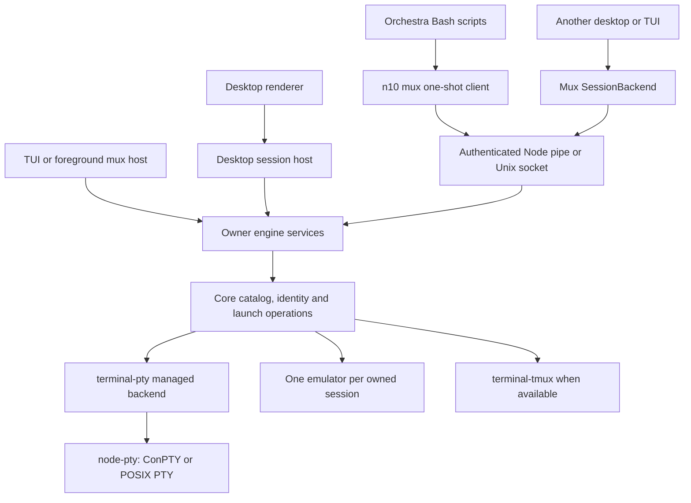
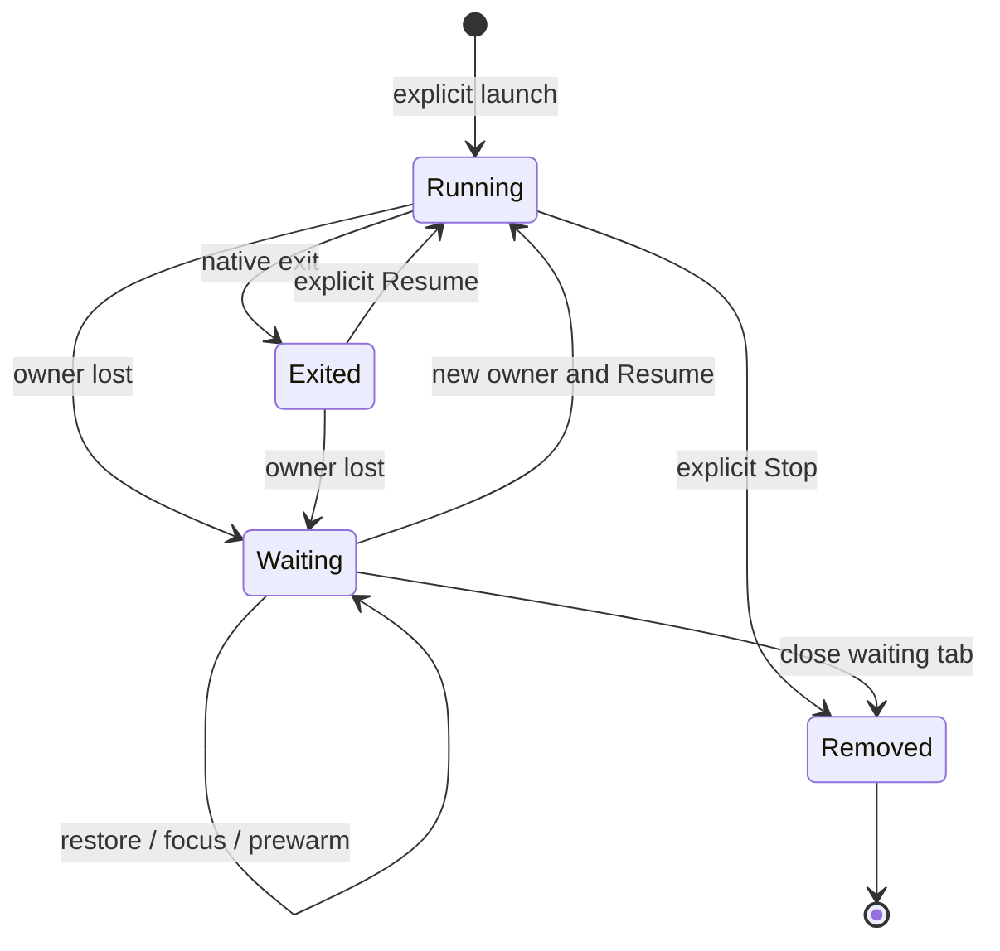

# Windows support

Status: proposed; design review required before implementation.

## Goals and boundaries

n10 uses tmux when it is available and managed PTYs when it is absent, on
Windows, Linux and macOS. Managed sessions belong to the running desktop, TUI
or foreground mux host; closing that owner ends them. Other n10 windows can
attach as clients. `n10 mux` gives Orchestra a small interface to those sessions.

Orchestra keeps its Bash scripts, invocation paths, allowlists and existing
tmux behavior on Linux/macOS, including installations without n10. Windows
callers use Git for Windows' Bash. There is no Orchestra Node rewrite or new
Node prerequisite. Beam's Windows binary supplies exec, control and mailbox;
Windows PTY streams in beam have no consumer and are outside scope.

The Windows baseline is Windows 11 x64, Git for Windows and local NTFS checkouts.
Development uses the repositories' pinned Node/Electron versions. Windows ARM64,
UNC/SMB and WSL require separate qualification. n10 packaging, persistent managed
sessions, a background service, automatic daemon startup, tray behavior and a
tmux-compatible CLI are outside scope. Beam binary/npm distribution is included.

## Baseline and #331

The implementation stack is based on [#331, `feat/restore-tabs`](https://github.com/notaharness/n10/pull/331)
while it is unmerged. Its baseline is `378e7e72`; #331 conflicts with master. Before implementation, **merge master into Kristján's
branch, resolve the conflicts there, and merge the updated base into downstream
branches. Never rebase or force-push his branch.** Changes to #331 can be pushed
there as authorized, including the saved-target change below.

#331 should save a discriminated session target now, separating it from a resume
recipe, rather than coupling the tab schema to `tmuxName`/`TmuxSessionIncarnation`:

```ts
type SavedSessionTarget =
  | { kind: 'tmux'; name: string; incarnation?: TmuxSessionIncarnation }
  | { kind: 'mux'; hostId: string; sessionId: string; generation: number };
```

The tab also retains repo/cwd/machine, tags, agent/account selectors and optional
verified conversation ID. Add the discriminator before #331 ships; this avoids
a Windows-specific migration or discarding saved tabs. The mux variant records
what to reattach to if still alive; its separate recipe supports explicit Resume
when the owner is gone. Runtime process IDs and connection state are not recipes.

Relevant source boundaries:

- [Architecture](../architecture.md) and [decisions](../decisions.md) put shared
  operations in core and observation/lifecycle in engine. Their tmux-only platform
  decision must be updated when the managed backend passes its acceptance gates.
- [SessionBackend](../../libs/terminal/src/lib/session-backend.ts) separates
  process/connection state and `dispose`/`kill`.
  [terminal-tmux](../../libs/terminal-tmux/src/lib/tmux-backend.ts) implements it;
  [terminal-pty](../../libs/terminal-pty/src/lib/pty-session.ts) is a node-pty
  wrapper whose dispose kills its process, not yet a managed backend.
- [session-identity.ts](../../libs/core/src/lib/session-identity.ts),
  [session-resolver.ts](../../libs/core/src/lib/session-resolver.ts) and
  [session-backend.ts](../../libs/core/src/lib/session-backend.ts) carry tmux
  assumptions beyond backend construction. The core registry owns the emulator;
  transport packages interpret no Orchestra tags.
- The [desktop host](../../apps/desktop/src/main/host-worker.ts) is an Electron
  utility process. Its [services](../../apps/desktop/src/host/services) adapt the
  engine to renderer IPC, with viewer tracking and a 512 KiB output ring. Host
  recovery currently assumes tmux survived. #331 restores tabs without launching
  missing sessions; exact Claude ID discovery currently depends on Linux `/proc`.
- [#316](https://github.com/notaharness/n10/pull/316)'s Shell resolver assumes
  `sh`, `$SHELL` and `-l`. `session-bin.ts` creates a `/bin/sh` n10 wrapper and a
  beam symlink. Both need native Windows entry points.
- [#94](https://github.com/notaharness/n10/pull/94), `53ec2f35` and `b09fd4af`
  establish regressions for Git argument quoting, slash handling and reuse of a
  checkout under a different directory name. `e71c7cf0` removed dead Windows
  launch branches; the new backend does not resurrect those paths.
- Historical `libs/pty-manager` (`6b734b07`) and `libs/tmux-*` are absent here.
  `10e2185c` removed wrappers, `e245e805` renamed tmux-control to terminal, and
  `367daed8` renamed tmux-manager to worktree-manager. Use their current owners.

The Orchestra inventory below is based on plugins `431094cf`; beam's platform
inventory is based on `d4c062a4`.

## Architecture and ownership

Core selects tmux first on the execution machine; otherwise it selects managed
PTY. A found but failing tmux produces an error, not a silent backend switch.
Existing handles pin their backend. Orchestra checks tmux first, then n10, and
probes on the target machine for remote operations. A tmux installation requires
neither a running mux owner nor n10 for Orchestra.



There is one managed owner per user/profile. The first desktop, TUI or explicit
`n10 mux serve` owns it. Bind the profile's endpoint before publishing readiness;
a competing n10 authenticates to the existing owner and uses the mux
`SessionBackend`. It does not steal ownership or spawn a second catalog.
A second desktop still uses Electron's normal single-instance behavior. An
explicit second `serve` reports the existing owner and exits without affecting it.

Owner UI: **Sessions end when you close this n10.** Client UI: **Sessions belong
to the desktop / terminal running n10; closing this window leaves them running.**
Closing a client only detaches. If the owner exits, clients show stopped/waiting
sessions; they do not silently elect a new owner or restart agents. A user can
start a new owner and choose Resume. The same behavior applies without tmux on
Linux/macOS, giving the existing Linux desktop/TUI e2e suites a real owner to test.

| Layer                | Responsibility                                                                                                                        |
| -------------------- | ------------------------------------------------------------------------------------------------------------------------------------- |
| `libs/terminal`      | Transport-neutral target/process/connection contracts; headless terminal APIs.                                                        |
| `libs/terminal-pty`  | Managed PTY records and attach/dispose/kill, retained exit facts and public node-pty calls.                                           |
| `libs/terminal-tmux` | Existing local/remote tmux semantics, exact targeting and native restart guards.                                                      |
| `libs/core`          | Identity, canonical paths, launch plans, catalog operations, mux codec/client/transport and shared Git/removal operations.            |
| `libs/engine`        | Shared discovery, observation, serialized mutations, shutdown and owner/client coordination. Both shells and mux call these services. |
| Desktop host / CLI   | Compose the owner or client; adapt IPC, lazy command dispatch and user-visible errors.                                                |
| Orchestra            | Existing Bash worktree/harness/report workflow with a narrow tmux-or-mux seam.                                                        |

The only new n10 native binding is the Windows Job Object operation below core.
Node's public networking API handles IPC. Core/engine keep their current import
boundaries; renderer contracts remain browser-safe.

### Catalog and terminal state

The owner has one record, PTY and emulator per session regardless of viewers.
Refactor the existing core registry rather than adding a mux-only registry.
`dispose()` releases a handle; `kill()` stops that exact session. Agent exits
retain screen, exit code and tags; shell exits follow engine cleanup. Connection
loss is distinct from process exit, including over beam.

Each owner has a random `hostId`; each record a `sessionId`; each process launch
increments `generation`. Send, stop and restart carry the expected generation
and host. Restart of a retained exited record has one winner; live replacement
remains a separately confirmed engine action. Metadata writes are atomic with
no revision counter. `claimTarget` atomically moves an `@orchestra-target` claim
between records in that owner.

Create validates cwd/identity, reserves the label and checkout, installs metadata
and I/O listeners, then starts the process. Failed spawn releases the reservation
and preserves the worktree. Engine serializes by canonical checkout, avoiding
duplicate launches under different labels. Existing duplicate tmux identities
retain the oldest-session rule. Identity tags cannot reassign a live checkout.

Capture uses public emulator buffers, modes and title events, including while
no viewer is attached. Keep 10,000 history lines and a bounded byte replay ring;
cap each capture at 512 KiB UTF-8 (and the encoded frame limit) and report
truncation/alternate screen. Preserve
Unicode at chunk boundaries and wait for emulator writes before final capture.
Desktop sequence numbers remain monotonic across restart; generation separates
old output from a new process. Local discovery is event driven; Git watching
remains a hint backed by polling, and remote observations remain batched.

## Mux commands and protocol

The one-shot CLI calls the running owner; it never implicitly starts a daemon.
Without an owner it returns `HOST_NOT_RUNNING`: **Open n10 or run `n10 mux serve`
in another terminal.** `serve` stays in the foreground until Ctrl+C/console close.
One-shot clients print JSON to stdout and diagnostics to stderr. Requests use
UTF-8 JSON on stdin (`--request -`), so prompts and paths are not shell source.

| Command                            | Contract                                                                                                                                                                                           |
| ---------------------------------- | -------------------------------------------------------------------------------------------------------------------------------------------------------------------------------------------------- |
| `n10 mux status`                   | Version/capabilities, owner type, host ID, execution OS and session count; no secrets.                                                                                                             |
| `n10 mux serve`                    | Foreground owner using the same engine/catalog as desktop and TUI.                                                                                                                                 |
| `n10 mux list [--capture N]`       | Complete summaries, optionally with one screen/history sample per record. `sessions.sh --sample` makes two batch calls, not one process launch per player.                                         |
| `n10 mux inspect ID`               | Exact summary, including retained exit state.                                                                                                                                                      |
| `n10 mux self`                     | Validate injected host/session/generation context and return that record.                                                                                                                          |
| `n10 mux create --request -`       | `{requestId,expectedHostId,label,cwd,argv,envSet,envUnset,cols,rows,tags,retainOnExit}`; reserve, launch and return IDs/canonical paths. Executable resolution uses shared core launch operations. |
| `n10 mux restart ID --request -`   | Launch body plus expected generation; only an exited record. Explicit resume never falls back to fresh launch.                                                                                     |
| `n10 mux metadata ID --request -`  | `{expectedHostId,set,unset,claimTarget?}`; atomic validated metadata/claim update.                                                                                                                 |
| `n10 mux send ID --request -`      | `{requestId,expectedHostId,generation,mode,text?,key?,submit?}`; modes `paste`, `literal`, `key`; result describes transport acceptance or a partial/unknown outcome.                              |
| `n10 mux capture ID [--history N]` | `{text,seq,generation,truncated,alternateScreen}`.                                                                                                                                                 |
| `n10 mux stop ID --request -`      | Expected host/generation; stop exact session and remove retained record, leaving Git worktree/branch intact.                                                                                       |

There is no owner `shutdown` command. Owners close through their UI or foreground
console. The CLI has no tmux formats, pane/window model, buffers or hooks.
Summaries include IDs, label, creation time, cwd, process state/PID/exit code,
size, activity, title and all twelve tags in the inventory. Known direct agent
launches are classified by the launch adapter; an arbitrary shell's foreground
agent is unknown until verified, not inferred from its title.

Wire v1 is bounded NDJSON with LF framing. After authentication, requests carry
`{v:1,id,op,params}`; replies are `{id,ok:true,result}` or
`{id,ok:false,error:{code,message}}`. Verbs map to `host.status` and
`session.list/inspect/self/create/restart/metadata/send/capture/stop`.
Limit a frame to 1 MiB, message text to 256 KiB, tags to 64 keys of 4 KiB each,
and outstanding requests to 32. Dimensions are 2–500. Batch captures split into
bounded `{id,ok:true,part:record}` frames followed by a completion result; the
CLI assembles the JSON result. Cap the whole batch at 16 MiB and return an
actionable limit error when more data is requested. A failed batch is an error,
not a successful empty list.

Use exit 0 for success, 2 validation, 3 unavailable host/session, 4 auth/version,
5 stale/conflicting state, 1 other failures. Preserve machine-readable errors:
`HOST_NOT_RUNNING`, `AUTH_FAILED`, `VERSION_UNSUPPORTED`, `NOT_FOUND`,
`IDENTITY_MISMATCH`, `STALE_GENERATION`, `RUNNING`, `INVALID_REQUEST`,
`SPAWN_FAILED`, `UNSUPPORTED`, `OUTCOME_UNKNOWN`.

A send serializes paste/literal and submission against other writers. Paste
honors bracketed-paste mode; key encoding honors cursor mode. Initial keys are
Enter, Escape, Tab, Backspace, arrows, Home, End, Delete, PageUp, PageDown and
C-c/C-d/C-z. Request IDs correlate operations, not exactly-once delivery. After
connection loss clients do not retry mutations automatically. A created record
retains its request ID for reconciliation; uncertain input requires operator
judgment. A partial paste never falls through to another reporting route.

### Authenticated local IPC

Use Node's public [`net.Server` and `net.createConnection`](https://nodejs.org/api/net.html#ipc-support):
a named pipe on Windows, Unix socket on POSIX. The stable endpoint is scoped to
the OS user/profile, for example `\\.\pipe\n10-mux-v1-<runtime-dir-hash>`; its
bind arbitrates ownership. Runtime descriptor and fresh
256-bit secret live under `%LOCALAPPDATA%\n10\run\<profile>` on Windows, inheriting
the private user-profile ACL, or a private directory/mode-0600 file on POSIX.
Only the winner publishes readiness and credentials atomically. Address-in-use
means authenticate/attach or report an error; failed authentication does not
permit deleting another owner's endpoint. Unix stale-socket cleanup requires
exclusive ownership of the startup lock; it cannot unlink a live listener.

Mutual HMAC-SHA256 authenticates both directions. The server initially sends only
a fresh nonce; the client sends its nonce and proof bound to both nonces, protocol
and expected host ID. After validating that proof the server sends its separately
labelled server proof. The client sends operations only after checking it.
Pre-auth output contains no session data, paths, tokens or launch information.
Apply short handshake deadlines, connection limits and constant-time comparison.
New owner lifetime means a new secret and host ID; stale clients reauthenticate.

No custom pipe DACL, connected-server PID lookup or native pipe wrapper is needed.
A pipe that can be opened is not an authenticated channel; a squatting server
cannot prove possession of the secret. [libuv's pipe implementation](https://github.com/libuv/libuv/blob/v1.x/src/win/pipe.c)
also uses first-instance protection. The security boundary is secret possession
under the user's profile, not the obscurity of the pipe name. Secrets stay out of
argv, tags, inherited environments, renderer IPC and saved tabs. Administrators
and hostile processes already acting as this user are outside this boundary.
Test profiles must preserve the private-directory requirement.

Restricted harness users may fail this authentication. Use their documented
permission route for reporting; denial preserves the complete report visibly.
It does not justify copying secrets into sandboxes or changing global permissions.

### Frontend stream extension

One-shot v1 is sufficient for Orchestra. The PR adding the mux `SessionBackend`
adds negotiated `session.watch/unwatch/resize` and streamed raw terminal I/O for
actual frontend consumers. Local non-owner desktop/TUI uses this extension over
the same authenticated socket. An atomic snapshot plus sequence starts each
watch; generation-tagged output/exit/removal events follow. A slow subscriber
with a 1 MiB queued backlog disconnects and resnapshots, leaving the owner running.

This local client backend is part of the initial managed-owner feature, before
claiming desktop/Orchestra interoperability. The later fleet PR adds
`n10 mux connect --stdio` as a proxy for that extension over beam exec. It performs
local authentication on the target; EOF detaches, never kills the owner. Neither
streaming nor the remote proxy expands the initial one-shot CLI's responsibilities.

## Orchestra's Bash backend seam

Keep both SKILL.md files' existing POSIX commands and all eleven `.sh` entries.
Selection occurs at `t`/`tmux_on`/`tmux_local` and the direct calls in `_routing.sh`
and `_launch.sh`. Factor narrow behavioral helpers (list, inspect, create/restart,
metadata, capture, send, stop, self); their tmux arm executes the current commands
and flags. Their mux arm calls the explicit verbs above. This is a translation
inside Orchestra, not a tmux CLI parser inside n10. The tmux arm does not probe
or invoke n10, change buffer handling, resume probing, defaults or report routing.

On Windows, Claude's Bash tool uses Git Bash. Codex/PowerShell skill instructions
resolve Git for Windows' `bin\bash.exe` from the installed Git location (with an
explicit override for custom installs), then invoke the same absolute script
path with PowerShell's call operator. Exclude `System32\bash.exe`/WSL. Git for
Windows supplies the required shell utilities; no Node, Python or jq dependency
is added to Orchestra. Reuse the existing Bash JSON encoder/scanners, extending
only the typed fields needed by mux. Test control characters, Unicode, arrays
and escaped paths against the exact wire schema.

Mux creation supplies complete metadata and argv, eliminating the placeholder
pane/prompt-buffer sequence on that arm. Prepare known-agent argv before create
through the mux branch of the launch helper; n10's core resolves/validates the
native executable. Unsupported opaque shell commands remain unclassified for
automated adoption. POSIX `_launch.sh` retains its existing launch behavior;
Windows has no `script(1)` probe and requires a known supported resume agent.
The Windows arm uses interactive/documented trust setup rather than private
trust-file writes. Existing Unix trust/resume behavior is outside this change.

At native n10/beam boundaries, explicitly convert filesystem paths with `cygpath`
and scope [MSYS argument-conversion exclusions](https://www.msys2.org/docs/filesystem-paths/)
to those calls. JSON stdin carries prompts/tags without conversion. Shell
utilities retain Git Bash paths; identity tags use target-native canonical paths.
Remote paths are never converted by the controller's `cygpath`. Existing Git and
worktree defaults, dry-run semantics, account selection and text/JSON outputs
remain unchanged. n10 worktrees still use `--no-node-modules` and `npm ci`.

### Script inventory

`O/` below means `orchestra/skills/orchestrator/scripts`; `P/` means
`orchestra/skills/player/scripts` in [notaharness/plugins](https://github.com/notaharness/plugins/tree/431094cf8995267a212d7ab39c3bbf592746ea94/orchestra).
`t`, `tmux_on` and `tmux_local` are wrappers, not additional tmux commands.
All parser-facing calls use `-u`; explicit server selection uses `-S SOCKET`.
Session existence/kill use exact `=name`; pane/option targets use `=name:`.

| Source          | tmux operations and options                                                                                                                                                                                                                                                                                                                | Mux equivalent                                                                                                                        |
| --------------- | ------------------------------------------------------------------------------------------------------------------------------------------------------------------------------------------------------------------------------------------------------------------------------------------------------------------------------------------ | ------------------------------------------------------------------------------------------------------------------------------------- |
| `O/_lib.sh`     | `has-session -t =name` for name allocation/existence; `list-sessions -F` for identity; `capture-pane -p -t`; `display-message -p '#S'`; direct `-u -S` list/set calls when marking the orchestrator                                                                                                                                        | Atomic create allocation, list/inspect, capture, self, metadata claim                                                                 |
| `O/spawn.sh`    | `display-message -p -t ... '#{pane_dead}'`; `new-session -d -s NAME -c CWD -x 220 -y 50`; duplicate-name `has-session`; tag `set-option`; `status off`, `remain-on-exit on`; `load-buffer -b orchestra-prompt-NAME -`; `respawn-pane -k -t ... -c CWD -e KEY=value ... -- /bin/sh -c ...`; failure cleanup `delete-buffer`, `kill-session` | One create or guarded restart with full metadata, argv and env. No placeholder or task buffer; task reaches launch adapter over stdin |
| `O/_launch.sh`  | Direct `-S` `show-buffer -b`, `delete-buffer -b`; tag get/set for type, actual agent and Claude conversation ID                                                                                                                                                                                                                            | Bash mux launch preparation supplies argv and metadata; no tmux prompt buffer                                                         |
| `O/adopt.sh`    | `has-session`; `display-message` dead/ownership reads; tag writes; `send-keys -t ... -l TEXT`, then `Enter`, or shared paste/queue route                                                                                                                                                                                                   | Inspect verified agent, atomic supervision metadata, literal/paste send or native queue                                               |
| `O/kill.sh`     | `kill-session -t =name`; `delete-buffer -b orchestra-prompt-NAME`                                                                                                                                                                                                                                                                          | Stop exact ID; no buffer cleanup needed                                                                                               |
| `O/screen.sh`   | Dead-state `display-message`; `capture-pane -p -t =name: -S -N`                                                                                                                                                                                                                                                                            | Inspect/capture with bounded history                                                                                                  |
| `O/send.sh`     | `send-keys -t ... KEY`; `send-keys -l TEXT` then Enter; shared buffer paste; native inbox/queue when possible                                                                                                                                                                                                                              | Key/literal/paste send; keep agent-native delivery policy above the backend                                                           |
| `O/sessions.sh` | `list-panes -a -F FORMAT`; shared capture for `--sample`                                                                                                                                                                                                                                                                                   | Batched list/capture per machine; preserve busy/idle/dead heuristic                                                                   |
| `O/relay.sh`    | Default `display-message -p '#S'`; shared local target checks/delivery. Talks directly to beam's control socket with `socat`/`nc -U`                                                                                                                                                                                                       | Self and backend routing; Windows beam control stdio proxy                                                                            |
| `P/_routing.sh` | Remote `display-message -p '#{socket_path}'`; fallback socket rule; `show-options -qv -t`, `set-option [-u] -t`; `display-message` for `#S`, `pane_dead`, `pane_current_command`, `pane_pid`; `has-session`; `load-buffer -b orchestra-PID -`, `paste-buffer -p -d -b ... -t`, cleanup `delete-buffer`, `send-keys ... Enter`              | Status/self/inspect, metadata, serialized send. Process/agent discovery is platform-specific, not fabricated tmux formats             |
| `P/report.sh`   | Through helpers: self context, orchestrator/config tag reads, local-target delivery, last-report tag write                                                                                                                                                                                                                                 | Same workflow using stored backend context and metadata; beam handling unchanged                                                      |

Complete formats consumed by those scripts:

- Identity `list-sessions -F`: `session_name`, `session_created`, `session_path`,
  `@orchestra-spawner`, `@orchestra-repo`, `@orchestra-session-type`,
  `@orchestra-branch`, `@orchestra-worktree-path`, tab-separated.
- Orchestrator-home listing: `session_name`, `@orchestra-target`.
- `list-panes -a -F`: `session_name`, `pane_dead`, `pane_current_command`,
  `window_activity`, `@orchestra-agent`, `@orchestra-orchestrator`,
  `@orchestra-last-report`, `@orchestra-repo`, `@orchestra-branch`,
  `@orchestra-spawner`, `@orchestra-session-type`, `@orchestra-worktree-path`,
  `pane_title` (last field may contain tabs).
- `display-message`: `#S`, `#{socket_path}`, `#{pane_dead}`,
  `#{pane_current_command}`, `#{pane_pid}`. No general format evaluator is needed.
- **Hooks: none.** There is no `set-hook`, control-mode subscription, attach,
  split-window or select-pane requirement in these scripts. Do not add global
  tmux hooks to implement lifecycle observation.

The complete metadata set is `@orchestra-` plus: `spawner`, `repo`, `session-type`,
`branch`, `worktree-path`, `orchestrator`, `orchestrator-config`, `agent`,
`launching`, `last-report`, `claude-session`, `target`. `launching` remains a tmux
implementation detail. `dir` stays Orchestra's spelling, read as `agent` by n10;
Orchestra still filters players to tagged worktree/dir sessions, excluding n10's
ordinary shell/agent terminals. Labels retain the shared sanitization, cap/hash
and numeric-collision rules; identity is never inferred from the label or branch.

### Identity and reporting

Managed children receive `N10_MUX_HOST_ID`, `N10_MUX_SESSION_ID`,
`N10_MUX_GENERATION` and endpoint location, with `ORCHESTRA_BACKEND=mux` for
players. These are context, not credentials. `self` validates them. Tmux retains
`ORCHESTRA_SOCKET`/`ORCHESTRA_SESSION` and `TMUX`/`#S`; existing handles pin their
backend even if PATH changes. Fresh launches strip parent harness/mux identity
before injecting their own. `ORCHESTRA_SESSION` is a label, not authorization.

Add local target `mux:<hostId>/<sessionId>` and allow it inside
`beam:<peerId>/...`. It expires with the owner and is never reconstructed from a
label. `@orchestra-target` claims require verified conversation/session ownership;
core moves a claim atomically. Extend grouping/relay allowlists. Reports read the
player's saved supervisor, never substitute the player's own Claude/Codex ID.

Unix inbox → queue → paste behavior is unchanged. Windows defaults to paste into
a verified managed agent when supported native inbox/queue discovery is absent.
Claude's [Windows inbox requires authentication](https://code.claude.com/docs/en/cross-session-messaging#the-sessions-inbox-socket);
another session's child token is not a peer credential. Explicit `claude:` or
`codex:` destinations fail if their supported API cannot be used, rather than
silently retargeting a pane. Arbitrary shell-launched agents require verified
registration or an explicit managed launch before automatic adoption.

`report`/`relay` always resolve local context despite inherited machine settings.
Accepted/stored/failed meanings and last-report updates stay unchanged; uncertain
delivery is not retried. For Windows relay, add beam's `control --stdio` byte
proxy for its native control pipe. Preserve `msg.subscribe` → delivery →
`msg.ack`/`msg.defer`; `beam msg listen` acknowledges too early. Existing Unix
`socat`/`nc -U` relay remains unchanged. Desktop relay requires the peer's `all`
grant for agent input (D13/D14/D17); `msg` alone is mailbox permission.

## Windows launch, paths and lifetime

### Native launch and filesystem

Extend #316's Shell setting with pwsh, Windows PowerShell, cmd and Git Bash.
Windows auto selects installed pwsh, then powershell, then `%ComSpec%`.
Use their native flags (`-NoLogo`, `/d`, Bash interactive/login flags), preserving
the existing visible fallback policy. Terminal Shell does not select an agent's
own tool-execution shell. POSIX shell resolution stays unchanged.

Resolve executable/argv on the execution machine. Native Claude/Codex run
directly; npm-installed agents use their public package bin and Node executable
or a supported script-shell adapter. [Node distinguishes `.cmd`/`.bat` from executable files](https://nodejs.org/api/child_process.html#spawning-bat-and-cmd-files-on-windows).
Use documented entry points, not npm-shim parsing or internal vendor layouts.
Preserve SystemRoot, ComSpec, profile/temp and one case-insensitive PATH entry.
The desktop supplies native `n10 util`/`mux` entries and `beam.exe` without global
n10: `.cmd` for interactive shells, explicit runtime/JS argv for machine calls,
using supported Electron-as-Node execution. Test that distribution seam.

Keep registry argument forms: Claude seed/resume/system prompt; Codex `-- PROMPT`
or `resume ID`/`--last`; Gemini `--prompt-interactive=`, Copilot `--interactive=`,
OpenCode `--prompt`. Test fresh/resume/report capabilities separately with actual
Windows installs. Shared structured launch plans replace core's `/bin/sh`
continuation composition. Explicit Resume never starts fresh. Validate encoded
Windows command-line length: stdin JSON does not remove the agent's process
argument limit. Oversized initial prompts require supported harness streaming or
an actionable error, while later messages use mux input.

Canonicalize repo/checkout with native realpath on the machine holding them.
Normalize separators/drive spelling without lowercasing arbitrary case-sensitive
paths; unqualified case-sensitive/UNC modes fail explicitly. Keep canonical
identity after a checkout disappears, independently of its label or branch.
Git calls use argv/cwd and porcelain/NUL output; retain #94's existing-checkout
lookup. Test spaces, Unicode, drive case, Git slashes, junctions, branch switches,
reserved names and long paths. User Git/global OS settings remain untouched.

Before worktree removal, stop matching sessions and await PTY/handle release,
then revalidate the shared core safety verdict. File locks may still make Git
fail; preserve checkout/branch state and report that failure. Snapshot writes
use same-directory temp/replace and retain the last good state on sharing errors.
Nonrecursive file watches are hints with polling recovery. Pin fixture/script LF,
accept CRLF text files, preserve terminal bytes and test both autocrlf settings.

### Owner lifetime and restore



On an owning desktop/TUI, quit with live PTYs confirms **Quit n10 and stop N
running sessions? Tabs and files are kept. Resume sessions when you reopen n10.**
Cancel is default. Count shells and background players across repositories.
Windows last-window close is Quit. `serve` Ctrl+C is explicit owner shutdown.
A client window only detaches, including after renderer reload or repo switching.
Tmux and remotely owned sessions keep their existing detach behavior.

Confirmed owner quit stops creates, flushes tab recipes, completes already
accepted Git mutations under engine rules, stops PTYs and exits after bounded
teardown. Save failure offers retry/cancel/quit with loss stated. Save metadata
while running as well, so crash recovery can restore waiting tabs. No focus,
prewarm, reconnect or host restart implicitly launches an agent.

On Windows the PTY-owning process creates a noninheritable
`JOB_OBJECT_LIMIT_KILL_ON_JOB_CLOSE` job and assigns **itself** before spawning
children. It alone retains the handle; no breakaway flags. That process is the
desktop session host, TUI, or foreground serve process. There is no extra contained
worker. [Job membership and nested jobs](https://learn.microsoft.com/en-us/windows/win32/procthread/job-objects)
provide cleanup when that owner exits. [ConPTY close](https://learn.microsoft.com/en-us/windows/console/closepseudoconsole)
already sends CTRL_CLOSE_EVENT to attached clients; the job additionally covers
detached/GUI descendants at owner exit. Closing one PTY does not claim to kill an
arbitrary detached process tree; remaining file locks surface as removal errors.

The first PR measures host exit on Electron main crash/parentPort closure, using
the pinned Electron/node-pty builds. The host must end on parent disconnection.
Only if that fails does the design need a main-held job; bring that evidence back
to review before adding it. Test immediate child creation, host crash, detached
and GUI descendants. On POSIX use native PTY teardown/process-group behavior;
owner-close tests cover the same user-visible session lifetime. POSIX detached
daemons are not covered by a Windows-style kernel job guarantee.

A resumed mux record gets a new live target in #331's discriminated schema.
Tabs may reattach to a still-running headless owner; stopped owners require
explicit Resume. Stale supervisor mux handles require re-adoption. Known exact
conversation IDs and launch-time account selectors survive; directory/latest
continuation is disclosed and shared-directory ambiguity requires selection.
Unsupported agents offer Start new. Saved tabs contain no credentials, complete
environments, pending prompts or PTY memory. Headless hosts keep no reboot-resume
database; worktrees/conversations remain available for explicit spawn/resume.

## Beam Windows binary and fleet integration

Beam's `d4c062a4` platform dependencies include Unix process groups/signals,
`creack/pty`, wait logic, Flock/Unix control sockets, Setsid, SIGWINCH and
`/dev/fd`, plus Unix-only binary paths. Split OS-specific files while retaining
the existing stream/control/mailbox protocols and grant semantics.

| Consumer                            | Windows work                                                                                                                                                                 |
| ----------------------------------- | ---------------------------------------------------------------------------------------------------------------------------------------------------------------------------- |
| Orchestra and remote mux over exec  | Native argv/env/cwd, separate stdout/stderr, exit status and per-exec Job Object established before the child runs; disconnect ends that exec tree.                          |
| n10/CLI control and Orchestra relay | Native named-pipe control endpoint, user-scoped access, lock/config/atomic-file behavior; `beam control --stdio` proxies control bytes without early mailbox acknowledgment. |
| Mailbox/reporting                   | Same durable store, offline delivery, ack/defer and grants; qualify tailcat and pure-Go SQLite on Windows.                                                                   |
| Daemon/console                      | Native startup and stdin lifeline for `--exit-with-parent`; Windows client console mode through public `x/term` APIs and required resize handling when talking to Unix PTYs. |
| Binary/testkit                      | `windows/amd64` beam and beamtest `.exe`; npm `@notaharness/beam-win32-x64`, platform/architecture mapping, `.exe` resolver, checksums and installed-package tests.          |

A PTY stream request **to a Windows target** returns beam's normal unsupported
error. No beam ConPTY or winpty implementation is planned. Windows clients may
still consume a Unix target's existing PTY stream; that is a client concern.
Maintain `CGO_ENABLED=0` release builds and the existing Unix behavior. Update
specs and browser-opening/path behavior alongside their implementations.
`BEAM_CONFIG_DIR` remains the override, with Windows default `%LOCALAPPDATA%\beam`;
`BEAM_SOCKET` is a pipe name, not a filesystem path to resolve.

D15 ownership remains: external beam daemons outlive n10; daemons n10 starts with
`--exit-with-parent` end with it. Beam does not host mux sessions. n10's daemon,
path, session-bin and beamtest downloader adapters consume the Windows contract.

```mermaid
sequenceDiagram
  participant O as Orchestra or remote n10
  participant B as Beam exec
  participant C as Target mux client
  participant H as Running owner
  O->>B: target-native argv and stdin
  B->>C: start one-shot or stream proxy
  C->>H: local mutual authentication
  O->>H: commands or frontend stream
  H-->>O: results and subscribed output
  B--xC: connection lost
  Note over H: sessions remain with the owner
  Note over O: reconcile; do not retry uncertain input
```

Orchestra uses one-shot commands over beam exec; frontend terminals later use
`mux connect --stdio` over exec and reuse the local mux `SessionBackend`.
The remote secret stays on the target. Native executable or configured launch
argv bootstraps n10 without the plugin; n10 capabilities identify its OS/backend.
Orchestra remote spawn requires the matching Bash plugin installation as today:
use target Git Bash/native launch argv and target home-relative or explicit paths,
not the controller's absolute plugin path. Probe tmux/n10 on that target.
An unavailable owner errors; remote execution never falls back to the local
machine or starts a detached owner. Unix targets with tmux retain their batch
poller/attach behavior; Unix targets without it use the same managed-owner path.

## E2e plan and CI dependencies

Use real Git, Electron, PTYs and IPC with scripted agents; no model credentials or
production beam service. Required runners are `windows-2022`, `ubuntu-latest`
and `macos-latest`; qualify Windows 11 separately from the Server runner.
All n10 jobs set `NX_DAEMON=false`. Cache/native artifact keys include OS,
architecture, runtime ABI and backend. Unit tests target parser/identity/guard
boundaries; the feature gates are end-to-end. Windows also runs build, lint,
typecheck and applicable unit suites, without broad core/engine exclusions.

| Suite                                    | Runner                                             | Acceptance                                                                                                                                                                                             |
| ---------------------------------------- | -------------------------------------------------- | ------------------------------------------------------------------------------------------------------------------------------------------------------------------------------------------------------ |
| Backend selection / standalone Orchestra | Linux/macOS with and without tmux; Windows         | tmux wins without probing n10; installed-but-failing tmux errors; no-tmux n10 desktop/TUI becomes or attaches to an owner; tmux Orchestra works with n10 removed from PATH.                            |
| Desktop/TUI managed sessions             | Linux and Windows required; macOS smoke            | Worktree create/reuse, native argv/cwd/env, resize/input/Unicode/alternate screen; viewer reload and repo switch retain process; shell exit cleans up, agent exit retains output.                      |
| Lifetime / #331                          | Linux and Windows                                  | Cancel/confirmed owner quit, client-only quit, headless owner plus desktop and TUI, hidden players, waiting-tab restore, no implicit launch and one explicit resume; owner loss propagates to clients. |
| Windows native viability                 | Windows                                            | ConPTY under real Electron host, pre-spawn self-job assignment, main/host crash, immediate/detached/GUI descendants and parentPort closure.                                                            |
| Mux contract                             | All three                                          | No-owner error, serve, all one-shot verbs, batch samples, exact IDs, concurrent restart/claim, stale generation, capture bounds, malformed/oversized input and uncertain-write behavior.               |
| IPC security                             | Windows and POSIX                                  | Bad proof/replay, unauthenticated preamble, spoof server, private secret, competing startup and stale endpoint; separate-user test below.                                                              |
| Shell/path/fixtures                      | Windows                                            | pwsh/powershell/cmd/Git Bash, native and npm agent entries, no global n10, spaces/drive forms/junctions, MSYS conversion, #94 quoting/reuse, locks/watch loss and CRLF/LF.                             |
| Orchestra tmux regression                | Linux/macOS without n10                            | Existing Bash spawn/resume/dir/adopt/send/screen/list/sample/kill/report, account/default/dry-run behavior and POSIX invocation paths.                                                                 |
| Orchestra mux                            | Windows via PowerShell and Git Bash; Linux no-tmux | Same applicable workflow against real mux, skill path quoting, parent identity stripping, dead-pane resume, stale supervisor, long messages and no duplicate partial report.                           |
| Beam exec/control/mailbox                | Windows two-daemon fixture; existing Unix suites   | Native exec status/stdio/argv/cleanup, pipe/lock, parent lifeline, stored/restarted/acked/deferred mail and grants; Windows PTY request explicitly unsupported; control proxy preserves ack timing.    |
| Distribution / integrated fleet          | Windows and Linux                                  | Packed beam/beamtest binaries, installed n10 artifact, plugin→beam exec→mux commands, desktop stream reconnect vs owner loss, target paths/accounts and all/msg relay boundary.                        |

Extend existing n10 desktop-e2e, cli-e2e and e2e:beam targets. Linux runs the real
Electron host in no-tmux as well as tmux configurations, not only standalone
serve. Windows fixtures isolate HOME/USERPROFILE/LOCALAPPDATA, use native fake
executables and supported npm entries, and omit Linux-only ozone/xvfb flags.
Keep pinned visual baselines on Linux; interaction assertions run on Windows.
Scratch tmux sockets and individually owned fixture processes remain isolated.

The required Windows security job runs an elevated setup step to create a random
local standard account with [`New-LocalUser`](https://learn.microsoft.com/en-us/powershell/module/microsoft.powershell.localaccounts/new-localuser).
Launch a harmless probe with [`Start-Process -Credential`](https://learn.microsoft.com/en-us/powershell/module/microsoft.powershell.management/start-process)
(CreateProcessWithLogonW), using a readable fixture executable and output directory
but the owner's private profile for credentials. Assert secret read fails and mux
authentication fails (or OS open is denied). If it can open the pipe, the only
pre-auth server frame is a nonce. Separately test bad-HMAC using the owner's
account to guarantee protocol coverage. Never log the account password; stop the
probe and remove the account/profile in finally/always cleanup. Setup failure
fails CI rather than skipping the test.

**Plugins CI consumes a built n10 artifact, not an unspecified future release.**
The n10 OS jobs upload packed CLI/test-runtime artifacts named by full commit SHA,
OS, architecture and runtime ABI, with checksums and a manifest. Include the
runtime needed for mux, native dependencies and normal command entries; no global
Node installation is added as an Orchestra requirement. This is a test fixture,
not n10 production packaging. Plugins CI pins an n10
SHA and successful workflow run ID in its fixture manifest, downloads that run's
matching artifact through GitHub Actions, verifies it, and installs into a scratch
prefix on PATH. A read-only GitHub App token scoped to n10 Actions supplies
cross-repo downloads in the trusted CI workflow; only that download step receives
it. Fork changes require maintainer approval before this integration job runs.
The artifact source is pinned and no write token enters plugin tests.
Expired/missing artifacts fail with a rebuild instruction, not a latest-version
fallback. Update the pin with the n10 mux PR; run the exact plugin head against
that artifact for cross-repo acceptance. n10 additionally runs the pinned plugin
suite against its candidate build before publishing the fixture artifact.

Beam's Windows in-process paired daemons with fake worker/dev DERP cover its
exec/control/mailbox scope in required CI. Integrated Windows↔Linux qualification
is an additional isolated paired-machine check; it is not required to prove an
unused Windows PTY feature. Manual qualification covers Windows 11, real harness
launch/resume/report under normal sandbox permissions, logoff/console close and
Windows Terminal rendering, recording actual versions and unsupported cases.
The existing entry points remain `NX_DAEMON=false npx nx e2e desktop-e2e`,
`NX_DAEMON=false npx nx e2e cli-e2e` and
`NX_DAEMON=false npx nx e2e:beam desktop-e2e`; the fixture configuration supplies
the tmux/no-tmux and OS matrix.

## Reviewable PR sequence

### n10 (stacked on reconciled #331)

1. **Go/no-go first.** Windows runner, real Electron-host ConPTY, self-owned Job
   Object and public Node pipe/HMAC tests, including separate-user and main-crash
   cleanup. Isolated viability work precedes broad core/engine refactoring.
2. **Terminal contracts.** Transport-neutral targets/process state and the
   #331 discriminated saved target. Gate with existing POSIX live-session e2e;
   coordinate the small schema change on #331 before it ships.
3. **Core resolver/catalog.** Generalize identity, launch plans and observations
   around those contracts, including shared removal callers. Keep tmux behavior
   and its e2e intact; defer remote mux transport to its own PR.
4. **Managed owner.** Implement registry/handle semantics, uniform backend
   selection and basic PTY lifecycle in desktop/TUI. Linux no-tmux e2e is required.
5. **One-shot mux.** Public Node IPC/auth, foreground serve, exact command set,
   batched capture, self-context and command entries. Gate with separate-process
   contract tests and the pinned Bash plugin fixture.
6. **Local client SessionBackend.** Add negotiated frontend streams so another
   desktop/TUI attaches to the owner; client/owner close UI and loss behavior.
   This is required for the initial Orchestra/desktop workflow, not deferred fleet
   work. Keep remote connect out of the one-shot CLI PR.
7. **Windows launch/restore integration.** Native shell/agent/path adapters,
   quit/save/wait/Resume, session-bin and tag/relay grouping. Gate on Windows and
   Linux owner e2e plus real-harness qualification before claiming support.
   Split shell/path primitives from the UI integration if review size requires it.
8. **Fleet reuse.** After beam B3, add target-native discovery and
   `connect --stdio`; reuse step 6's mux backend over beam exec. Gate with e2e:beam
   and target-native paths, grants and connection/owner-loss cases.

### plugins

- **P1 — Bash mux seam.** Keep all script names and the existing tmux arm; add
  helpers translating the inventoried operations to one-shot mux, Git Bash
  invocation instructions and Windows path/launch/report behavior. No runtime
  rewrite PR. Gate with no-n10 POSIX tmux tests and n10 step 5's pinned artifact.
- **P2 — Native control/fleet.** After beam B3 and n10 step 8, add Windows relay
  through `beam control --stdio`, remote native argv and mux target routing.
  Preserve Unix relay behavior and validate accepted/stored/failed outcomes.

### beam

Follow beam's current stack convention; release tags/publication remain Hermann's.

- **B1 — Windows control/daemon.** Native pipe, user access, locks/paths,
  parent lifeline, control stdio proxy and Windows CI. Preserve Unix protocol and
  relay behavior; no n10 dependency.
- **B2 — Windows exec/mailbox.** Native exec with Job Objects, argv/exit/stdio
  and disconnect cleanup, paired-daemon durable mailbox/grant tests, explicit
  unsupported response to Windows PTY requests. No ConPTY work.
- **B3 — Binary/testkit.** Windows x64 beam/beamtest and npm package/resolver,
  checksums, packed-install e2e and release dry run; then n10/plugins consume it.

## Remaining gates and recommendations

| Gate                                        | Recommendation                                                                                                                                                                |
| ------------------------------------------- | ----------------------------------------------------------------------------------------------------------------------------------------------------------------------------- |
| Electron main crash leaves a host alive     | Measure in step 1. Prefer self-owned host job plus parent-close exit; add a main-held job only with evidence and review.                                                      |
| Agent-specific Windows launch/resume/report | Advertise capabilities per tested harness/version; preserve exact IDs/accounts when known and disclose latest-in-directory continuation.                                      |
| Sandbox/inbox access                        | Keep the same-user secret boundary; documented permission flow or complete visible failure. Default verified managed agents to mux input when peer inbox auth is unavailable. |
| Unqualified filesystems and paths           | Start with local NTFS; report unsupported cases without global Git/OS changes.                                                                                                |
| Base coordination                           | Keep the authorized #331 stack, merge master without rebasing, and put the discriminated target into #331 before release.                                                     |

Library limitations go back to review with public/native alternatives. This plan
contains no compatibility backend, private library patch or port of removed
Windows launch code.
